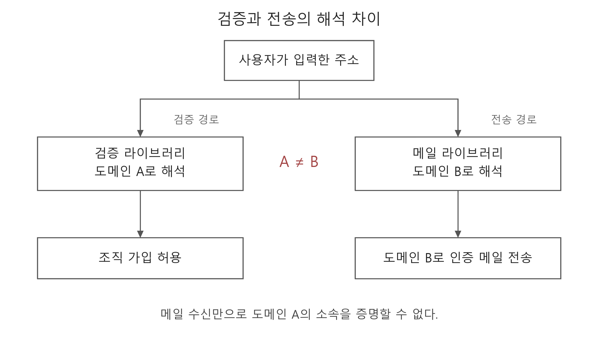
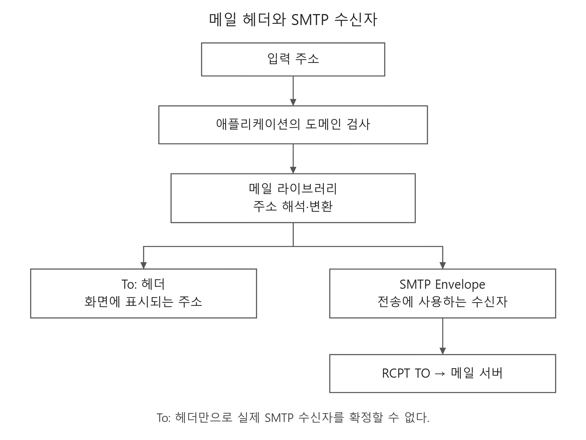
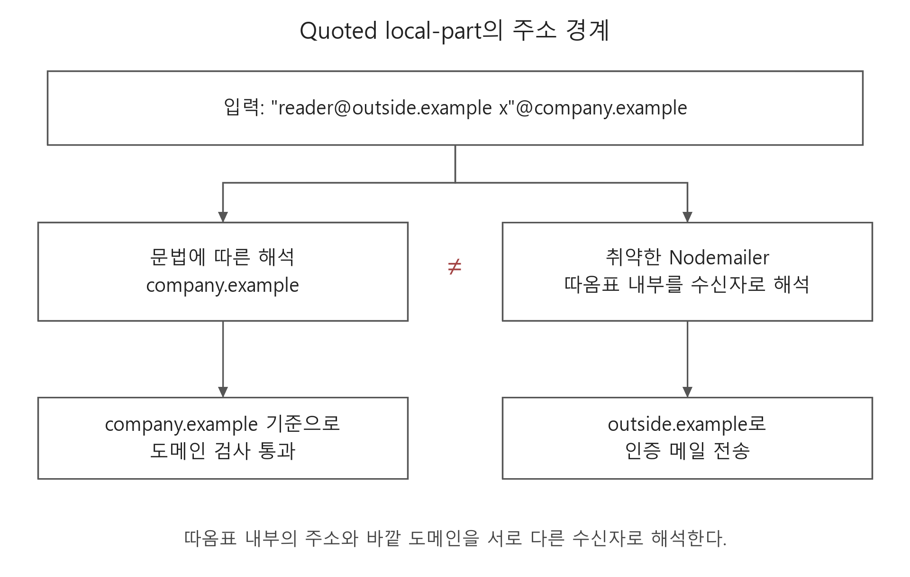
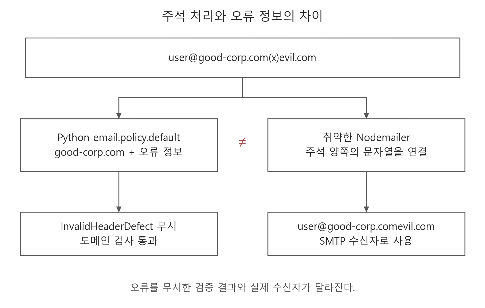
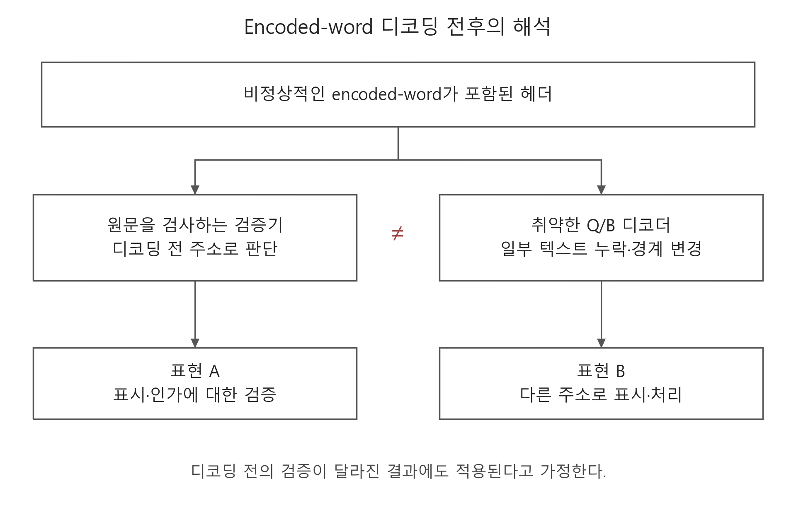
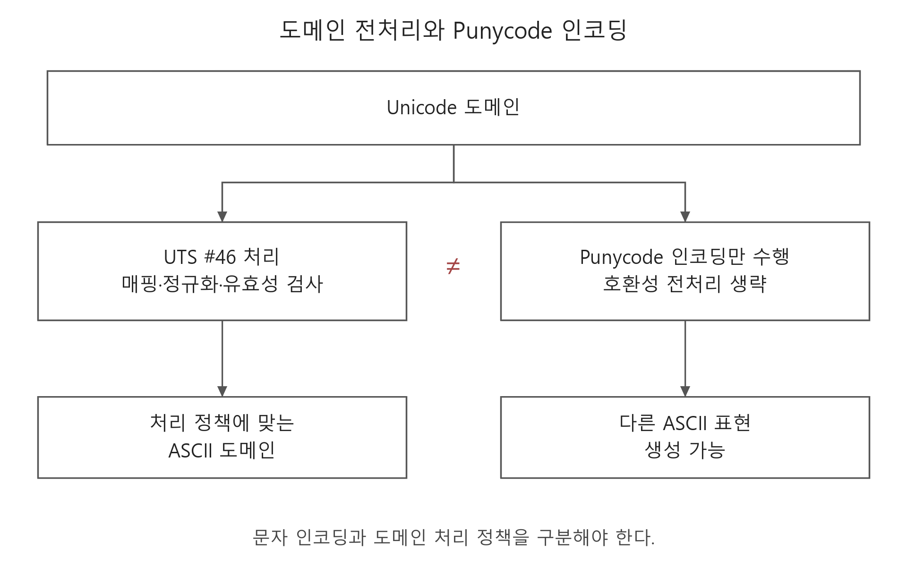
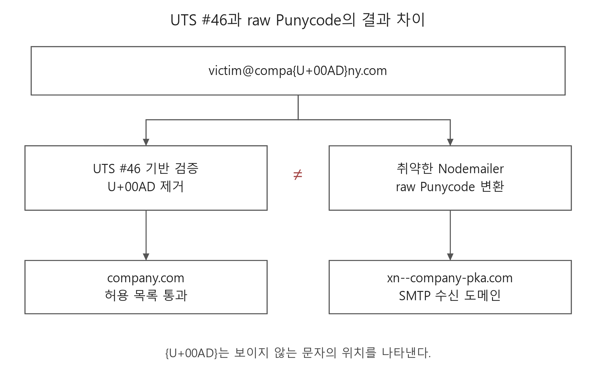
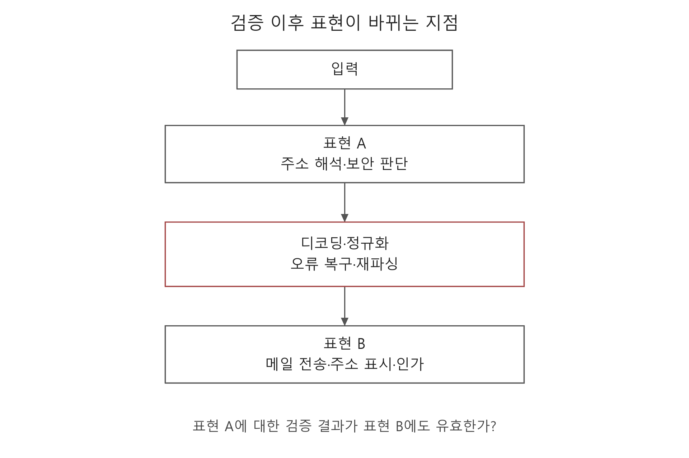
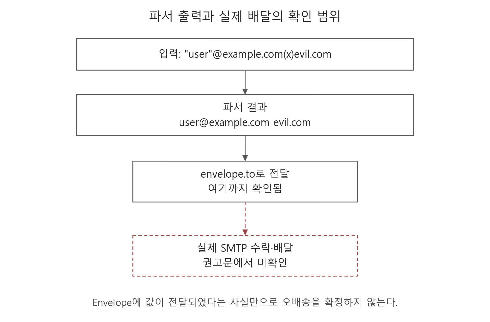
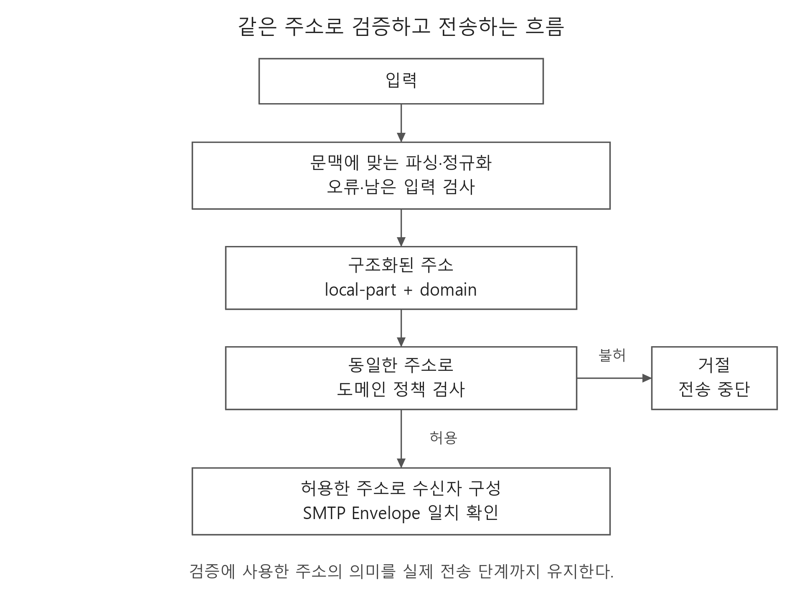

+++
date = '2026-09-21T20:00:00+09:00'
lastmod = '2026-09-22'
draft = false
title = '[Analysis] Email Parser Differential 분석'
summary = "이메일 주소를 검증하는 과정과 실제 메일을 전송하는 과정에서 해석이 달라지는 원인을 표준 문서와 공개 취약점 사례를 통해 분석"
toc = true
tags = ["Access Control", "Parser Differential", "Email", "Canonicalization"]
url = '/analysis/email-parser-differential/'
+++

---

## 들어가며

회사 이메일을 가진 사용자만 가입할 수 있는 서비스를 생각해 보자.
애플리케이션은 입력한 주소의 도메인을 검사하고, 허용된 도메인이면 인증 메일을 전송한다. 이후 사용자가 인증 링크를 누르면 해당 조직에 속한 계정으로 처리한다.

그런데 도메인을 검증하는 라이브러리와 메일을 전송하는 라이브러리가 같은 주소를 다르게 해석한다면 어떻게 될까?

검증 과정에서는 회사 도메인으로 판단했지만, 인증 메일은 공격자가 소유한 다른 도메인으로 전달될 수 있다. 이 경우 공격자는 인증 메일까지 정상적으로 수신하면서 도메인 기반의 가입 제한을 우회하게 된다.

PortSwigger의 [Splitting the email atom](https://portswigger.net/research/splitting-the-email-atom)은 이메일 주소의 파싱 차이를 이용해 이러한 접근 제어를 우회하는 과정을 다룬 연구다.
2024년 공개된 이 연구 이후에도 Nodemailer와 Ruby mail 등에서 관련 취약점이 보고되었다.

이번 글에서는 이메일 주소가 처리되는 과정을 살펴보고, 주소 문법과 디코딩, 도메인 정규화가 서로 다른 해석으로 이어지는 원인을 분석한다.
사례의 동작과 영향은 공개된 보안 권고문을 기준으로 설명하며, 버전 정보는 2026년 9월 22일 확인한 내용을 사용한다.

---

## Parser Differential이란?

파서(Parser)는 입력 문자열을 정해진 문법에 따라 해석하고, 각 부분의 의미를 구분하는 구성 요소다.
이메일 주소라면 표시 이름과 사서함 이름, 도메인 등을 구분하는 역할을 수행한다.

Parser Differential은 동일한 입력을 서로 다른 파서가 다르게 해석하는 현상을 의미한다.
다만 파싱 결과에 차이가 있다고 해서 모두 취약점이 되는 것은 아니다. 공백을 보존하는 방식만 다르고 최종 수신자가 같다면, 그 차이가 접근 제어를 우회하는 데 사용됐다고 볼 수는 없다.

문제는 한쪽의 해석을 기준으로 내린 보안 판단이 다른 쪽의 동작에도 적용된다고 가정할 때 발생한다.
[MITRE의 CWE-436: Interpretation Conflict](https://cwe.mitre.org/data/definitions/436.html)는 다른 구성 요소가 입력을 처리하는 방식을 잘못 전제해 의도하지 않은 동작으로 이어지는 문제를 설명한다.

이메일 도메인 검증을 예로 들면 다음과 같은 구조가 된다.



검증 라이브러리는 도메인 A를 근거로 가입을 허용한다. 그러나 메일 라이브러리는 같은 문자열을 도메인 B의 주소로 해석하고, 해당 주소로 인증 메일을 보낸다.

즉, 사용자가 인증 메일을 수신했다는 사실은 도메인 B의 사서함에 접근할 수 있다는 의미일 뿐, 처음 검증한 도메인 A에 속한다는 근거가 되지 못한다.

이러한 차이가 어디서 발생하는지 이해하려면 먼저 이메일 주소가 어떤 과정을 거쳐 실제 수신자로 사용되는지 살펴볼 필요가 있다.

---

## 이메일 주소의 처리 과정

메일에는 메시지에 표시되는 주소와 SMTP 전송에 사용하는 주소가 있다.

[RFC 5322](https://www.rfc-editor.org/rfc/rfc5322.html#section-3.6)에서 정의하는 `From:`, `To:`, `Reply-To:`는 메시지 헤더에 포함되는 정보다. 각각 메시지 작성자와 수신자, 회신 주소 등을 나타낸다.

반면 [RFC 5321](https://www.rfc-editor.org/rfc/rfc5321.html#section-3.3)의 `MAIL FROM`, `RCPT TO`는 SMTP 통신 과정에서 발신 경로와 수신자를 지정하는 명령이다. 이때 사용하는 주소 정보가 SMTP Envelope에 해당한다.

애플리케이션이 메일 라이브러리에 `to` 문자열을 넘기면, 라이브러리는 이를 해석해 메시지 헤더와 Envelope를 구성할 수 있다.



여기서 애플리케이션의 도메인 검사와 메일 라이브러리의 주소 해석이 서로 다른 규칙을 사용한다면, 검증을 통과한 주소가 전송 과정에서 다른 의미를 가지게 된다.

따라서 `To:` 헤더에 정상적인 주소가 표시된다는 사실만으로 실제 수신자를 확정할 수는 없다. SMTP 서버에 어떤 주소를 전달했는지는 `RCPT TO`까지 확인해야 한다.

---

## 주소 문법에 따른 해석 차이

### Quoted Local-part

이메일 주소의 기본 구조는 `local-part@domain`이며, RFC에서는 이를 `addr-spec`이라고 부른다. 이때 `local-part`는 해당 도메인 안에서 사서함을 식별하는 부분이다.

[RFC 5322의 Addr-Spec Specification](https://www.rfc-editor.org/rfc/rfc5322.html#section-3.4.1)에 따르면 local-part에는 일반적인 `dot-atom` 형태뿐 아니라 큰따옴표로 감싼 `quoted-string`도 사용할 수 있다.
`dot-atom`은 허용된 문자들을 점으로 연결한 형태이고, `quoted-string`은 큰따옴표 안의 내용을 하나의 문자열로 해석하는 형태다.

예를 들어 다음과 같은 주소가 있다고 가정하자.

```text
"foo@bar"@example.com
```

위 주소에서 `foo@bar`는 따옴표로 감싸진 local-part에 해당하며, 실제 도메인은 `example.com`이다.
따라서 첫 번째 `@`를 기준으로 문자열을 나누면 주소를 잘못 해석하게 된다.

또한 [RFC 5322의 기본 문법](https://www.rfc-editor.org/rfc/rfc5322.html#section-3.2)에는 역슬래시로 문자를 이스케이프하는 `quoted-pair`도 정의되어 있다. 즉, 주소를 구분할 때는 특수문자의 존재뿐 아니라 해당 문자가 어떤 문법 안에 있는지도 확인해야 한다.

### Nodemailer의 Quoted Local-part 처리

Nodemailer의 [CVE-2025-13033](https://github.com/advisories/GHSA-mm7p-fcc7-pg87)은 quoted local-part 안의 `@`를 잘못 처리해 의도하지 않은 수신자에게 메일이 전달되는 취약점이다.
영향 범위는 `7.0.7` 미만이며, `7.0.7`에서 수정되었다.

[공개된 권고문](https://github.com/nodemailer/nodemailer/security/advisories/GHSA-mm7p-fcc7-pg87)의 입력을 설명용 도메인으로 바꾸면 다음과 같다.

```text
"reader@outside.example x"@company.example
```

주소 문법에 따라 해석하면 따옴표로 감싼 부분 전체가 local-part이고, 바깥의 `company.example`이 도메인이 된다.
그러나 취약한 Nodemailer는 따옴표 내부의 주소를 수신자로 선택한다.



애플리케이션이 `company.example`을 기준으로 가입을 허용한 뒤 입력 원문을 그대로 Nodemailer에 넘긴다면, 메일은 `outside.example` 방향으로 전송될 수 있다.
원문 권고문에서도 이러한 주소 해석 차이로 의도한 도메인과 실제 전송 대상이 달라지는 결과를 설명한다.

즉, 검증 과정에서 유지됐던 quoted local-part의 범위가 전송 과정에서는 다르게 해석된 것이다.

### RFC 5322 Comment 처리

이메일 주소에는 큰따옴표 외에도 파싱 결과에 영향을 주는 문법이 존재한다. 그중 하나가 괄호로 감싼 주석인 `comment`다.

[RFC 5322 §3.2.2](https://www.rfc-editor.org/rfc/rfc5322.html#section-3.2.2)에서는 주석과 folding white space의 조합을 `CFWS`로 정의하고, 이를 주소 문법의 허용된 위치에서 사용한다. 이러한 주석은 문법상 허용되는 위치에 들어가야 하므로, 주소에서 괄호 부분을 일괄적으로 지우는 방식으로 처리해서는 안 된다.

Nodemailer의 [GHSA-cc9r-2j5m-2m83](https://github.com/nodemailer/nodemailer/security/advisories/GHSA-cc9r-2j5m-2m83)은 주석을 제거한 뒤 양쪽 문자열을 연결하면서 발생한 취약점이다.
영향 범위는 `6.9.16` 이상 `9.1.0` 미만이며, `9.1.0`에서 수정되었다.

권고문에서 제시한 입력은 다음과 같다.

```text
user@good-corp.com(x)evil.com
```

Python의 `email.policy.default`로 헤더를 해석하면 `good-corp.com`이라는 도메인과 함께 `InvalidHeaderDefect`가 반환된다. 반면 취약한 Nodemailer는 주석 양쪽의 문자열을 연결해 `good-corp.comevil.com`을 도메인으로 사용한다.



여기서 살펴봐야 할 부분은 앞단의 파서가 오류 정보도 함께 반환했다는 점이다.
애플리케이션이 이 오류를 무시하고 추출된 `good-corp.com`만으로 도메인을 검증하면, 잘못된 입력이 검증을 통과하게 된다.

권고문은 Nodemailer `9.0.6`과 SMTP 서버를 이용한 전송 검증을 보고한다. 다만 모든 검증기가 같은 결과를 내는 것은 아니다. 해당 비교에서 `email.utils.getaddresses`는 Nodemailer와 같은 도메인을 추출한다.

따라서 이 문제는 주석 처리의 차이와 애플리케이션의 오류 처리 방식을 함께 봐야 한다. 파서가 주소를 반환했다는 사실만으로 입력 전체가 정상적으로 해석됐다고 판단할 수는 없다.

### 과거 문법과 호환성 처리

이메일 파서가 처리해야 하는 범위에는 과거에 사용되던 문법도 포함된다.
[RFC 5322의 Obsolete Syntax](https://www.rfc-editor.org/rfc/rfc5322.html#section-4)는 새 메시지를 생성할 때 사용하지 않아야 하지만, 기존 메시지를 해석할 때는 처리해야 하는 `obs-*` 문법을 정의한다.

이는 새로운 메시지를 만드는 쪽과 이미 존재하는 메시지를 읽는 쪽이 다뤄야 할 범위가 같지 않다는 의미다.

다만 RFC가 오래되었다는 것, 해당 RFC가 다른 문서로 대체되었다는 것, 문법 내부에 `obs-*`가 존재한다는 것은 구분해야 한다. 표준이 요구하는 과거 문법의 처리와 구현이 임의로 잘못된 입력을 복구하는 동작도 별개의 문제다.

---

## Encoded-word 디코딩에 따른 해석 차이

### RFC 2047 Encoded-word

주소의 경계가 처음부터 다르게 해석되는 경우도 있지만, 입력을 변환하는 과정에서 새로운 의미가 생기는 경우도 있다.
이를 이해하기 위해 RFC 2047의 encoded-word 문법을 먼저 살펴보자.

[Encoded-word](https://www.rfc-editor.org/rfc/rfc2047.html#section-2)는 메시지 헤더의 특정 위치에 비ASCII 텍스트를 표현하기 위한 형식으로, 다음과 같이 구성된다.

```text
=?charset?encoding?encoded-text?=
```

`charset`은 디코딩한 바이트를 해석할 문자 집합이고, `encoding`은 해당 바이트를 표현하는 방식이다.
[RFC 2047의 Encoding 규칙](https://www.rfc-editor.org/rfc/rfc2047.html#section-4)에 따르면 `Q`는 `=XX` 형태의 16진수 표현을 사용하며 `_`는 공백으로 처리한다. `B`는 Base64를 사용한다.

예를 들어 다음 두 문자열은 모두 `A@B`로 디코딩된다.

```text
=?UTF-8?Q?A=40B?=  -> A@B
=?UTF-8?B?QUBC?=   -> A@B
```

여기서 한 가지 짚고 넘어갈 부분이 있다.
[RFC 2047 §5](https://www.rfc-editor.org/rfc/rfc2047.html#section-5)는 encoded-word를 `addr-spec` 내부에 사용하는 것을 금지한다. 표시 이름처럼 encoded-word가 허용되는 위치와 실제 주소는 구분해야 한다.

따라서 어떤 라이브러리가 주소 내부의 encoded-word를 디코딩하더라도, 이를 RFC가 요구한 동작이라고 설명할 수는 없다.
특히 디코딩 결과에 `@`나 따옴표가 생기고 이를 다시 주소로 해석한다면, 처음 검증한 주소의 구조가 바뀔 수 있다.

UTF-8을 헤더에서 직접 사용하는 [RFC 6532](https://www.rfc-editor.org/rfc/rfc6532.html#section-3.6)에서도 encoded-word를 변환한 결과가 문법적으로 잘못된 헤더가 될 수 있음을 설명한다. 문자 인코딩을 지원하는 것과 변환된 결과를 안전하게 사용하는 것은 함께 검토해야 한다.

### Ruby mail의 Encoded-word 처리

Ruby `mail`의 [GHSA-mvxr-6m87-mv2q](https://github.com/mikel/mail/security/advisories/GHSA-mvxr-6m87-mv2q)는 `q_value_decode`와 `b_value_decode`가 비정상적인 encoded-word를 처리하는 과정에서 발생한 문제다.
이 취약점은 [CVE-2026-63435](https://github.com/advisories/GHSA-mvxr-6m87-mv2q)로 등록되어 있으며, `2.9.1`에서 수정되었다.

권고문에 따르면 디코더는 문자열의 첫 encoded-word만 처리했고, 나머지 텍스트를 일관되게 보존하지 못했다.
또한 charset을 찾는 패턴이 탐욕적으로 동작해 `?` 구분자를 넘어 매칭할 수 있었다.

그 결과 인코딩된 부분과 일반 문자열의 경계가 달라지고, 원문에서 읽은 주소와 디코딩 후 사용하는 주소 사이에 차이가 생길 수 있었다.



앞단에서는 원문에 포함된 주소를 기준으로 검증을 수행한다. 그러나 이후 디코딩 과정에서 텍스트 일부가 누락되거나 경계가 바뀌면, 표시나 인가 처리에 사용되는 주소는 검증 당시의 주소와 달라진다.

권고문이 설명하는 영향도 이러한 발신자·수신자 주소의 표시 위장과 헤더 기반 검증의 우회 가능성이다. 앞서 살펴본 Nodemailer 사례와 달리, 이 자료만으로 특정 인증 메일의 오배송이나 계정 탈취가 재현됐다고 판단할 수는 없다.

영향 버전은 원문 권고문에 `< 2.9.0`, GitHub Advisory DB에 `< 2.9.1`로 서로 다르게 표기되어 있다. 두 문서가 공통으로 제시하는 수정 버전은 `2.9.1`이며, 이 표기 차이만으로 `2.9.0`이 안전하다고 단정할 수는 없다.

---

## 도메인 정규화에 따른 해석 차이

### IDNA와 Punycode

다음으로 살펴볼 것은 국제화 도메인을 처리하는 과정이다.
Unicode는 문자를 코드 포인트로 구분하며, 국제화 도메인(IDN)은 이러한 비ASCII 문자를 포함하는 도메인을 다룬다.

[RFC 5890](https://www.rfc-editor.org/rfc/rfc5890.html#section-2.3.2.1)에서 설명하는 IDNA는 국제화 도메인을 애플리케이션에서 처리하기 위한 규칙이다. IDNA2008은 관련 RFC 묶음을 가리키며, 유효한 국제화 라벨의 Unicode 형태를 U-label, 이에 대응하는 ASCII 형태를 A-label이라고 한다.

이 과정에서 사용되는 인코딩 알고리즘이 [Punycode](https://www.rfc-editor.org/rfc/rfc3492.html#section-1)다.
다만 Punycode로 문자열을 변환했다고 해서 IDNA의 유효성 검사나 전처리가 모두 수행된 것은 아니다.

[Unicode UTS #46](https://www.unicode.org/reports/tr46/)은 IDNA와 함께 사용할 호환성 처리를 정의한다. 문자 매핑과 정규화, 무시할 문자 처리, 유효성 검사 등이 여기에 포함된다.
예를 들어 U+00AD SOFT HYPHEN은 무시하는 문자로 분류된다.



위와 같이 한쪽은 매핑과 정규화를 거친 뒤 도메인을 변환하고, 다른 쪽은 Punycode 인코딩만 적용한다면 결과가 달라질 수 있다.
즉, 두 라이브러리가 모두 도메인을 ASCII로 바꾼다고 해서 동일한 주소를 사용한다고 볼 수는 없다.

### Nodemailer의 IDNA/Punycode 처리

Nodemailer의 [GHSA-wmmp-3585-3rmp](https://github.com/nodemailer/nodemailer/security/advisories/GHSA-wmmp-3585-3rmp)은 이러한 처리 차이를 이용한 도메인 검증 우회 사례다.
영향 범위는 `9.1.0` 미만이며, `9.1.0`에서 수정되었다.

권고문에서는 다음과 같은 입력을 비교한다. 여기서 `{U+00AD}`는 보이지 않는 문자의 위치를 표시한 것이며, 중괄호를 포함한 문자열 자체를 의미하지는 않는다.

```text
victim@compa{U+00AD}ny.com
```

UTS #46을 적용하는 검증기는 U+00AD를 제거하고 `company.com`을 검증한다.
반면 취약한 Nodemailer는 raw Punycode 변환을 적용해 `xn--company-pka.com`을 SMTP 수신 도메인으로 사용한다.



애플리케이션이 정규화된 `company.com`을 기준으로 검증을 통과시킨 뒤 원문을 전송 라이브러리에 넘기면, 실제 전송 과정에서는 다른 도메인이 만들어지는 것이다.

권고문은 테스트 SMTP 서버가 `RCPT TO:<victim@xn--company-pka.com>`을 수락한 결과까지 제시한다. 그러나 이것이 공격자가 해당 도메인을 등록하고 인터넷상에서 메일을 수신했다는 의미는 아니다.

Punycode로 생성한 문자열이 모두 유효한 IDNA A-label이 되는 것은 아니기 때문이다. 위 예시의 `xn--company-pka`를 디코딩하면 U+00AD가 다시 나타나며, 권고문도 이 문자가 `.com` 등록용 IDN 테이블에서 허용되지 않는다고 설명한다.
따라서 주소 변환 결과가 달라진다는 사실과 실제 공격자에게 메일이 전달된다는 결과는 구분해야 한다. 실제 오배송으로 이어지는지 판단하려면 목적지의 등록·해석 가능성과 메일 수신 조건까지 확인해야 한다.

---

## 공통 원인 분석

지금까지 살펴본 사례들은 주소를 해석하는 위치와 방법에 차이가 있다.
Quoted local-part와 주석 사례에서는 주소의 경계를 구분하는 방식이 달랐고, Ruby mail에서는 디코딩 이후 문자열이 바뀌었다. IDNA/Punycode 사례에서는 도메인을 정규화하는 규칙이 달랐다.

그러나 이들을 검증과 사용의 관계로 정리하면 다음과 같은 공통 구조를 확인할 수 있다.



애플리케이션은 먼저 해석한 주소를 기준으로 보안 판단을 내린다. 이후 다른 구성 요소가 같은 입력을 다시 파싱하거나 변환하면, 실제 동작에 사용하는 주소는 처음의 주소와 달라질 수 있다.

이때 확인해야 할 것은 검증 이후에 어떤 처리가 남아 있는가이다.
파싱한 뒤 표시용 텍스트만 디코딩하는 것과 문자열 전체를 디코딩한 뒤 다시 파싱하는 것은 다르다. 도메인을 정규화한 뒤 검증하는 것과 검증을 마친 뒤 전송 시점에 정규화하는 것도 서로 다른 결과를 만들 수 있다.

즉, 한 단계에서 검증이 완료됐다는 사실만으로 이후의 모든 처리 결과를 신뢰해서는 안 된다.
2024년 연구와 이후 공개된 취약점들도 이러한 해석 불일치가 서로 다른 처리 경로에서 반복될 수 있음을 보여준다. 개별 페이로드가 모든 버전에서 동일하게 동작한다는 의미는 아니다.

### 패치 이후의 추가 파싱 경로

같은 종류의 문법을 다루더라도 입력의 형태에 따라 다른 처리 경로를 거칠 수 있다.
Nodemailer의 [GHSA-g57g-f23g-4646](https://github.com/nodemailer/nodemailer/security/advisories/GHSA-g57g-f23g-4646)은 quoted local-part와 주석이 함께 사용될 때의 동작을 다룬다. 영향 범위는 `9.1.0` 이상 `10.0.9` 미만이며, `10.0.9`에서 수정되었다.

권고문에 기록된 입력과 파서의 결과는 다음과 같다.

```text
입력:       "user"@example.com(x)evil.com
파서 결과:  user@example.com evil.com
```

파서가 반환한 주소에는 공백 뒤로 추가 문자열이 남아 있고, 이 값이 `envelope.to`까지 전달된다.



다만 해당 권고문에서 확인한 범위는 Envelope에 잘못된 주소가 전달되는 단계까지다.
실제 SMTP 서버가 이를 수락해 의도하지 않은 수신자에게 메일을 배달하는지는 확인되지 않았다. 따라서 계정 탈취나 명령 삽입도 입증된 영향으로 볼 수는 없다.

이 사례는 앞선 주석 처리 패치와 다른 파싱 경로가 남을 수 있음을 보여준다. 동시에 파서의 출력이 달라졌다는 사실과 실제 메일이 잘못 전달됐다는 결과는 구분해서 분석해야 한다는 점도 확인할 수 있다.

---

## 대응 방안

앞서 살펴본 취약점들을 방어하려면 주소의 형식뿐 아니라, 검증 이후 실제로 사용되는 값까지 확인해야 한다.
검증한 주소의 의미가 전송 과정에서도 유지되도록 처리 흐름을 구성하는 것이 중요하다.

### 검증과 전송에 동일한 주소 사용

먼저 서비스가 지원할 주소 형식을 정하고, 해당 문법에 맞는 파싱과 도메인 정규화를 수행해야 한다.
이 과정에서 오류나 해석하지 못한 입력이 남았는지 확인한 뒤, 도메인 정책을 통과한 주소만 전송에 사용한다.



여기서 구조화된 주소란 local-part와 domain을 분리해 각각의 의미를 유지한 값이다.
검증에는 정규화한 주소를 사용하면서 전송에는 입력 원문을 다시 넘기는 방식은 피해야 한다.

또한 메일 라이브러리가 주소를 문자열로 조립하거나 다시 파싱한다면, 최종 Envelope가 검증한 수신자를 가리키는지 확인해야 한다. 같은 라이브러리를 사용하더라도 내부의 모든 처리 경로가 같다고 보장할 수는 없기 때문이다.

주소 전체에 동일한 정규화 규칙을 적용하는 것도 주의해야 한다.
[RFC 5321 §2.3.11](https://www.rfc-editor.org/rfc/rfc5321.html#section-2.3.11)에 따르면 local-part의 의미는 해당 도메인의 수신 측에서 결정한다. 따라서 주소 전체를 무조건 소문자로 바꾸는 방식처럼 local-part의 의미를 변경할 수 있는 처리는 피해야 한다.

### 파싱 오류와 지원하지 않는 문법 처리

파서가 주소를 반환했다고 해서 입력 전체가 정상적으로 해석된 것은 아니다.
주석 처리 사례의 `InvalidHeaderDefect`처럼 오류 정보가 함께 전달된다면, 애플리케이션은 이를 확인하고 잘못된 입력을 거절해야 한다.

또한 RFC에서 허용하는 모든 표현을 가입 폼에서도 지원해야 하는 것은 아니다. 서비스에 표시 이름이나 주석이 필요하지 않다면 지원 범위에서 제외할 수 있다.
국제화 주소를 지원한다면 검증과 전송 과정에서 같은 정규화 정책을 사용해야 한다.

### 실제 처리 결과 비교

여러 파서가 같은 입력을 처리한다면 각 단계의 결과를 비교하는 Differential Testing을 적용할 수 있다.
[PortSwigger 연구](https://portswigger.net/research/splitting-the-email-atom)에서도 이러한 파서 비교와 퍼징을 통해 해석이 달라지는 입력을 탐색했다.

우선 검증기에서 추출한 local-part와 domain, 오류 정보, 처리하지 못한 문자열을 확인한다.
이후 정규화된 도메인과 메일 라이브러리가 만든 헤더·Envelope를 비교하고, SMTP 통신의 `RCPT TO`와 서버의 응답까지 따라간다.

실제 배달 여부가 필요한 경우에는 테스트 메일이 도착한 사서함도 확인해야 한다.
따옴표나 주석, encoded-word, Unicode 문자의 조합에 따라 값이 달라졌더라도 서버가 이를 거절한다면, 다른 수신자에게 배달된 경우와는 영향을 구분해야 한다.

### 이메일 도메인을 이용한 권한 부여

메일 수신 확인은 해당 사서함에 접근할 수 있다는 근거로 사용할 수 있다.
그러나 조직 내 역할이나 높은 권한까지 이메일 도메인만으로 결정한다면, 주소 해석의 차이가 곧 권한 부여의 문제로 이어질 수 있다.

따라서 이러한 권한은 조직의 IdP(Identity Provider)가 제공하는 신원 정보나 명시적인 멤버십, 초대 절차 등과 함께 검증하는 방향을 고려할 필요가 있다.

---

## 마치며

이메일 주소는 하나의 문자열이지만, 애플리케이션 내부에서는 검증과 표시, 전송 과정을 거치며 여러 번 해석된다.
이번에 살펴본 취약점들은 이 과정에서 따옴표의 범위가 달라지거나, 디코딩된 문자열과 정규화된 도메인이 처음의 판단과 어긋나면서 발생했다.

결국 주소를 검증한다는 것은 입력 형식이 올바른지 확인하는 것에서 끝나지 않는다. 그 주소를 다음 구성 요소가 어떻게 해석하고, 최종적으로 누구에게 메일을 보내는지까지 연결해서 봐야 한다.

이러한 관점은 이메일에만 적용되는 것은 아니다. HTTP Request Smuggling의 앞단·뒷단 서버, URL Parser Confusion의 필터·HTTP 클라이언트, SAML/XML의 검증·데이터 사용 과정에서도 같은 입력을 어떻게 해석하는지가 문제가 될 수 있다. 각 영역의 구체적인 문법과 성립 조건은 별도로 살펴볼 필요가 있다.

취약점을 분석할 때도 어떤 입력이 필터를 통과했는지와 함께, 검증한 값이 이후에 어떤 의미로 사용되는지를 따라가는 과정이 중요하다고 생각한다.

---

> 참고자료  
> [PortSwigger — Splitting the email atom](https://portswigger.net/research/splitting-the-email-atom)  
> [MITRE — CWE-436: Interpretation Conflict](https://cwe.mitre.org/data/definitions/436.html)  
> [RFC 5321 — Simple Mail Transfer Protocol](https://www.rfc-editor.org/rfc/rfc5321.html)  
> [RFC 5322 — Internet Message Format](https://www.rfc-editor.org/rfc/rfc5322.html)  
> [RFC 2047 — Message Header Extensions for Non-ASCII Text](https://www.rfc-editor.org/rfc/rfc2047.html)  
> [RFC 6532 — Internationalized Email Headers](https://www.rfc-editor.org/rfc/rfc6532.html)  
> [RFC 3492 — Punycode](https://www.rfc-editor.org/rfc/rfc3492.html)  
> [RFC 5890 — IDNA Definitions and Document Framework](https://www.rfc-editor.org/rfc/rfc5890.html)  
> [Unicode — UTS #46: Unicode IDNA Compatibility Processing](https://www.unicode.org/reports/tr46/)  
> [Nodemailer — GHSA-mm7p-fcc7-pg87](https://github.com/nodemailer/nodemailer/security/advisories/GHSA-mm7p-fcc7-pg87)  
> [GitHub Advisory DB — CVE-2025-13033](https://github.com/advisories/GHSA-mm7p-fcc7-pg87)  
> [Ruby mail — GHSA-mvxr-6m87-mv2q](https://github.com/mikel/mail/security/advisories/GHSA-mvxr-6m87-mv2q)  
> [GitHub Advisory DB — CVE-2026-63435](https://github.com/advisories/GHSA-mvxr-6m87-mv2q)  
> [Nodemailer — GHSA-cc9r-2j5m-2m83](https://github.com/nodemailer/nodemailer/security/advisories/GHSA-cc9r-2j5m-2m83)  
> [Nodemailer — GHSA-wmmp-3585-3rmp](https://github.com/nodemailer/nodemailer/security/advisories/GHSA-wmmp-3585-3rmp)  
> [Nodemailer — GHSA-g57g-f23g-4646](https://github.com/nodemailer/nodemailer/security/advisories/GHSA-g57g-f23g-4646)
