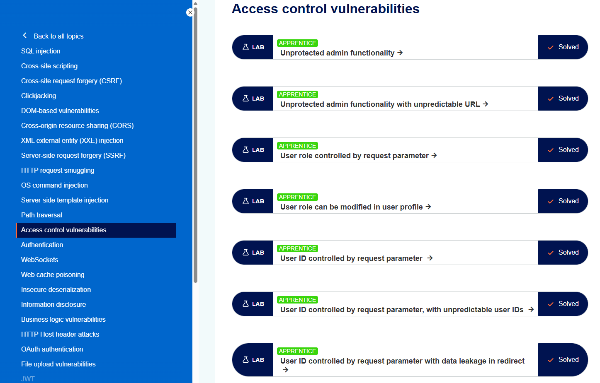

+++
date = '2026-07-06T14:00:00+09:00'
draft = false
title = '[Note] PortSwigger - Access Control 토픽 정리 및 실습'
summary = "Access Control의 세 축과 수직·수평·컨텍스트 분류, 미보호 기능·파라미터 기반·플랫폼 오구성·IDOR·다단계·Referer 등 유형별 우회 경로, 그리고 진단 방법과 대응 방안을 정리한 자료"
toc = true
tags = ["Access Control", "Authorization", "IDOR", "Privilege Escalation", "PortSwigger"]
url = '/note/note-portswigger---access-control-토픽-정리-및-실습/'
+++

---

## 들어가며

Access Control(접근 제어)은 "인증된 사용자가 **무엇을 할 수 있는가**"를 통제하는 취약점 영역이다.  
공격자가 새로운 실행 경로를 여는 것이 아니라, 애플리케이션이 마땅히 걸었어야 할 **권한 검사를 빠뜨린** 지점을 파고든다는 점이 특징이다.

이 글에서는 Access Control의 세 축과 취약점의 분류, 실무에서 관찰되는 유형별 우회 경로, 그리고 진단과 대응 방법을 정리한다.  
유형별 Lab 풀이는 별도의 Write-up으로 정리했으며, 본문 곳곳과 마지막에서 연결한다.

*https://portswigger.net/web-security/access-control*

---

## Access Control이란?

웹 애플리케이션의 접근 제어는 세 가지 개념 위에 선다.

| 축 | 질문 | 역할 |
| --- | --- | --- |
| 인증(Authentication) | 당신은 누구인가? | 사용자가 주장하는 신원을 확인 |
| 세션 관리(Session Management) | 다음 요청도 같은 사용자인가? | 이후 HTTP 요청을 그 사용자와 연결 |
| 인가(Access Control) | 그 행위를 할 권한이 있는가? | 시도하는 행위·리소스의 허용 여부 결정 |

앞의 둘이 갖춰져야 인가가 성립한다. 누구인지 모르면 무엇을 허용할지 정할 수 없기 때문이다. 그래서 접근 제어 결함은 대개 **인증은 통과했는데 인가가 빠진** 형태로 나타난다. 로그인은 정상이지만, 그 사용자가 접근해선 안 될 데이터나 기능에 서버가 아무 검사 없이 응답하는 것이다.

접근 제어가 무너지면 피해는 침해된 권한의 범위를 따른다. 일반 사용자 간이면 서로의 데이터가 열리고, 관리자 기능이 뚫리면 애플리케이션 전체의 통제권이 넘어간다. 특히 한 사용자의 데이터 노출이 관리자 계정 탈취로 이어지면(수평→수직 상승) 파급이 급격히 커진다.

---

## 접근 제어의 분류

| 분류 | 통제 대상 | 예시 |
| --- | --- | --- |
| 수직(Vertical) | 권한 등급이 다른 기능 | 일반 사용자가 관리자 전용 기능에 접근 |
| 수평(Horizontal) | 같은 등급의 다른 사용자 리소스 | 한 사용자가 다른 사용자의 계정·주문을 조회 |
| 컨텍스트 의존(Context-dependent) | 애플리케이션·상호작용의 상태 | 정해진 순서를 건너뛰고 특정 단계를 직접 실행 |

수평 상승이 수직 상승으로 확장되는 경로도 흔하다. IDOR로 임의 사용자의 데이터를 읽을 수 있으면 그 대상을 관리자로 겨눌 수 있고, 관리자의 비밀번호나 세션을 얻는 순간 수직 상승이 완성된다. [password disclosure](/write-up/portswigger/access-control/write-up-portswigger---user-id-controlled-by-request-parameter-with-password-disclosure/) 랩이 그 전형이다.

---

## 취약점 유형과 우회

### 미보호 기능 (Unprotected functionality)

관리자 기능이 URL 뒤에 있는데 그 URL에 권한 검사가 없는 경우다. 링크를 걸지 않아 화면에 안 보인다는 사실만으로 보호되고 있다고 착각한 것이다. 경로는 여러 곳으로 새어 나온다.

| 노출 경로 | 확인 방법 | 관련 실습 |
| --- | --- | --- |
| `robots.txt`·메타데이터 파일 | 크롤러 차단 목록이 역으로 경로를 노출 | [unprotected admin](/write-up/portswigger/access-control/write-up-portswigger---unprotected-admin-functionality/) |
| 클라이언트 자바스크립트 | `admin`·`role` 키워드로 소스 검색, 조건부 링크의 경로 문자열 | [unpredictable URL](/write-up/portswigger/access-control/write-up-portswigger---unprotected-admin-functionality-with-unpredictable-url/) |
| 강제 브라우징(forced browsing) | `/admin`·`/administrator`·`/admin-panel` 등 관례적 경로 대입 | 위 두 랩 |

경로를 예측 불가능한 문자열로 만들어도(`/admin-chaer7`) 은닉일 뿐이다. 애플리케이션이 그 경로를 스스로 노출하는 순간 난이도는 0이 된다.

### 파라미터 기반 접근 제어

역할·권한을 요청에 실린 값으로 판단하는 경우다. 요청은 클라이언트가 통제하므로 값을 바꾸면 권한이 바뀐다.

| 통로 | 페이로드 | 관련 실습 |
| --- | --- | --- |
| 쿠키 | `Admin=false` → `Admin=true` | [role via parameter](/write-up/portswigger/access-control/write-up-portswigger---user-role-controlled-by-request-parameter/) |
| 히든 필드·쿼리 | `?admin=true`, `?role=1` | 위와 동형 |
| Mass assignment | 이메일 변경 요청에 `roleid:2` 추가 | [role in profile](/write-up/portswigger/access-control/write-up-portswigger---user-role-can-be-modified-in-user-profile/) |

공통 원인은 **권한이라는 서버의 상태를 클라이언트 입력으로 표현**한 것이다. Mass assignment에서는 요청에 없던 필드가 응답에 등장하는 것이 결정적 단서가 된다.

### 수평 권한 상승과 IDOR

사용자별 리소스를 클라이언트가 지정한 식별자로 반환하면서, 그 리소스가 요청자의 것인지 확인하지 않는 경우다. IDOR(Insecure Direct Object Reference)은 그중 내부 객체를 직접 참조로 노출한 형태를 가리킨다.

| 식별자·통로 | 우회 | 관련 실습 |
| --- | --- | --- |
| 예측 가능한 `id` 파라미터 | 다른 사용자명으로 치환 | [user id parameter](/write-up/portswigger/access-control/write-up-portswigger---user-id-controlled-by-request-parameter/) |
| GUID | 블로그·프로필 등에 노출된 GUID 수집 | [unpredictable IDs](/write-up/portswigger/access-control/write-up-portswigger---user-id-controlled-by-request-parameter-with-unpredictable-user-ids/) |
| 리다이렉트 본문 | 302 응답에 실려 온 데이터 확인 | [data leakage in redirect](/write-up/portswigger/access-control/write-up-portswigger---user-id-controlled-by-request-parameter-with-data-leakage-in-redirect/) |
| 미리 채워진 비밀번호 | `type=password`의 `value` 속성 노출 | [password disclosure](/write-up/portswigger/access-control/write-up-portswigger---user-id-controlled-by-request-parameter-with-password-disclosure/) |
| 정적 파일명 | 순번 파일(`2.txt` → `1.txt`) 직접 요청 | [IDOR](/write-up/portswigger/access-control/write-up-portswigger---insecure-direct-object-references/) |

GUID처럼 예측이 어려운 식별자도 접근 제어가 되지 못한다. 예측 난이도는 은닉이지 인가가 아니며, 식별자가 어딘가에 한 번이라도 노출되면 그대로 재료가 된다.

### 플랫폼 오구성 (Platform misconfiguration)

접근 제어를 기능 자체가 아니라 앞단(프런트엔드)의 경로·메서드 규칙에 맡긴 경우다. 프런트엔드가 보는 요청과 백엔드가 처리하는 요청을 어긋나게 만들면 규칙이 우회된다.

| 기법 | 요청 | 관련 실습 |
| --- | --- | --- |
| URL 재작성 헤더 | `X-Original-URL: /admin`, `X-Rewrite-URL` | [URL-based](/write-up/portswigger/access-control/write-up-portswigger---url-based-access-control-can-be-circumvented/) |
| 메서드 전환 | `POST` 검사 → `OPTIONS`·`GET`으로 우회 | [method-based](/write-up/portswigger/access-control/write-up-portswigger---method-based-access-control-can-be-circumvented/) |

이는 하나의 요청을 두 컴포넌트가 다르게 해석할 때 그 틈에서 우회가 성립하는, [Path Traversal의 이중 인코딩](/write-up/portswigger/path-traversal/write-up-portswigger---file-path-traversal-traversal-sequences-stripped-with-superfluous-url-decode/)이나 request smuggling과 같은 계열의 문제다.

### URL 매칭 불일치

접근 제어 규칙과 요청 라우팅이 URL을 다르게 정규화하면, 규칙에는 안 걸리면서 같은 핸들러에 도달하는 경로가 생긴다.

- 대소문자: `/admin/deleteUser` ↔ `/ADMIN/DELETEUSER`
- 후행 슬래시: `/admin/deleteUser` ↔ `/admin/deleteUser/`
- Spring `useSuffixPatternMatch`: `/admin/deleteUser.anything`이 `/admin/deleteUser`에 매핑

### 다단계 프로세스

여러 단계로 나뉜 상태 변경에서, 앞 단계에만 권한 검사가 걸리고 마지막 단계는 검사 없이 독립 호출 가능한 경우다. 각 단계는 개별 요청이므로 순서를 건너뛰고 마지막 단계를 직접 보내면 앞 검사를 통과할 일이 없다. [multi-step](/write-up/portswigger/access-control/write-up-portswigger---multi-step-process-with-no-access-control-on-one-step/) 랩이 이 형태다.

### Referer 기반 접근 제어

하위 기능의 접근을 `Referer` 헤더로 판단하는 경우다. `Referer`는 클라이언트가 통제하는 값이므로 위조로 무력화된다. [referer-based](/write-up/portswigger/access-control/write-up-portswigger---referer-based-access-control/) 랩이며, CSRF의 [Referer 검증 우회](/write-up/portswigger/csrf/write-up-portswigger---csrf-with-broken-referer-validation/)와 같은 뿌리다.

### 위치 기반 접근 제어

국가·지역으로 접근을 제한하는 방식은 웹 프록시·VPN, 또는 클라이언트 측 지오로케이션 조작으로 우회된다. 클라이언트가 통제하는 신호를 근거로 삼는다는 점에서 앞선 유형들과 원인이 같다.

---

## 진단 방법

진단은 다음 순서로 진행한다.

1. **접근면을 목록화한다.** 관리자·내부 기능(수직)과 사용자별 리소스(수평)를 나눠 상태 변경·조회 엔드포인트를 모은다.
2. **미보호 기능을 탐색한다.** `robots.txt`·메타데이터 파일, 자바스크립트 소스의 경로 문자열, 강제 브라우징으로 링크되지 않은 기능을 찾는다.
3. **수직 상승을 시도한다.** 권한성 값(쿠키·파라미터·`roleid`)을 변조하고, 메서드 전환(`OPTIONS`·`GET`), `X-Original-URL` 헤더, `Referer` 위조로 관리자 기능에 도달하는지 본다.
4. **수평 상승·IDOR을 시도한다.** 식별자 파라미터·파일명을 다른 사용자 것으로 치환하고, GUID는 노출 지점을 먼저 찾는다. 리다이렉트 응답은 상태 코드가 아니라 본문까지 확인한다.
5. **다단계·컨텍스트를 점검한다.** 확인·완료 단계 요청을 앞 단계 없이 단독으로, 낮은 권한 세션으로 보내 각 단계가 개별 검증되는지 본다.

각 단계의 판단 기준과 다음 시도는 [Access Control Playbook](/playbook/playbook-access-control-%EC%A7%84%EB%8B%A8-cheat-sheet/)에 표로 정리했다.

> 접근 제어 결함은 성공하는 순간 실제 계정·데이터의 상태가 바뀐다. 승인된 테스트 환경과 실습에서만, 되돌릴 수 있는 대상과 본인 계정으로 검증한다.

---

## 대응 방안

- **난독화에 의존하지 않는다.** 경로를 숨기거나 식별자를 예측 불가능하게 만드는 것은 접근 제어가 아니다. 그것들은 정보 노출 한 건으로 무력화된다.
- **기본적으로 거부한다(deny by default).** 공개할 의도가 명확한 리소스가 아니라면 접근을 기본 차단하고, 허용을 명시적으로 선언한다.
- **단일 통합 메커니즘을 쓴다.** 접근 제어를 기능마다 제각각 구현하지 말고 애플리케이션 전역의 단일 메커니즘으로 강제한다. 프런트엔드 경로 필터가 아니라 기능을 실제 수행하는 지점에서 검사한다.
- **코드 레벨에서 강제한다.** 각 리소스가 허용하는 접근을 개발자가 반드시 선언하도록 하고, 선언이 없으면 거부되게 한다.
- **철저히 감사·테스트한다.** 접근 제어가 설계대로 동작하는지 낮은 권한 계정으로 교차 검증한다. 특히 다단계 프로세스는 모든 단계를 개별적으로 확인한다.

핵심은 두 가지다. 첫째, **권한은 서버 세션에만 두고 요청에 실린 어떤 값도 근거로 삼지 않는다.** 쿠키·파라미터·헤더·`Referer`는 모두 클라이언트가 통제하는 입력이다.  
둘째, **검증은 조건이 아니라 행위에 건다.** 메서드·경로 형태·단계 순서 같은 조건에 검증을 걸면, 공격자는 값을 맞출 필요 없이 조건 밖으로 벗어나기만 하면 된다.

---

## 실습

PortSwigger Web Security Academy의 Access Control 랩을 유형별로 풀어 정리했다.  
각 랩의 상세 풀이는 Write-up으로 별도 정리했으며, 아래는 유형별 개요다.

| 유형 | 대표 Lab | 난이도 |
| --- | --- | --- |
| 미보호 기능 | Unprotected admin functionality / with unpredictable URL | APPRENTICE |
| 파라미터 기반 | User role controlled by request parameter / modified in profile | APPRENTICE |
| 수평 상승·IDOR | User ID controlled by request parameter (기본 / GUID / redirect / password / IDOR) | APPRENTICE |
| 플랫폼 오구성 | URL-based / Method-based access control circumvented | PRACTITIONER |
| 다단계 | Multi-step process with no access control on one step | PRACTITIONER |
| Referer 기반 | Referer-based access control | PRACTITIONER |

전체 풀이는 [Access Control Write-up 아카이브](/write-up/portswigger/access-control/)에서 확인할 수 있다.

---

## 마치며

이 글에서는 Access Control의 세 축과 수직·수평·컨텍스트 분류, 미보호 기능·파라미터 기반·플랫폼 오구성·IDOR·다단계·Referer 등 유형별 우회 경로, 진단과 대응 방법을 정리했다.

Access Control은 화려한 익스플로잇의 취약점이 아니다. 서버가 요청마다 물어야 할 "이 사용자가 이 행위를 할 권한이 있는가"라는 질문을 빠뜨린 자리에서 생긴다. 그래서 방어의 방향도 하나로 모인다. 권한을 **위조할 수 없는 서버 세션**에만 두고, 모든 접근면에서 그 권한을 **행위 실행 직전에** 확인하는 것이다.

랩들을 관통하는 교훈은 검증의 유무보다 검증이 걸리는 위치가 중요하다는 점이다. 경로를 숨겨도, 식별자를 어렵게 만들어도, 프런트엔드에서 걸러도, 앞 단계에만 검사를 두어도 — 검증이 실제 행위에 도달하지 못하는 한 우회는 방식만 바꿔 반복된다.  
이 글이 Access Control을 학습하거나 진단을 준비하는 과정에서 하나의 참고 자료로 활용되기를 바란다.

---

> 참고자료  
> https://portswigger.net/web-security/access-control  
> https://owasp.org/Top10/A01_2021-Broken_Access_Control/  
> https://cwe.mitre.org/data/definitions/639.html
