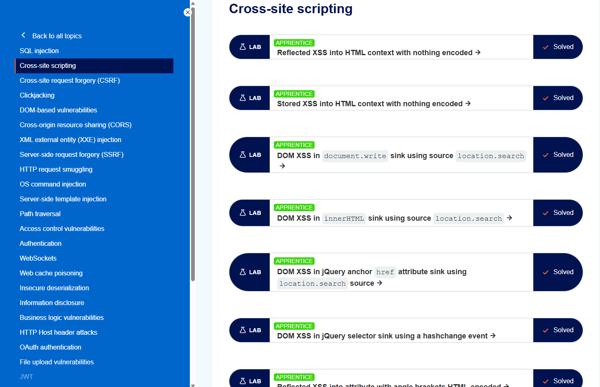

+++
date = '2026-06-10T14:00:00+09:00'
draft = false
title = '[Note] PortSwigger - Cross-Site Scripting(XSS) 토픽 정리 및 실습'
summary = "XSS의 정의와 동작 원리, Reflected·Stored·DOM 기반 세 가지 유형, 공격이 초래하는 영향과 진단 방법, 그리고 CSP를 포함한 대응 방안을 정리한 자료"
toc = true
tags = ["XSS", "PortSwigger", "CSP"]
url = '/note/note-portswigger---cross-site-scriptingxss-토픽-정리/'
+++

---

## 들어가며

Cross-Site Scripting(XSS)은 웹 애플리케이션에서 가장 흔하게 발견되는 취약점 중 하나다.  
공격자가 취약한 사이트를 통해 악성 스크립트를 다른 사용자의 브라우저에서 실행시키는 기법으로, 이름과 달리 대상은 서버가 아니라 애플리케이션을 이용하는 **다른 사용자**다.

이 글에서는 XSS의 기본 정의와 동작 원리, 세 가지 주요 유형, 공격이 초래하는 영향, 그리고 진단과 대응 방법을 정리한다.  
유형별 Lab 풀이는 별도의 Write-up으로 정리했으며, 본문 마지막에서 연결한다.


*https://portswigger.net/web-security*

---

## XSS란?

XSS는 공격자가 사용자와 애플리케이션 사이의 상호작용을 침해할 수 있는 웹 보안 취약점이다.  
서로 다른 웹사이트를 격리하도록 설계된 동일 출처 정책(Same-Origin Policy)을 우회하게 만들어, 공격자가 피해자 사용자로 위장하도록 허용한다.

이를 통해 공격자는 해당 사용자가 수행할 수 있는 모든 행위를 대신 수행하고, 사용자가 접근할 수 있는 모든 데이터를 열람할 수 있다.  
만약 피해자가 애플리케이션 내에서 관리자 같은 높은 권한을 가진 사용자라면, 공격자는 애플리케이션의 전체 기능과 데이터에 대한 통제권까지 확보할 수 있다.

---

## XSS는 어떻게 동작하는가

XSS는 취약한 웹사이트를 조작해, 사용자에게 악성 JavaScript가 반환되도록 만드는 방식으로 동작한다.  
이 악성 코드가 피해자의 브라우저 안에서 실행되는 순간, 공격자는 그 사용자가 애플리케이션과 맺고 있는 상호작용을 완전히 장악할 수 있게 된다.

즉 XSS의 핵심은 "신뢰할 수 없는 입력이 필터링·인코딩 없이 출력에 삽입되어, 데이터가 아니라 실행 가능한 코드로 해석되는 것"에 있다.

> XSS 취약점을 증명(PoC)할 때는 브라우저에서 임의의 JavaScript가 실제로 실행되는지를 확인한다. 전통적으로 짧고 무해하며 성공 여부를 놓치기 어려운 `alert()` 함수를 사용해 왔다. 다만 Chrome 92(2021년 7월) 이후로는 교차 출처 iframe에서 `alert()` 호출이 차단되므로, 이런 상황에서는 `print()` 함수를 대체 PoC로 사용한다.

---

## XSS의 유형

XSS는 악성 스크립트가 어디에서 유입되는지에 따라 크게 세 가지로 나뉜다.

| 유형          | 스크립트 출처                       | 특징                                          |
| ------------- | ----------------------------------- | --------------------------------------------- |
| Reflected XSS | 현재 HTTP 요청                      | 요청에 담긴 입력이 즉시 응답에 반사됨          |
| Stored XSS    | 웹사이트의 데이터베이스             | 저장된 입력이 이후 응답에서 실행됨             |
| DOM-Based XSS | 클라이언트 측 코드(JavaScript)      | 서버가 아닌 브라우저의 DOM 처리 과정에서 발생  |

### Reflected XSS

Reflected XSS는 가장 단순한 형태의 XSS다.  
애플리케이션이 HTTP 요청으로 받은 데이터를 안전하지 않은 방식으로 **즉시 응답에 포함**시킬 때 발생한다.

예를 들어 다음과 같이 요청 파라미터가 그대로 응답에 출력되는 경우를 보자.

```html
https://insecure-website.com/status?message=All+is+well.

<p>Status: All is well.</p>
```

애플리케이션이 이 데이터를 별도로 처리하지 않으므로, 공격자는 파라미터 자리에 스크립트를 넣어 다음과 같은 공격을 구성할 수 있다.

```html
https://insecure-website.com/status?message=<script>/* Bad stuff here... */</script>

<p>Status: <script>/* Bad stuff here... */</script></p>
```

피해자가 공격자가 만든 URL에 접속하면, 스크립트가 해당 사용자의 세션 컨텍스트에서 실행된다.

### Stored XSS

Stored XSS(Persistent XSS 또는 Second-Order XSS)는 애플리케이션이 신뢰할 수 없는 출처의 데이터를 받아 **저장**했다가, 이후 응답에서 안전하지 않은 방식으로 출력할 때 발생한다.

이 데이터는 블로그 댓글, 채팅방 닉네임, 주문서의 연락처처럼 사용자가 직접 제출하는 값일 수도 있고, 웹메일이 표시하는 SMTP 메시지나 모니터링 도구가 표시하는 패킷 데이터처럼 다른 경로에서 유입되는 값일 수도 있다.

예를 들어 사용자들이 남긴 메시지를 다른 사용자에게 보여 주는 게시판이 있다고 하자.

```html
<p>Hello, this is my message!</p>
```

애플리케이션이 입력을 별도로 처리하지 않으면, 공격자는 다른 사용자를 겨냥한 스크립트가 담긴 메시지를 저장할 수 있다.

```html
<p><script>/* Bad stuff here... */</script></p>
```

이후 그 게시글을 조회하는 모든 사용자의 브라우저에서 스크립트가 실행된다는 점이 Reflected XSS와의 결정적 차이다.

### DOM-Based XSS

DOM-Based XSS(DOM XSS)는 클라이언트 측 JavaScript가 신뢰할 수 없는 출처의 데이터를 안전하지 않게 처리할 때, 특히 그 데이터를 DOM에 다시 써 넣을 때 발생한다.  
서버 측 코드가 아니라 브라우저에서 실행되는 코드 자체에 취약점이 존재한다는 점이 앞의 두 유형과 다르다.

예를 들어 입력 필드의 값을 읽어 HTML 요소에 그대로 써 넣는 코드를 보자.

```javascript
var search = document.getElementById('search').value;
var results = document.getElementById('results');
results.innerHTML = 'You searched for: ' + search;
```

공격자가 입력 필드의 값을 제어할 수 있다면, 자신의 스크립트가 실행되도록 만드는 값을 구성할 수 있다.

```html
You searched for: 
```

일반적으로 이 입력 필드는 URL 쿼리 문자열 같은 HTTP 요청의 일부에서 채워지므로, 공격자는 Reflected XSS와 마찬가지로 악성 URL을 통해 공격을 전달할 수 있다.

---

## XSS로 할 수 있는 것

XSS 취약점을 익스플로잇한 공격자는 일반적으로 다음과 같은 행위를 수행할 수 있다.

- 피해자 사용자로 위장하거나 가장
- 해당 사용자가 수행할 수 있는 모든 행위 수행
- 사용자가 접근 가능한 모든 데이터 열람
- 사용자의 로그인 자격 증명 탈취
- 웹사이트 변조(Defacement)
- 웹사이트에 트로이목마 기능 삽입

---

## XSS의 영향

XSS의 실제 영향은 애플리케이션의 성격과 데이터 민감도, 그리고 침해된 사용자의 권한 수준에 따라 크게 달라진다.

- **정적 안내형(Brochureware) 애플리케이션**: 모든 사용자가 익명이고 정보가 공개되어 있다면 영향은 대체로 미미하다.
- **민감 데이터를 다루는 애플리케이션**: 금융 거래, 이메일, 의료 기록 등을 다룬다면 영향은 대체로 심각하다.
- **높은 권한을 가진 사용자가 침해된 경우**: 공격자가 애플리케이션 전체를 장악하고 모든 사용자와 데이터를 침해할 수 있어 영향은 치명적이다.

---

## XSS 진단 방법

대부분의 XSS 취약점은 Burp Suite의 웹 취약점 스캐너로 빠르고 안정적으로 탐지할 수 있다. 수동 진단의 접근은 유형에 따라 다르다.

Reflected·Stored XSS의 수동 진단은, 애플리케이션의 모든 입력 지점에 짧은 고유 문자열(예: 임의의 영숫자 조합)을 넣고, 그 값이 HTTP 응답에서 어느 위치에 반환되는지 확인한 뒤, 각 위치에서 적절히 조작한 입력으로 임의의 JavaScript를 실행시킬 수 있는지 개별적으로 검증하는 과정이다. 이를 통해 XSS가 발생하는 **컨텍스트**를 파악하고, 그에 맞는 페이로드를 선택한다.

URL 파라미터에서 비롯되는 DOM-Based XSS도 유사하다. 파라미터에 고유 입력을 넣고 브라우저 개발자 도구로 DOM에서 그 입력을 검색한 뒤, 각 위치가 익스플로잇 가능한지 확인한다.  
다만 `document.cookie` 같은 비(非) URL 기반 입력이나 `setTimeout` 같은 비 HTML 기반 싱크(sink)에서 발생하는 DOM XSS는 탐지가 훨씬 어려워, JavaScript 코드를 직접 검토하는 것 외에는 대안이 없는 경우가 많다.

---

## 관련 주제

### Content Security Policy(CSP)

CSP는 XSS를 비롯한 일부 취약점의 영향을 완화하기 위한 브라우저 메커니즘이다.  
CSP를 적용한 애플리케이션에 XSS 유사 동작이 존재하더라도 CSP가 익스플로잇을 방해하거나 차단할 수 있다. 다만 CSP 자체를 우회해 기저의 취약점을 익스플로잇할 수 있는 경우도 많다.

### Dangling Markup Injection

입력 필터나 방어 기제 때문에 완전한 XSS 익스플로잇이 불가능한 상황에서, 교차 도메인으로 데이터를 탈취하기 위해 사용하는 기법이다.  
다른 사용자에게 노출되는 민감 정보를 캡처하는 데 자주 활용되며, 여기에는 사용자를 대신해 비인가 행위를 수행하는 데 쓰일 수 있는 CSRF 토큰도 포함된다.

---

## 대응 방안

XSS 방어는 단순한 경우도 있지만, 애플리케이션의 복잡도와 사용자 입력 처리 방식에 따라 훨씬 까다로워질 수 있다. 일반적으로는 다음 조치들을 조합해 대응한다.

- **입력값 도착 시 필터링**: 입력을 받는 시점에 예상되거나 유효한 형태를 기준으로 가능한 한 엄격하게 필터링한다.
- **출력 시 인코딩**: 사용자가 제어 가능한 데이터를 응답에 출력하는 시점에, 그 데이터가 실행 가능한 콘텐츠로 해석되지 않도록 인코딩한다. 출력 컨텍스트에 따라 HTML·URL·JavaScript·CSS 인코딩을 조합해야 한다.
- **적절한 응답 헤더 사용**: HTML이나 JavaScript를 담을 의도가 없는 응답에는 `Content-Type`과 `X-Content-Type-Options` 헤더를 사용해 브라우저가 응답을 의도한 대로 해석하게 한다.
- **Content Security Policy**: 마지막 방어선으로 CSP를 적용해, 그럼에도 남아 있는 XSS의 심각도를 낮춘다.

핵심은 **출력 인코딩**이 컨텍스트에 좌우된다는 점이다. 같은 값이라도 HTML 본문, 속성 값, `<script>` 블록 내부, URL 파라미터 중 어디에 출력되는지에 따라 필요한 인코딩이 달라진다.

---

## 실습

PortSwigger Web Security Academy의 XSS 랩을 유형별로 풀어 정리했다.
각 랩의 상세 풀이는 Write-up으로 별도 정리했으며, 아래는 유형별 개요다.

| 유형                         | 대표 Lab                                                    | 난이도                    |
| ---------------------------- | ----------------------------------------------------------- | ------------------------- |
| 기본 Reflected·Stored XSS    | HTML context with nothing encoded                           | APPRENTICE                |
| DOM-Based XSS                | document.write / innerHTML / jQuery sink                     | APPRENTICE · PRACTITIONER |
| HTML·JavaScript 컨텍스트     | attribute / JavaScript string / template literal            | APPRENTICE · PRACTITIONER |
| 태그·속성 필터 우회          | most tags blocked / SVG markup allowed                      | PRACTITIONER              |
| 공격 영향 확장               | stealing cookies / capturing passwords / bypassing CSRF     | PRACTITIONER              |
| AngularJS 샌드박스 탈출      | sandbox escape without strings / sandbox escape with CSP    | EXPERT                    |
| CSP·Dangling Markup 우회     | strict CSP with dangling markup / CSP policy injection      | PRACTITIONER · EXPERT     |

전체 풀이는 [XSS Write-up 아카이브](/write-up/portswigger/xss/)에서 확인할 수 있다.

---

## 마치며

이 글에서는 XSS의 정의와 동작 원리, Reflected·Stored·DOM 기반 세 유형, 공격의 영향과 진단·대응 방법을 정리했다.  
XSS는 SQL Injection이 서버 측 데이터베이스를 노리는 것과 달리, 다른 사용자를 겨냥하는 **클라이언트 측 취약점**이라는 점이 가장 큰 특징이다.

세 유형 모두 "신뢰할 수 없는 입력이 코드로 해석되는" 동일한 뿌리에서 출발하지만, 스크립트가 유입되는 경로와 발생 위치가 다르기 때문에 진단·대응 접근도 달라진다.  
특히 실제 진단에서는 취약점을 어느 위치에서 어떤 컨텍스트로 실행할 수 있는지를 정확히 파악하는 것이 페이로드 선택의 출발점이 되므로, 유형과 컨텍스트를 함께 이해해 두는 것이 도움이 된다.

---

> 참고자료  
> https://portswigger.net/web-security/cross-site-scripting  
> https://portswigger.net/web-security/cross-site-scripting/reflected  
> https://portswigger.net/web-security/cross-site-scripting/stored  
> https://portswigger.net/web-security/cross-site-scripting/dom-based  
> https://portswigger.net/web-security/cross-site-scripting/preventing
