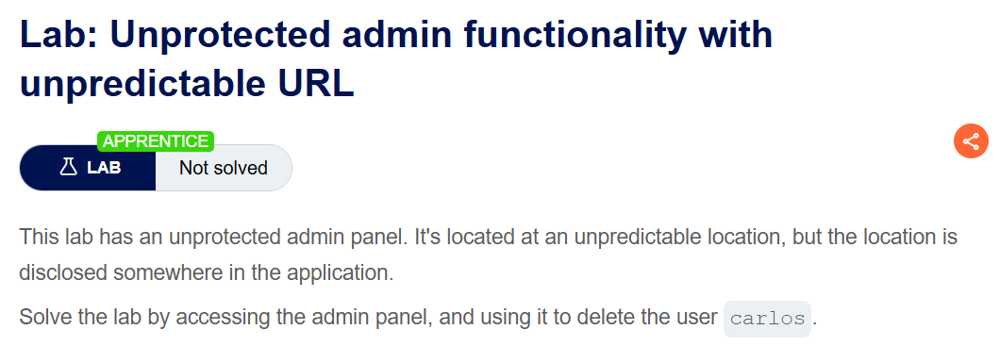
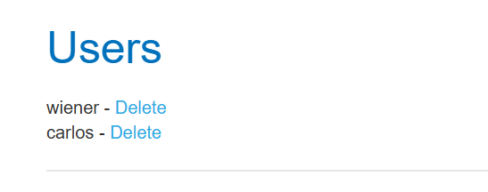
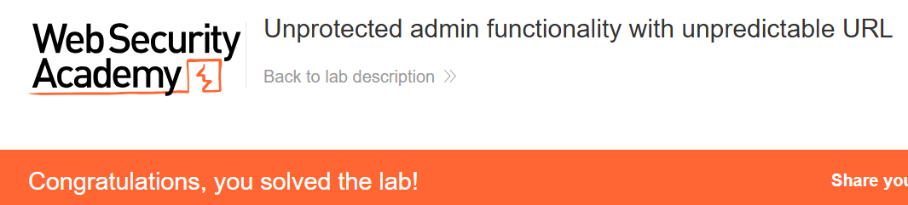

+++
url = '/write-up/portswigger/access-control/write-up-portswigger---unprotected-admin-functionality-with-unpredictable-url/'
date = '2026-07-02T12:00:00+09:00'
draft = false
title = '[Write-up] PortSwigger - Unprotected admin functionality with unpredictable URL'
summary = "예측 불가능한 관리자 패널 경로를 클라이언트 자바스크립트 소스에서 찾아내 접근하는 Access Control 풀이"
toc = true
tags = ["Access Control", "Authorization", "Forced Browsing", "Information Disclosure", "PortSwigger", "Apprentice"]
+++

---

## 문제 분석

> **난이도**: `APPRENTICE`  
> **Lab**: [Unprotected admin functionality with unpredictable URL](https://portswigger.net/web-security/access-control/lab-unprotected-admin-functionality-with-unpredictable-url)

> 

관리자 패널이 보호되지 않지만 예측할 수 없는 위치에 존재한다. 다만 그 위치가 애플리케이션 어딘가에 공개되어 있다고 하며, 이를 찾아 `carlos` 사용자를 삭제하면 문제가 해결된다.

### Access Control 진단

앞선 랩과 달리 이번에는 경로가 관례적이지 않다. 먼저 `robots.txt`를 요청해 보면 존재하지 않는다. 메타데이터 파일에는 노출되어 있지 않다는 뜻이다.

문제에서 경로가 "애플리케이션 어딘가에 공개되어 있다"고 했으므로, 서버가 아니라 **클라이언트로 내려온 코드**를 의심한다. 페이지 HTML과 자바스크립트에서 `admin` 문자열을 검색한다.

```html
<script>
var isAdmin = false;
if (isAdmin) {
   var topLinksTag = document.getElementsByClassName("top-links")[0];
   var adminPanelTag = document.createElement('a');
   adminPanelTag.setAttribute('href', '/admin-chaer7');
   adminPanelTag.innerText = 'Admin panel';
   topLinksTag.append(adminPanelTag);
   var pTag = document.createElement('p');
   pTag.innerText = '|';
   topLinksTag.appendChild(pTag);
}
</script>
```

이 스크립트 블록이 관리자 패널 링크를 동적으로 만드는 코드다. `isAdmin`이 `true`일 때만 링크를 생성하도록 되어 있지만, **생성 여부와 무관하게 경로 문자열 `/admin-chaer7`은 코드에 그대로 박혀 있다.** 조건이 거짓이라 화면에 링크가 안 그려질 뿐, 경로는 모든 방문자에게 전달된 셈이다.

---

## 익스플로잇

소스에서 얻은 경로로 접근하면 사용자 관리 패널이 열린다.

```text
GET /admin-chaer7 HTTP/2
Host: <lab-id>.web-security-academy.net
```



`carlos` 사용자를 삭제하면 문제가 해결된다.



---

## 정리

경로를 무작위 문자열(`-chaer7`)로 만든 것은 앞선 랩의 `robots.txt` 노출보다 한 단계 나아간 은닉이다. 그러나 여전히 은닉일 뿐 접근 제어가 아니다. 관리자 패널 자체에는 권한 검사가 없고, 경로만 어렵게 만들어 두었다.

핵심 결함은 **권한 판단이 클라이언트에서 이루어진다**는 데 있다. `if (isAdmin)`는 브라우저에서 실행되는 조건이고, 서버는 그 링크를 누가 볼 수 있는지 관여하지 않는다. 클라이언트로 내려간 코드는 그 안의 모든 문자열과 분기를 공격자가 그대로 읽을 수 있으므로, 링크를 숨기는 로직은 곧 경로를 알려 주는 로직이 된다. 이는 정보 노출(information disclosure)이 접근 제어 우회의 발판이 되는 전형적인 형태다.

진단에서는 관리자 기능이 짐작되는데 메타데이터 파일이 비어 있다면, **응답으로 내려오는 HTML·자바스크립트 전체에서 `admin`, `role`, `panel`, `internal` 같은 키워드를 검색**하는 습관이 유효하다. 조건부로만 노출되는 링크, 주석 처리된 경로, API 엔드포인트 목록이 여기서 자주 발견된다.

방어는 조건을 클라이언트가 아니라 **서버에서** 판단하고, 관리자 경로 자체에 권한 검사를 두는 것이다. 링크를 그리느냐 마느냐는 UI 편의일 뿐 보안 경계가 될 수 없다. 관련 개념은 [Access Control Note](/note/note-portswigger---access-control-%ED%86%A0%ED%94%BD-%EC%A0%95%EB%A6%AC-%EB%B0%8F-%EC%8B%A4%EC%8A%B5/)에 정리했다.
