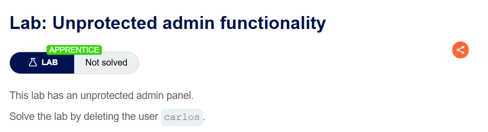
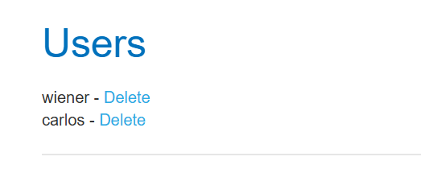
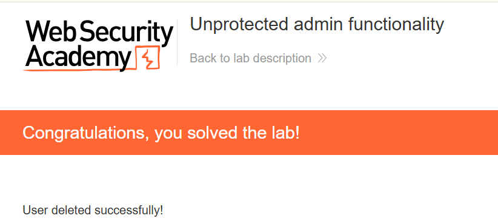

+++
url = '/write-up/portswigger/access-control/write-up-portswigger---unprotected-admin-functionality/'
date = '2026-07-02T09:00:00+09:00'
draft = false
title = '[Write-up] PortSwigger - Unprotected admin functionality'
summary = "robots.txt에 노출된 관리자 패널 경로로 직접 접근해 사용자를 삭제하는 기본 Access Control 풀이"
toc = true
tags = ["Access Control", "Authorization", "Forced Browsing", "PortSwigger", "Apprentice"]
+++

---

## 문제 분석

> **난이도**: `APPRENTICE`  
> **Lab**: [Unprotected admin functionality](https://portswigger.net/web-security/access-control/lab-unprotected-admin-functionality)

> 

관리자 패널이 아무런 접근 제어 없이 노출되어 있다. 패널을 찾아 `carlos` 사용자를 삭제하면 문제가 해결된다.

### Access Control 진단

관리자 패널이 존재한다는 것은 알지만 그 경로는 화면 어디에도 링크되어 있지 않다. 먼저 해야 할 일은 **경로를 찾는 것**이고, 이는 인증이 아니라 콘텐츠 탐색(content discovery)의 영역이다.

수동 탐색에서 가장 먼저 확인하는 지점은 사이트가 스스로 노출하는 메타데이터 파일들이다.

- `robots.txt`, `sitemap.xml`, `security.txt`, `humans.txt`, `crossdomain.xml`, `clientaccesspolicy.xml`
- `/.well-known/` 하위(`change-password`, `assetlinks.json`, `apple-app-site-association` 등)

이 중 `robots.txt`는 크롤러에게 "수집하지 말라"고 알리는 파일인데, 역설적으로 **감추고 싶은 경로를 그대로 적어 두는** 곳이기도 하다.

```text
User-agent: *
Disallow: /administrator-panel
```

`Disallow` 항목에 관리자 패널 경로 `/administrator-panel`이 그대로 드러나 있다.

---

## 익스플로잇

찾아낸 경로로 직접 접근하면 인증 절차 없이 사용자 관리 화면이 열린다.

```text
GET /administrator-panel HTTP/2
Host: <lab-id>.web-security-academy.net
```



패널에서 `carlos` 사용자를 삭제하면 문제가 해결된다.



---

## 정리

이 랩은 수직 권한 상승(vertical privilege escalation)의 가장 단순한 형태다. 관리자 기능이 URL 하나 뒤에 있고, 그 URL에 도달하는 요청에 **아무런 권한 검사가 걸려 있지 않다.** 링크를 걸지 않아 화면에 안 보인다는 사실만으로 보호되고 있다고 착각한 것이다.

이런 방식을 보안 관점에서 **난독화에 의존한 접근 제어(security by obscurity)**라고 부른다. 경로를 숨기는 것은 접근 제어가 아니다. 접근 제어는 "이 사용자가 이 행위를 할 권한이 있는가"를 요청마다 확인하는 것이고, 경로의 은닉 여부와는 무관하다. 숨긴 경로는 `robots.txt`·자바스크립트 소스·에러 메시지·백업 파일 등 수많은 경로로 새어 나온다. 이 랩에서는 하필 그것을 숨기려고 만든 파일이 노출 경로가 됐다.

진단 관점에서 남는 습관은 하나다. 관리자·내부 기능이 있으리라 짐작되면 **먼저 `robots.txt`와 사이트가 자동 생성하는 메타데이터 파일부터 확인**한다. 강제 브라우징(forced browsing)으로 `/admin`, `/administrator`, `/admin-panel` 같은 관례적 경로를 대입하는 것도 병행한다.

방어는 반대 방향이어야 한다. 경로를 숨기는 대신, 공개할 의도가 없는 모든 리소스는 **기본적으로 접근을 거부(deny by default)**하고 관리자 권한을 명시적으로 확인해야 한다. 접근 제어 유형과 진단 흐름 전반은 [Access Control Note](/note/note-portswigger---access-control-%ED%86%A0%ED%94%BD-%EC%A0%95%EB%A6%AC-%EB%B0%8F-%EC%8B%A4%EC%8A%B5/)와 [Access Control Playbook](/playbook/playbook-access-control-%EC%A7%84%EB%8B%A8-cheat-sheet/)에 정리했다.
