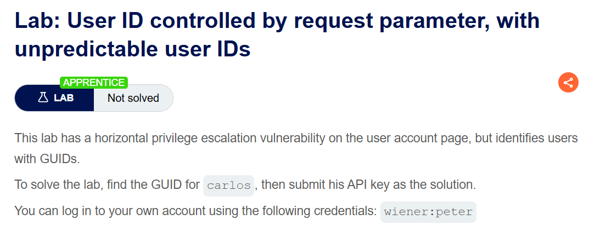
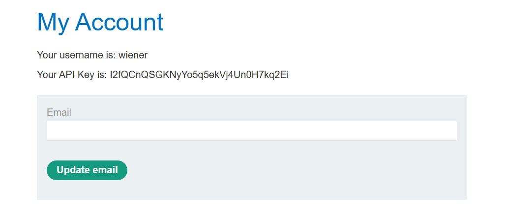
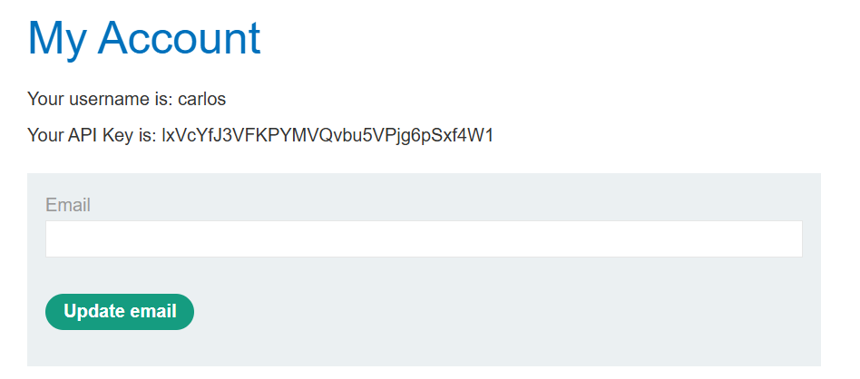
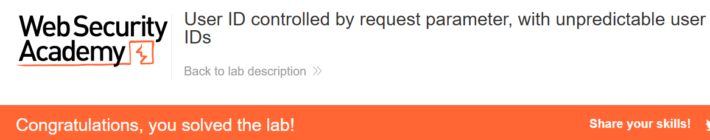

+++
url = '/write-up/portswigger/access-control/write-up-portswigger---user-id-controlled-by-request-parameter-with-unpredictable-user-ids/'
date = '2026-07-03T12:00:00+09:00'
draft = false
title = '[Write-up] PortSwigger - User ID controlled by request parameter, with unpredictable user IDs'
summary = "GUID로 사용자를 식별하는 IDOR에서, 블로그 작성자 링크에 노출된 대상의 GUID를 수집해 API Key를 탈취하는 풀이"
toc = true
tags = ["Access Control", "IDOR", "Information Disclosure", "PortSwigger", "Apprentice"]
+++

---

## 문제 분석

> **난이도**: `APPRENTICE`  
> **Lab**: [User ID controlled by request parameter, with unpredictable user IDs](https://portswigger.net/web-security/access-control/lab-user-id-controlled-by-request-parameter-with-unpredictable-user-ids)

> 

사용자 계정 페이지에 수평 권한 상승 취약점이 존재하지만, 사용자를 GUID로 식별한다. `carlos`의 GUID를 찾아 API Key를 획득해 제출하면 문제가 해결된다. 실습 계정은 `wiener:peter`다.

### Access Control 진단

실습 계정으로 로그인하면 계정 페이지에서 API Key를 확인할 수 있다.



이때 계정 페이지 요청은 `/my-account?id=fff59b90-2d60-448a-b91f-3e4042a3dcca` 형태로, 앞선 랩의 사용자명 대신 **GUID(UUID v4)**를 식별자로 쓴다. 구조는 IDOR 그대로지만 `carlos`로 바꿔 넣을 값을 모른다는 점이 다르다. UUID v4는 122비트 난수라 대입으로 알아내는 것은 사실상 불가능하므로, **그 값이 어딘가에 노출된 지점**을 찾아야 한다.

사이트를 둘러보면 블로그 글 조회 페이지에서 작성자 계정 링크가 사용자 GUID를 그대로 담고 있다.

```html
<span id="blog-author">
<a href="/blogs?userId=416ad36d-3c1c-435f-9232-02d00d86fb8a">administrator</a>
</span>
```

각 사용자의 GUID로 그가 작성한 글 목록을 보여 주는 기능이며, 이 링크가 GUID 노출 경로가 된다.

---

## 익스플로잇

`carlos`의 GUID를 얻으려면 `carlos`가 작성한 글의 작성자 링크를 확인한다.

```html
<span id="blog-author">
<a href="/blogs?userId=1c7e9576-441a-4a38-b09b-2704c729f1dd">carlos</a>
</span>
```

`carlos`가 쓴 글에서 GUID `1c7e9576-441a-4a38-b09b-2704c729f1dd`를 얻고, 이 값을 계정 페이지 요청에 넣는다.

```http
GET /my-account?id=1c7e9576-441a-4a38-b09b-2704c729f1dd HTTP/2
Host: <lab-id>.web-security-academy.net
Cookie: session=<session>
```



`carlos`의 계정 페이지가 열리며 API Key가 노출된다. 이 값을 제출하면 문제가 해결된다.



---

## 정리

이 랩이 던지는 질문은 "예측 불가능한 식별자는 접근 제어가 될 수 있는가"이다. 답은 아니오다. GUID는 앞선 랩의 순차 사용자명보다 추측하기 어렵지만, 어렵다는 것은 은닉이지 인가가 아니다. 애플리케이션이 그 GUID를 **다른 곳에서 스스로 노출**하는 순간 난이도는 0이 된다.

여기서 노출 경로는 블로그 작성자 링크였다. 사용자를 식별하는 값이 URL·API 응답·HTML 속성 어디든 한 번이라도 등장하면, 공격자는 그것을 수집해 IDOR의 재료로 쓴다. 즉 결함의 본질은 앞선 랩과 동일한 인가 누락이고, GUID는 그 위에 덧씌운 은닉막일 뿐이다. 은닉막은 정보 노출 한 건으로 걷힌다.

진단에서는 식별자가 GUID여서 IDOR을 포기하지 말고, 그 GUID가 노출되는 지점을 먼저 찾는다. 프로필·작성 글·댓글·공유 링크·API의 사용자 목록 응답이 흔한 노출처다. 대상 사용자가 남긴 흔적(글·댓글)을 따라가면 그의 식별자에 도달하는 경우가 많다.

방어는 두 겹이다. 우선 접근 제어를 식별자의 예측 난이도가 아니라 **세션 기반 인가**로 세운다. 그리고 사용자 식별자를 불필요하게 노출하지 않는다 — 화면에 필요한 것은 표시 이름이지 내부 GUID가 아니다. 예측 가능한 식별자를 쓰는 기본형은 [User ID controlled by request parameter](/write-up/portswigger/access-control/write-up-portswigger---user-id-controlled-by-request-parameter/)에서 다뤘다.
