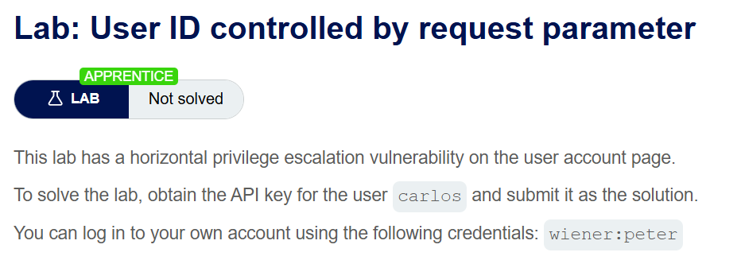
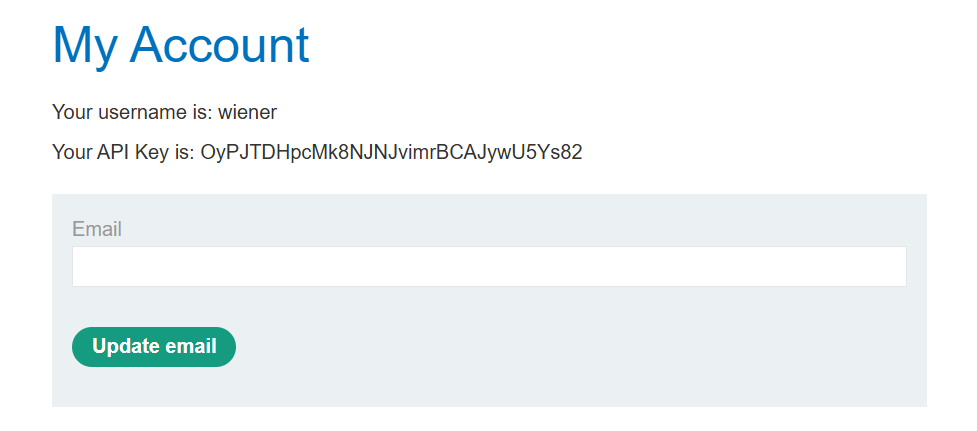
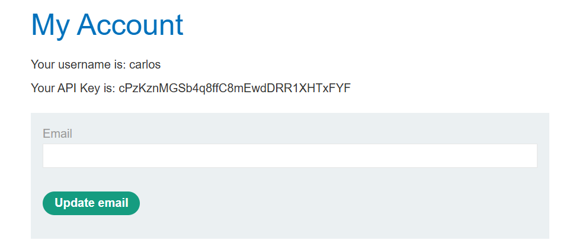
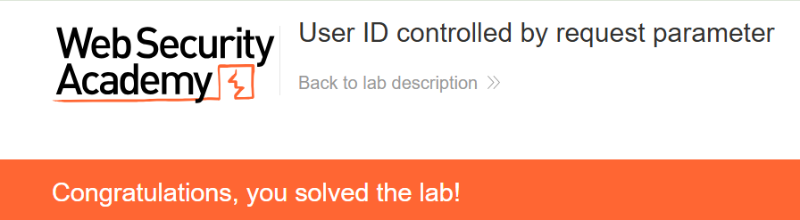

+++
url = '/write-up/portswigger/access-control/write-up-portswigger---user-id-controlled-by-request-parameter/'
date = '2026-07-03T09:00:00+09:00'
draft = false
title = '[Write-up] PortSwigger - User ID controlled by request parameter'
summary = "my-account의 id 파라미터를 다른 사용자로 바꿔 API Key를 탈취하는 수평 권한 상승(IDOR) 풀이"
toc = true
tags = ["Access Control", "IDOR", "Privilege Escalation", "Parameter Tampering", "PortSwigger", "Apprentice"]
+++

---

## 문제 분석

> **난이도**: `APPRENTICE`  
> **Lab**: [User ID controlled by request parameter](https://portswigger.net/web-security/access-control/lab-user-id-controlled-by-request-parameter)

> 

사용자 계정 페이지에 수평 권한 상승(horizontal privilege escalation) 취약점이 존재한다. `carlos` 사용자의 API Key를 획득해 제출하면 문제가 해결된다. 실습 계정은 `wiener:peter`다.

### Access Control 진단

실습 계정으로 로그인하면 계정 페이지에서 자신의 API Key를 확인할 수 있다.



이때 계정 페이지 요청을 보면 `/my-account?id=wiener` 형태로 **사용자를 id 파라미터로 지정**하고 있다. 서버가 이 값을 그대로 믿고 해당 사용자의 데이터를 돌려준다면, 값을 다른 사용자로 바꾸는 것만으로 남의 계정을 열 수 있다.

---

## 익스플로잇

`id` 파라미터를 `wiener`에서 `carlos`로 바꿔 요청한다.

```http
GET /my-account?id=carlos HTTP/2
Host: <lab-id>.web-security-academy.net
Cookie: session=<session>
```



`carlos`의 계정 페이지가 열리며 API Key가 노출된다. 이 값을 제출하면 문제가 해결된다.



---

## 정리

이 랩은 IDOR(Insecure Direct Object Reference), 즉 안전하지 않은 직접 객체 참조의 전형이다. 서버는 요청자가 누구인지(`session` 쿠키)는 알고 있으면서도, **어떤 사용자의 데이터를 반환할지를 세션이 아니라 `id` 파라미터로 결정**했다. 인증은 통과했지만 인가(authorization)가 빠진 것이다.

앞선 수직 상승 랩들이 "일반 사용자가 관리자 기능에 접근"하는 문제였다면, 이번은 "한 사용자가 같은 등급인 다른 사용자의 데이터에 접근"하는 수평 상승이다. 등급을 넘지 않으므로 더 눈에 덜 띄지만, 사용자 수만큼의 데이터가 서로에게 열려 있다는 점에서 파급은 오히려 넓다.

결함의 뿌리는 앞선 파라미터 랩들과 동일하다 — 서버가 판단해야 할 것(누구의 데이터인가)을 클라이언트 입력(`id`)이 결정했다. 진단에서는 사용자별 리소스를 다루는 요청에 **식별자 파라미터가 노출되는지** 확인하고, 그 값을 다른 사용자의 것으로 바꿔 접근이 허용되는지 본다. 계정 페이지, 주문 조회, 메시지함처럼 "내 것"을 보여 주는 모든 기능이 후보다.

방어는 반환할 데이터를 **파라미터가 아니라 세션에 연결된 사용자로 결정**하는 것이다. `id`를 굳이 받아야 한다면, 그 `id`가 현재 세션 사용자의 것인지 서버가 매 요청 검증해야 한다. 식별자가 예측 불가능한 GUID일 때의 변형은 [with unpredictable user IDs](/write-up/portswigger/access-control/write-up-portswigger---user-id-controlled-by-request-parameter-with-unpredictable-user-ids/)에서 다룬다.
