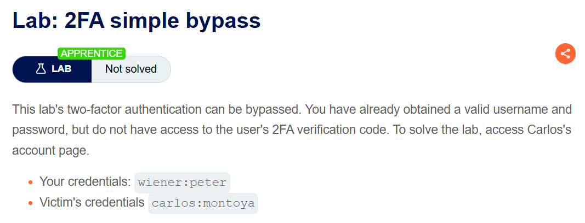
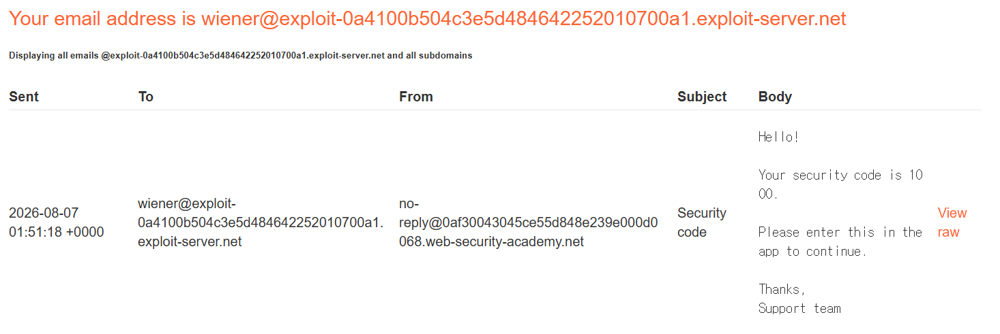
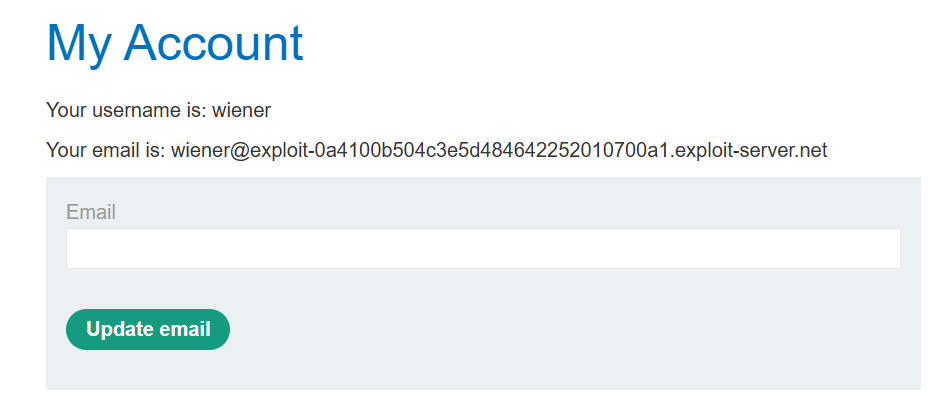
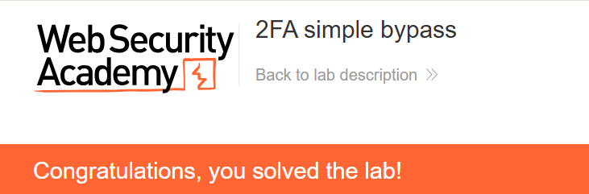

+++
url = '/write-up/portswigger/authentication/write-up-portswigger---2fa-simple-bypass/'
date = '2026-07-08T12:00:00+09:00'
draft = false
title = '[Write-up] PortSwigger - 2FA simple bypass'
summary = "2단계 인증을 거치지 않고 인증 이후 페이지로 바로 접근해 2FA를 통째로 건너뛰는 기본 Authentication 풀이"
toc = true
tags = ["Authentication", "Multi-Factor Authentication", "Broken Logic", "PortSwigger", "Apprentice"]
+++

---

## 문제 분석

> **난이도**: `APPRENTICE`  
> **Lab**: [2FA simple bypass](https://portswigger.net/web-security/authentication/multi-factor/lab-2fa-simple-bypass)

> 

이 랩은 2단계 인증(2FA)을 우회할 수 있다. 유효한 username·password는 이미 알고 있지만 대상 사용자의 2단계 코드에는 접근할 수 없다. `carlos`의 계정 페이지에 접근하면 문제가 해결된다. 실습 계정은 `wiener:peter`, 대상 계정은 `carlos:montoya`다.

### Authentication 진단

먼저 본인 계정 `wiener`로 로그인하면 비밀번호 입력 이후 2단계 코드를 요구한다. 기본적으로 `wiener` 계정의 Email client 접근이 가능해 코드를 받을 수 있다.



여기서 2단계 인증을 진행하지 않고 계정 페이지(`/my-account`)로 바로 이동을 시도해 본다. 그런데 **2FA를 거치지 않았는데도 계정 페이지가 정상적으로 열린다.**



즉 서버는 로그인(1단계)만 마치면 세션을 인증된 것으로 취급하고, 2단계 완료 여부를 최종 리소스 접근에서 검사하지 않는다.

---

## 익스플로잇

대상 계정 `carlos:montoya`로 로그인하면 2FA 코드 입력 화면으로 넘어가는데, 코드를 입력하지 않고 곧바로 `/my-account`로 이동한다.

```http
GET /my-account HTTP/2
Host: <lab-id>.web-security-academy.net
Cookie: session=<carlos-session-after-login>
```

2단계를 건너뛴 채 `carlos`의 계정 페이지에 접근되며 문제가 해결된다.



---

## 정리

이 랩은 MFA 우회의 가장 단순한 형태다. 결함의 본질은 **2단계 인증이 접근을 실제로 통제하지 못하고 화면 흐름으로만 존재**한다는 점이다. 로그인에 성공한 순간 세션은 이미 완전히 인증된 상태가 되고, 2FA 페이지는 그저 다음 화면일 뿐 강제되는 관문이 아니다. 그래서 그 화면을 지나치기만 하면 코드 없이도 보호된 리소스에 닿는다.

핵심은 다단계 인증에서 **각 단계의 완료 상태가 서버 세션에 저장되고, 이후 접근에서 그 상태가 검증되어야** 한다는 것이다. 2단계를 통과하지 않은 세션은 "부분 인증" 상태로 묶여, 계정 페이지 같은 최종 리소스 접근이 거부되어야 한다. 이 랩은 그 검사가 통째로 빠져, 1단계만으로 모든 것이 열린다.

이는 [Access Control의 다단계 프로세스](/write-up/portswigger/access-control/write-up-portswigger---multi-step-process-with-no-access-control-on-one-step/) 결함과 같은 계열이다. 정해진 순서를 전제로 설계하면서 마지막(혹은 중간) 단계를 독립적으로 검증하지 않으면, 공격자는 그 순서를 지키지 않고 원하는 지점에 바로 도달한다. 진단에서는 2FA 화면이 뜨는 즉시 코드를 입력하지 않고 인증 이후 엔드포인트에 직접 접근해 본다. 검증이 로직에 더 깊이 얽힌 형태는 [2FA broken logic](/write-up/portswigger/authentication/write-up-portswigger---2fa-broken-logic/)에서 다룬다.
