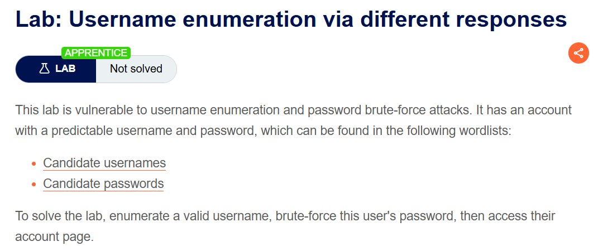
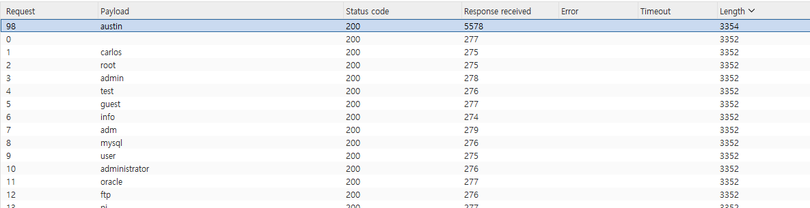
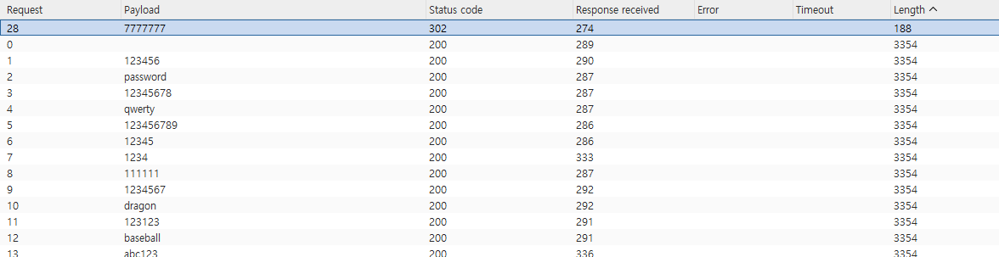
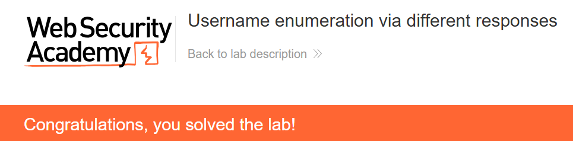

+++
url = '/write-up/portswigger/authentication/write-up-portswigger---username-enumeration-via-different-responses/'
date = '2026-07-08T09:00:00+09:00'
draft = false
title = '[Write-up] PortSwigger - Username enumeration via different responses'
summary = "로그인 실패 응답이 username 유효 여부에 따라 다른 점을 이용해 유효 계정을 열거하고, 이어 비밀번호를 브루트포스해 로그인하는 기본 Authentication 풀이"
toc = true
tags = ["Authentication", "Username Enumeration", "Brute Force", "PortSwigger", "Apprentice"]
+++

---

## 문제 분석

> **난이도**: `APPRENTICE`  
> **Lab**: [Username enumeration via different responses](https://portswigger.net/web-security/authentication/password-based/lab-username-enumeration-via-different-responses)

> 

이 랩은 username 열거와 비밀번호 브루트포스에 취약하다. 예측 가능한 username·password를 가진 계정이 존재하며, PortSwigger가 제공하는 [username 후보](https://portswigger.net/web-security/authentication/auth-lab-usernames)와 [password 후보](https://portswigger.net/web-security/authentication/auth-lab-passwords) 목록에서 찾을 수 있다. 유효한 username을 특정하고 그 계정의 비밀번호를 알아내 로그인하면 문제가 해결된다.

### Authentication 진단

먼저 로그인 요청을 보내 원본을 확보한다.

```http
POST /login HTTP/2
Host: <lab-id>.web-security-academy.net
Content-Type: application/x-www-form-urlencoded

username=a&password=a
```

존재하지 않는 계정으로 요청하면 응답에 `Invalid username`이 표시된다. 응답이 **username의 유효 여부에 따라 달라진다**는 뜻이고, 이 차이 하나로 유효한 계정을 걸러낼 수 있다.

---

## 익스플로잇

username 자리에 후보 목록을 대입해 자동 요청을 보내고, 응답 길이 순으로 정렬한다.



유효하지 않은 username의 응답 길이는 모두 3352로 동일한데, `austin`만 3354로 다르다. 해당 응답 본문을 열어 보면 `Invalid username`이 아니라 `Incorrect password`가 반환된다 — **username은 맞았고 비밀번호만 틀렸다**는 신호다. 유효 계정을 `austin`으로 특정한다.

이제 username을 `austin`으로 고정하고 주입 위치를 password로 옮겨 후보 목록을 대입한다.



`7777777`에서만 응답이 달라진다(로그인 성공 리다이렉트). 확인한 `austin:7777777`으로 로그인하면 문제가 해결된다.



---

## 정리

이 랩은 username 열거의 가장 단순한 형태다. 애플리케이션이 로그인 실패를 두 종류로 나누어 답한 것 — 존재하지 않는 계정에는 `Invalid username`, 존재하는 계정에는 `Incorrect password` — 이 배려가 곧 취약점이 된다. 공격자는 이 차이를 오라클 삼아, 비밀번호를 모르는 채로 유효한 계정 목록을 먼저 확정한다.

여기서 열거와 브루트포스는 분리된 두 단계다. 열거는 "누가 존재하는가"를, 브루트포스는 "그 계정의 비밀번호는 무엇인가"를 푼다. 계정을 하나로 좁히고 나면 브루트포스의 탐색 공간은 비밀번호 후보 크기로 줄어든다. 만약 실패 응답이 유효 여부와 무관하게 동일했다면, 공격자는 username과 password를 곱한 훨씬 큰 공간을 뒤져야 했을 것이다.

진단에서는 유효·무효 계정의 실패 응답을 나란히 놓고 **메시지·응답 길이·상태 코드·리다이렉트·응답 시간**의 차이를 본다. 메시지가 같아 보여도 응답 길이가 몇 바이트 다르면 그 자체가 신호다. 방어는 반대로, 로그인 실패를 항상 **동일한 메시지·형태·시간**으로 반환해 관찰 가능한 차이를 없애는 것이다. 같은 열거가 더 미묘한 형태로 숨는 경우는 [subtly different responses](/write-up/portswigger/authentication/write-up-portswigger---username-enumeration-via-subtly-different-responses/)에서 다룬다. 인증 취약점 전반은 [Authentication Note](/note/note-portswigger---authentication-%ED%86%A0%ED%94%BD-%EC%A0%95%EB%A6%AC-%EB%B0%8F-%EC%8B%A4%EC%8A%B5/)와 [Authentication Playbook](/playbook/playbook-authentication-%EC%A7%84%EB%8B%A8-cheat-sheet/)에 정리했다.
