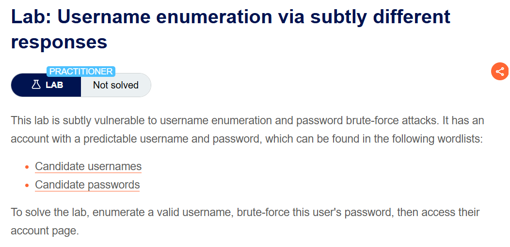
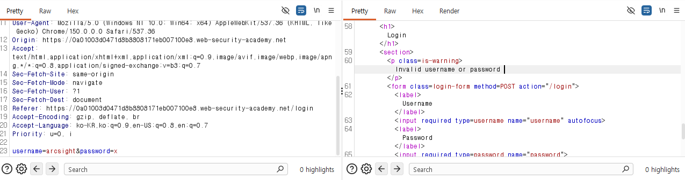
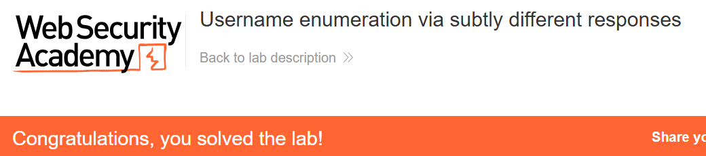

+++
url = '/write-up/portswigger/authentication/write-up-portswigger---username-enumeration-via-subtly-different-responses/'
date = '2026-07-08T18:00:00+09:00'
draft = false
title = '[Write-up] PortSwigger - Username enumeration via subtly different responses'
summary = "실패 메시지의 마침표 유무 같은 미세한 차이를 Turbo Intruder의 Anomaly Rank로 잡아 유효 계정을 열거하고 로그인하는 Authentication 풀이"
toc = true
tags = ["Authentication", "Username Enumeration", "Brute Force", "PortSwigger", "Practitioner"]
+++

---

## 문제 분석

> **난이도**: `PRACTITIONER`  
> **Lab**: [Username enumeration via subtly different responses](https://portswigger.net/web-security/authentication/password-based/lab-username-enumeration-via-subtly-different-responses)

> 

이 랩도 username 열거와 비밀번호 브루트포스에 취약하지만, 앞선 랩과 달리 응답 차이가 **한눈에 보이지 않는다.** [username 후보](https://portswigger.net/web-security/authentication/auth-lab-usernames)와 [password 후보](https://portswigger.net/web-security/authentication/auth-lab-passwords)를 이용해 유효 계정으로 로그인하면 문제가 해결된다.

### Authentication 진단

로그인에 실패하면 `Invalid username or password.` 응답이 온다. 존재하지 않는 계정도, 존재하는 계정도 겉으로는 같은 메시지를 돌려주는 것처럼 보인다. 이럴 때는 눈이 아니라 도구로 차이를 잡아야 한다.

Turbo Intruder로 username 후보 전체에 요청을 보낸다. 사용한 스크립트는 다음과 같다.

```python
# Find more example scripts at https://github.com/PortSwigger/turbo-intruder/blob/master/resources/examples/default.py
def queueRequests(target, wordlists):
    engine = RequestEngine(endpoint=target.endpoint,
                           concurrentConnections=2,
                           requestsPerConnection=50,
                           pipeline=False,
                           engine=Engine.THREADED,
                           maxRetriesPerRequest=3
                           )

    for word in open(r'C:\Users\cas\Desktop\CAS\asset\word.txt'):
        engine.queue(target.req, word.rstrip())

def handleResponse(req, interesting):
    table.add(req)
```

Turbo Intruder는 각 응답에 `Anomaly Rank`(다른 응답들과 얼마나 다른지를 나타내는 점수)를 매긴다. 이 점수가 가장 높은 응답을 보면 `arcsight` 계정에서만 문구가 미묘하게 다르다 — 다른 응답은 `Invalid username or password.`인데, `arcsight`만 끝에 **마침표가 없는** `Invalid username or password`가 반환된다.



사람 눈에는 거의 구분되지 않는 이 한 글자 차이가 유효 계정을 특정하는 신호다.

---

## 익스플로잇

주입 위치를 password로 바꾸고 동일한 스크립트로 다시 브루트포스한다. 결과에서 `1234`만 302 응답을 돌려준다.

확인한 `arcsight:1234`로 로그인하면 문제가 해결된다.



---

## 정리

이 랩은 [different responses](/write-up/portswigger/authentication/write-up-portswigger---username-enumeration-via-different-responses/) 랩과 원리가 같지만, 차이가 **의도적으로 미세하게** 숨겨져 있다는 점이 다르다. 개발자가 실패 메시지를 통일하려다 한 곳에서 마침표를 빠뜨렸고, 그 사소한 불일치가 그대로 열거 오라클이 된다. 열거를 막으려면 메시지 문자열뿐 아니라 응답의 모든 관찰 가능한 속성 — 길이·공백·상태 코드·시간 — 이 완전히 동일해야 한다.

실무적 교훈은 **"응답이 같아 보인다"를 눈으로 판단하지 않는다**는 것이다. 수백 개의 응답을 사람이 비교할 수는 없으므로, Turbo Intruder의 Anomaly Rank나 Burp Intruder의 응답 길이·grep-match 정렬로 이상치를 기계적으로 찾는다. 이 랩처럼 차이가 한 글자면 길이 정렬로도 잡히지만, 차이가 바이트 수까지 같으면 diff 기반 anomaly 점수가 필요하다.

방어는 [different responses](/write-up/portswigger/authentication/write-up-portswigger---username-enumeration-via-different-responses/)와 동일하다 — 실패 응답을 문자 단위까지 동일하게 만들고, 유효 계정에서만 비밀번호 검증이 도는 시간 차이도 함께 제거한다. 시간으로 새는 경우는 [response timing](/write-up/portswigger/authentication/write-up-portswigger---username-enumeration-via-response-timing/)에서 다룬다.
