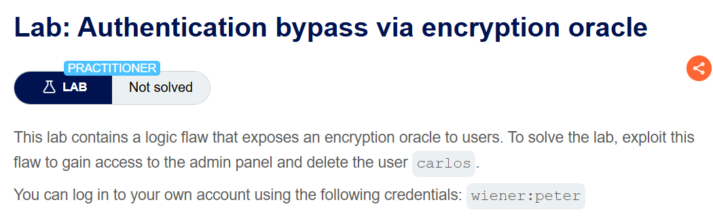
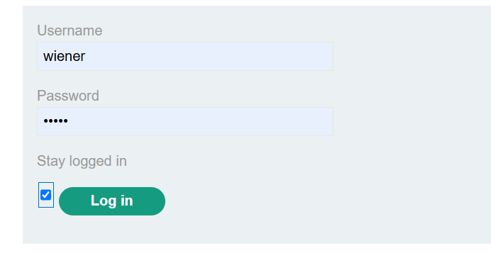
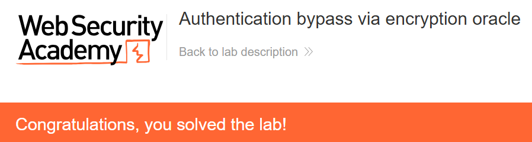

+++
date = '2026-09-11T21:40:00+09:00'
draft = false
title = '[Write-up] PortSwigger - Authentication bypass via encryption oracle'
summary = "알림 쿠키의 암·복호화 기능으로 관리자용 stay-logged-in 값을 만들고 인증을 우회하는 Business Logic 풀이"
toc = true
tags = ["Business Logic", "Encryption Oracle", "Authentication Bypass", "PortSwigger", "Practitioner"]
+++

---

## 문제 분석

> **난이도**: `PRACTITIONER`  
> **Lab**: [Authentication bypass via encryption oracle](https://portswigger.net/web-security/logic-flaws/examples/lab-logic-flaws-authentication-bypass-via-encryption-oracle)

> 

이 랩은 사용자가 제어할 수 있는 암호화 오라클을 노출한다. 이를 이용해 관리자 패널에 접근하고 `carlos`를 삭제하면 문제가 해결된다. 실습 계정은 `wiener:peter`다.

### Business Logic 진단

로그인 화면에는 Stay logged in 기능이 있다.



이 기능을 선택하면 로그인 요청에 다음 값이 추가되고, 응답은 암호화된 `stay-logged-in` 쿠키를 설정한다.

```text
csrf=<csrf>&username=wiener&password=peter&stay-logged-in=on
```

```http
Set-Cookie: stay-logged-in=7tP4IQTtV576tJB9OnoB6IdcKOeKwEpgIoUMoMxZmGM%3d
```

`session` 쿠키가 없어도 이 쿠키만 있으면 계정에 접근할 수 있다. 암호문 자체로는 평문 형식을 알 수 없으므로, 같은 사이트의 다른 기능을 살펴본다.

댓글에 잘못된 이메일 주소를 제출하면 응답이 암호화된 `notification` 쿠키를 설정하고, 다음 게시물 응답은 그 쿠키를 복호화해 오류를 표시한다. `stay-logged-in` 값을 `notification` 쿠키에 넣어 보내면 다음 평문이 나타난다.

```html
<header class="notification-header">
    wiener:<timestamp>
</header>
```

인증 쿠키의 평문 형식은 `username:timestamp`다. 예시의 `<timestamp>`에는 현재 인스턴스의 쿠키를 복호화해 확인한 타임스탬프를 사용한다. 댓글 이메일 기능은 입력을 암호화하고 알림 기능은 쿠키를 복호화하므로, 두 기능을 조합하면 원하는 인증 평문에 대응하는 암호문을 만들 수 있다.

---

## 익스플로잇

댓글의 잘못된 이메일 주소를 암호화하면 서버가 평문 앞에 `Invalid email address: `를 붙인다. 마지막 공백까지 포함한 이 접두사는 **23바이트**다.

원하는 값은 다음과 같다.

```text
administrator:<timestamp>
```

접두사만 제거한 암호문은 길이 오류를 일으킨다.

```html
<p class=is-warning>Input length must be multiple of 16 when decrypting with padded cipher</p>
```

이 응답으로 필요한 경계가 16바이트 단위임을 확인할 수 있다. 접두사 23바이트 뒤에 임의의 9바이트를 더하면 제거할 앞부분이 정확히 32바이트가 된다. 이메일에는 다음 값을 넣는다.

```text
123456789administrator:<timestamp>
```

응답의 `notification` 쿠키를 Burp Decoder로 옮겨 다음 순서로 처리한다.

1. URL 디코딩한다.
2. Base64 디코딩해 원시 바이트를 얻는다.
3. 원시 바이트의 처음 32바이트를 삭제한다.
4. 남은 바이트를 Base64 인코딩한 뒤 URL 인코딩한다.

변환한 값을 `notification` 쿠키로 보내면 접두사 없이 다음 값만 복호화된다.

```text
administrator:<timestamp>
```

이 암호문을 `stay-logged-in` 쿠키에 넣고 기존 `session` 쿠키는 제거한다. 관리자 계정으로 인식된 상태에서 `/admin`에 접근해 `carlos`를 삭제하면 문제가 해결된다.



---

## 정리

비밀키를 알아내거나 암호 알고리즘을 깨뜨린 것이 아니다. 알림 기능이 공격자가 고른 평문을 암호화하고 다시 복호화해 주며, 인증 기능도 같은 형식의 암호문을 받아들인 것이 원인이다. 16바이트 오류는 변환에 필요한 블록 경계만 보여줄 뿐, 이 관찰만으로 구체적인 암호화 모드나 padding oracle을 단정할 수는 없다.

민감한 토큰은 용도별로 키나 컨텍스트를 분리하고 무결성을 검증해야 한다. 알림용 암호문이 인증용 쿠키로 재사용되어서는 안 되며, 장기 로그인 토큰은 서버가 발급·검증하는 추측 불가능한 값으로 관리해야 한다. 기능 간 암호문 비교 절차는 [Business Logic Playbook](/playbook/business-logic/)에 정리했다.
