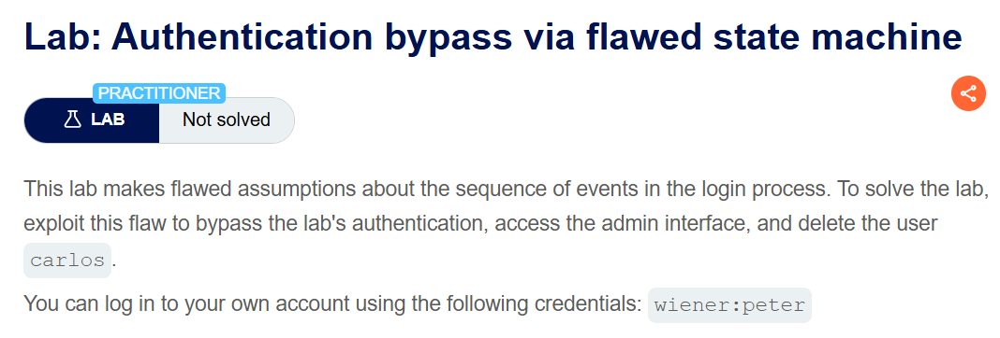
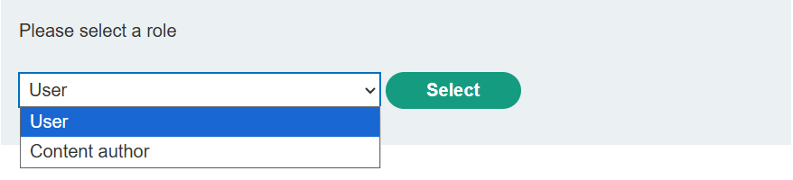
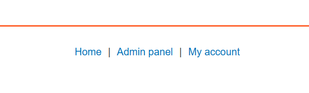
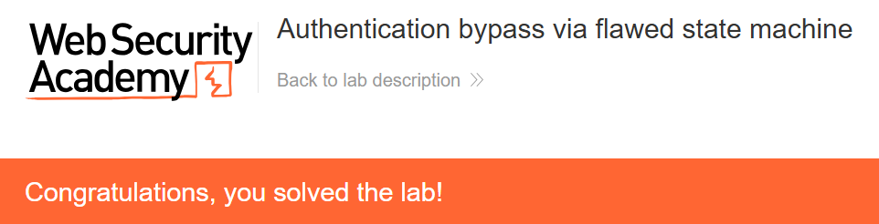

+++
date = '2026-09-04T22:00:00+09:00'
draft = false
title = '[Write-up] PortSwigger - Authentication bypass via flawed state machine'
summary = "로그인 성공 직후 GET /role-selector를 중단해 역할 제한이 적용되기 전의 기본 관리자 상태로 접근하는 Business Logic 풀이"
toc = true
tags = ["Business Logic", "State Machine", "Authentication Bypass", "PortSwigger", "Practitioner"]
+++

---

## 문제 분석

> **난이도**: `PRACTITIONER`  
> **Lab**: [Authentication bypass via flawed state machine](https://portswigger.net/web-security/logic-flaws/examples/lab-logic-flaws-authentication-bypass-via-flawed-state-machine)

> 

이 랩은 로그인 과정의 이벤트 순서를 잘못 가정한다. 인증 흐름을 우회해 관리자 인터페이스에 접근하고 `carlos`를 삭제하면 문제가 해결된다. 실습 계정은 `wiener:peter`다.

### Business Logic 진단

실습 계정으로 로그인하면 곧바로 홈 화면으로 이동하지 않고 역할 선택 화면이 나타난다.



역할을 고르면 다음 요청이 전송된다.

```http
POST /role-selector HTTP/2
Host: <lab-id>.web-security-academy.net
Cookie: session=<session>
Content-Type: application/x-www-form-urlencoded

role=content-author&csrf=<csrf>
```

`role`을 `admin`이나 `administrator`로 바꿔도 권한은 달라지지 않는다. `/admin`을 직접 요청하면 관리자만 사용할 수 있다는 응답이 돌아온다.

역할 제출값을 변조하는 문제가 아니라 로그인과 역할 확정 사이의 상태가 의심된다. 정상 흐름을 다시 보면 `POST /login`이 성공한 다음 브라우저가 `GET /role-selector`를 요청하고, 이후 사용자가 역할을 제출한다. 그렇다면 **역할 선택 화면으로 진입하는 요청 자체를 건너뛸 때** 세션이 어떤 기본 상태로 남는지 확인할 수 있다.

---

## 익스플로잇

로그아웃한 뒤 Proxy intercept를 켜고 다시 로그인한다. 자격증명이 담긴 `POST /login`은 서버로 전달해 로그인을 성공시킨다. 그다음 발생하는 요청은 다음과 같다.

```http
GET /role-selector HTTP/2
Host: <lab-id>.web-security-academy.net
Cookie: session=<session>
```

이 `GET /role-selector` 요청을 Drop하고 홈페이지로 이동한다. 역할 제한을 적용하는 단계가 실행되지 않아 세션이 기본 `administrator` 역할로 남고, Admin panel에 접근할 수 있다.



관리자 인터페이스에서 `carlos`를 삭제하면 문제가 해결된다.



---

## 정리

서버는 로그인 성공 시점에 세션을 먼저 인증된 관리자 상태로 만들고, 뒤의 역할 선택 단계에서 권한을 낮췄다. 공격자가 `GET /role-selector`를 중단하자 후속 전이가 일어나지 않았고, 안전하지 않은 기본 상태가 그대로 노출됐다.

단계형 인증은 각 중간 상태에 최소 권한을 부여해야 한다. 역할이 확정되기 전에는 보호 기능에 접근할 수 없어야 하며, 이후 요청도 역할 확정 상태를 서버에서 확인해야 한다. 구매 단계가 같은 이유로 분리된 사례는 [Insufficient workflow validation](/write-up/portswigger/business-logic/insufficient-workflow-validation/)에서 다룬다.
