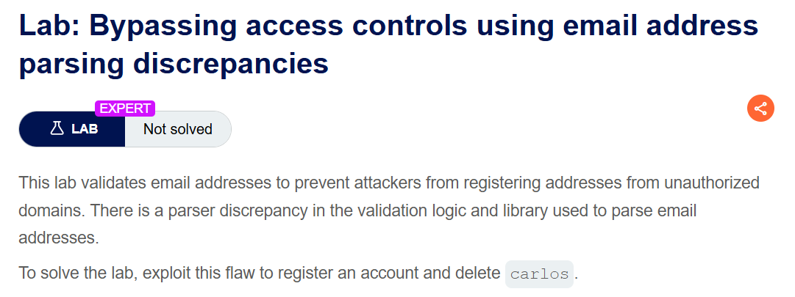
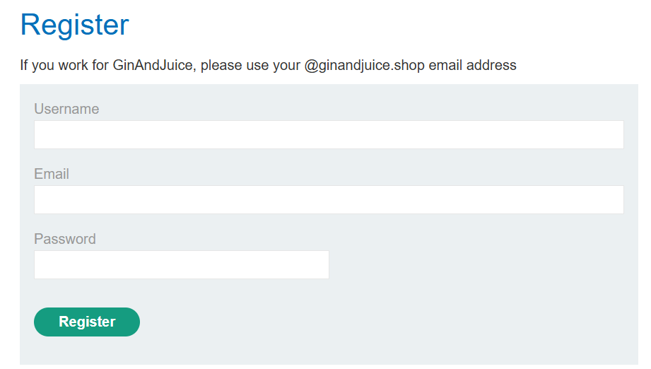
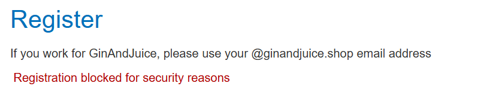
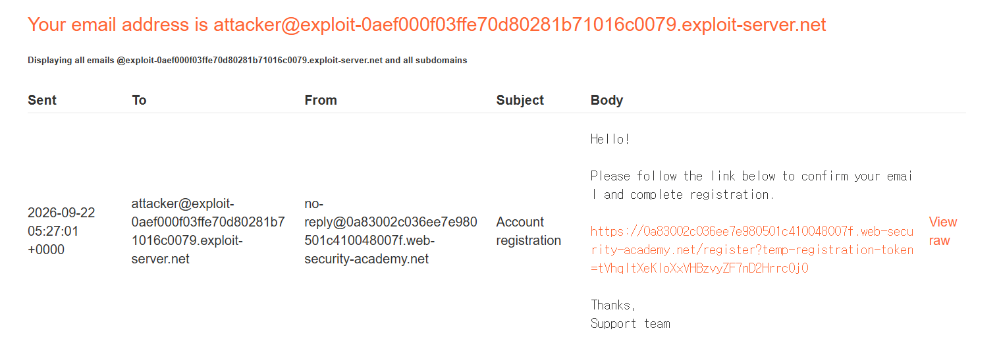
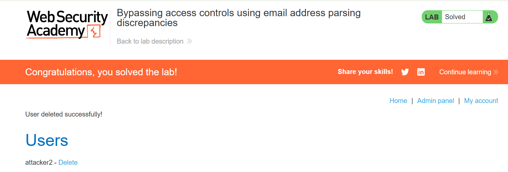

+++
date = '2026-09-14T20:20:00+09:00'
draft = false
title = '[Write-up] PortSwigger - Bypassing access controls using email address parsing discrepancies'
summary = "Encoded-word와 UTF-7 계열 디코딩 차이로 조직 도메인 검증은 통과하고 확인 메일은 외부 주소로 받아 관리자 권한을 얻는 Business Logic 풀이"
toc = true
tags = ["Business Logic", "Email Parsing", "Encoded-Word", "Access Control", "PortSwigger", "Expert"]
+++

---

## 문제 분석

> **난이도**: `EXPERT`  
> **Lab**: [Bypassing access controls using email address parsing discrepancies](https://portswigger.net/web-security/logic-flaws/examples/lab-logic-flaws-bypassing-access-controls-using-email-address-parsing-discrepancies)

> 

이 랩은 이메일 도메인을 검사하는 로직과 실제 주소를 처리하는 라이브러리가 같은 입력을 다르게 해석한다. 계정을 등록해 관리자 패널에 접근하고 `carlos`를 삭제하면 문제가 해결된다.

### Business Logic 진단

회원가입 화면은 `@ginandjuice.shop` 이메일 주소만 허용한다고 안내한다.



일반 외부 주소로 가입하면 `Only emails with the ginandjuice.shop domain are allowed`가 출력된다. 먼저 PortSwigger Research의 [Splitting the Email Atom](https://portswigger.net/research/splitting-the-email-atom)에 나온 encoded-word 탐색 방식을 적용한다.

```text
=?utf-8?q?=61=62=63?=example@ginandjuice.shop
```

UTF-8이나 ISO-8859-1 encoded-word는 보안상 차단된다.



charset을 UTF-7로 바꾼 다음 입력은 같은 차단 오류를 일으키지 않는다.

```text
=?utf-7?q?&AGEAYgBj-?=example@ginandjuice.shop
```

검증기는 입력 끝의 허용 도메인을 기준으로 판단하지만, 메일 처리기는 `=?charset?q?...?=` 형식의 encoded-word를 디코딩한다. 두 구성 요소가 디코딩 전후의 서로 다른 주소를 보고 있는 것이다.

여기서 사용하는 `&AEA-`와 `&ACA-`는 이 랩의 디코더가 각각 `@`와 공백으로 받아들이는 표현이다. 일반적인 표준 UTF-7의 shift 표기는 `+...-`이므로, `&...-` 형태의 수용은 해당 디코더의 수정된 처리 방식으로 구분해야 한다.

---

## 익스플로잇

실습의 외부 메일 주소가 `attacker@exploit-0aef000f03ffe70d80281b71016c0079.exploit-server.net`이라면 다음 값을 등록 요청에 넣는다.

```text
=?utf-7?q?attacker&AEA-exploit-0aef000f03ffe70d80281b71016c0079.exploit-server.net&ACA-?=@ginandjuice.shop
```

검증 단계에서는 전체 문자열이 `@ginandjuice.shop`으로 끝나므로 조직 도메인 조건을 통과한다. 이후 메일 처리기가 encoded-word를 해석하면 `&AEA-`는 `@`, `&ACA-`는 공백이 된다. 그 결과 실제 확인 메일은 앞쪽의 외부 실습 주소로 전달되고, 뒤의 허용 도메인 부분은 수신 주소로 사용되지 않는다.



도착한 링크로 계정을 활성화하고 등록한 계정으로 로그인하면 Admin panel에 접근할 수 있다. 관리자 인터페이스에서 `carlos`를 삭제해 문제를 해결한다.



---

## 정리

이 랩은 이메일 문자열에 허용 도메인이 보이는지의 문제가 아니라, **검증기가 확인한 수신자와 메일 처리기가 선택한 수신자가 달랐던 문제**다. encoded-word와 문자셋 디코딩이 적용되는 시점의 차이로 외부 사용자가 조직 이메일 소유자로 인정됐다.

이메일을 권한 근거로 사용할 때는 검증·저장·발송 전 과정이 동일하게 정규화된 하나의 주소를 사용해야 한다. 특정 인코딩 문자열만 차단하는 방식은 다른 파서 동작을 놓칠 수 있으며, 구현에서 관찰한 디코딩 결과를 표준 전체의 동작으로 일반화해서도 안 된다. 입력과 실제 수신자를 비교하는 절차는 [Business Logic Playbook](/playbook/business-logic/)에 정리했다.
