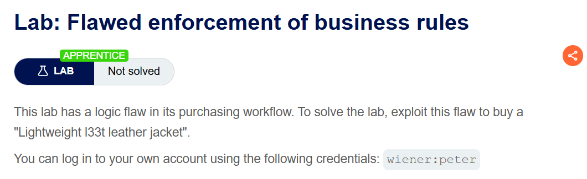
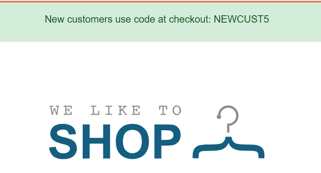
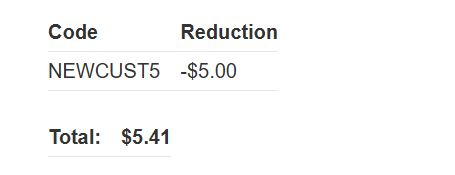
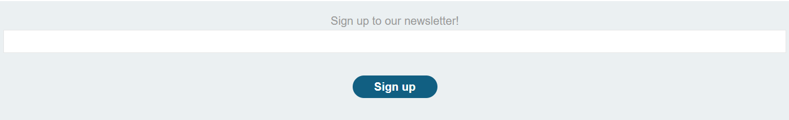
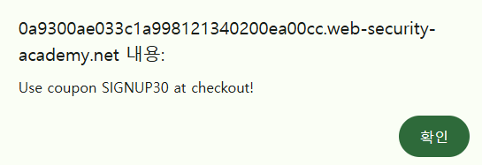
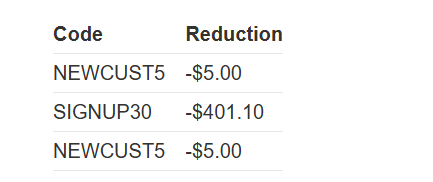
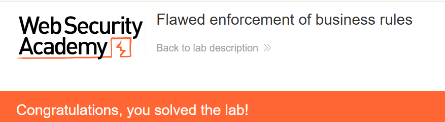

+++
date = '2026-08-18T20:40:00+09:00'
draft = false
title = '[Write-up] PortSwigger - Flawed enforcement of business rules'
summary = "같은 쿠폰의 연속 사용만 막는 검증을 두 쿠폰의 교차 적용으로 우회하는 Business Logic 풀이"
toc = true
tags = ["Business Logic", "Coupon Abuse", "PortSwigger", "Apprentice"]
+++

---

## 문제 분석

> **난이도**: `APPRENTICE`  
> **Lab**: [Flawed enforcement of business rules](https://portswigger.net/web-security/logic-flaws/examples/lab-logic-flaws-flawed-enforcement-of-business-rules)

> 

이 랩은 구매 과정에 로직 결함이 있다. 이를 이용해 `Lightweight l33t leather jacket`을 구매하면 문제가 해결된다. 실습 계정은 `wiener:peter`다.

### Business Logic 진단

페이지 상단에는 신규 고객이 결제 시 `NEWCUST5` 코드를 사용하라는 안내가 있다.



먼저 저렴한 상품으로 구매 흐름을 확인한다. Add to cart를 누르면 상품 번호와 수량을 전송한다.

```http
POST /cart HTTP/2
Host: <lab-id>.web-security-academy.net
Cookie: session=<session>
Content-Type: application/x-www-form-urlencoded

productId=5&redir=PRODUCT&quantity=1
```

결제는 CSRF 토큰을 포함한 `POST /cart/checkout`에서 처리되고, 이후 `GET /cart/order-confirmation?order-confirmed=true`로 이동한다.

장바구니의 쿠폰 입력란에 `NEWCUST5`를 넣으면 다음 요청이 발생한다.

```http
POST /cart/coupon HTTP/2
Host: <lab-id>.web-security-academy.net
Cookie: session=<session>
Content-Type: application/x-www-form-urlencoded

csrf=<csrf-token>&coupon=NEWCUST5
```

쿠폰이 적용되면 총액에서 `$5`가 빠진다. 이후 결제 절차는 기존과 같다.



같은 쿠폰을 다시 적용하면 `Coupon already applied`라는 경고가 나온다. 이 결과만 보면 쿠폰을 한 번만 사용할 수 있는 것으로 보인다.

다른 기능을 살펴보면 페이지 하단에 뉴스레터 가입란이 있다.



여기에 이메일을 입력하고 Sign up을 누르면 `SIGNUP30`이라는 새 쿠폰을 받는다.



이제 `NEWCUST5` 다음에 `SIGNUP30`을 적용하고, 다시 `NEWCUST5`를 입력해 본다. 같은 쿠폰을 연속으로 적용했을 때와 달리 다시 할인이 반영된다.



화면에는 `NEWCUST5`의 `$5` 할인이 두 번 기록되어 있다. 따라서 서버가 막는 것은 이미 사용한 쿠폰 전체의 재사용이 아니라, 바로 앞과 같은 쿠폰을 연속으로 제출하는 경우로 보인다.

---

## 익스플로잇

재킷을 장바구니에 담고 `NEWCUST5`와 `SIGNUP30`을 번갈아 적용한다.

```text
NEWCUST5 → SIGNUP30 → NEWCUST5 → SIGNUP30 → …
```

두 코드를 바꿔 가며 제출하면 중복 사용 경고를 피하면서 할인 금액이 누적된다. 총액이 남은 잔액 이내가 될 때까지 적용한 뒤 Place order를 누르면 문제가 해결된다.



---

## 정리

서로 다른 쿠폰 두 개가 함께 적용된다는 사실만으로 재사용 결함이 입증되지는 않는다. 이 랩에서 결정적인 결과는 **다른 쿠폰을 사이에 넣자 이미 쓴 쿠폰이 다시 적용된 것**이다.

쿠폰별 사용 제한을 지키려면 해당 주문에서 사용한 쿠폰 이력을 기준으로 검증해야 한다. 직전에 입력한 코드와만 비교하면 요청 순서를 바꾸는 것만으로 제한을 우회할 수 있다.
