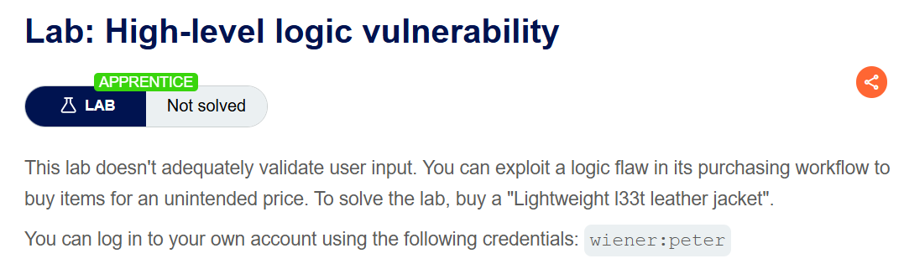
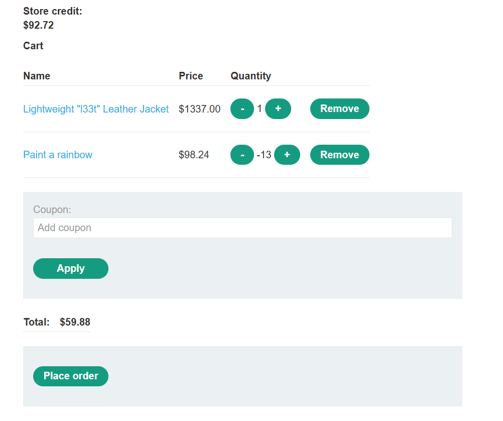
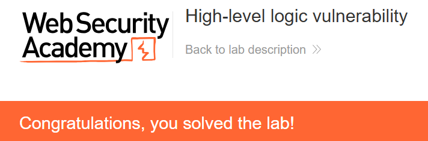

+++
date = '2026-08-11T21:30:00+09:00'
draft = false
title = '[Write-up] PortSwigger - High-level logic vulnerability'
summary = "음수 수량의 상품으로 장바구니 합계를 낮춰 잔액보다 비싼 재킷을 구매하는 Business Logic 풀이"
toc = true
tags = ["Business Logic", "Input Validation", "PortSwigger", "Apprentice"]
+++

---

## 문제 분석

> **난이도**: `APPRENTICE`  
> **Lab**: [High-level logic vulnerability](https://portswigger.net/web-security/logic-flaws/examples/lab-logic-flaws-high-level)

> 

이 랩은 구매 과정의 입력 검증에 결함이 있다. 이를 이용해 `Lightweight l33t leather jacket`을 구매하면 문제가 해결된다. 실습 계정은 `wiener:peter`다.

### Business Logic 진단

로그인하면 초기 잔액은 `$100`이고 재킷 가격은 `$1337`이다. 먼저 저렴한 상품을 장바구니에 담아 정상 구매 절차를 확인한다.

```http
POST /cart HTTP/2
Host: <lab-id>.web-security-academy.net
Cookie: session=<session>
Content-Type: application/x-www-form-urlencoded

productId=18&redir=PRODUCT&quantity=1
```

이후 CSRF 토큰을 포함한 `POST /cart/checkout`으로 결제하고, `GET /cart/order-confirmation?order-confirmed=true`에서 주문 결과를 확인한다.

[가격 파라미터를 직접 바꾼 랩](/write-up/portswigger/business-logic/excessive-trust-in-client-side-controls/)과 달리 이 요청에는 `price`가 없다. 상품을 그대로 둔 채 총액에 영향을 줄 수 있는 값은 `quantity`다.

---

## 익스플로잇

먼저 `quantity`에 소수를 넣어 보지만 오류가 발생한다. 음수를 넣으면 장바구니에는 반영되지만, 결제를 시도했을 때 `GET /cart?err=NEGATIVE_TOTAL`로 이동하며 실패한다.

결제 이후의 요청을 `GET /cart/order-confirmation?order-confirmed=true`로 바꿔 보아도 `You have not checked out` 응답이 온다. 주문 확인 URL만 요청한다고 결제 상태가 만들어지지는 않는다.

이번에는 저렴한 상품을 정상 결제하고, 주문 확인 요청을 처리하기 전에 재킷을 추가해 본다. 하지만 기존 상품은 이미 결제된 상태이며 재킷은 그 뒤에 장바구니에 추가된다. 이 순서로도 재킷을 주문에 끼워 넣을 수 없다.

다시 `NEGATIVE_TOTAL` 응답을 보면 서버가 거부한 것은 음수 수량 자체가 아니라 **장바구니의 음수 합계**다. 재킷은 정상 수량으로 담고, 다른 상품을 음수 수량으로 담아 합계만 잔액 이내로 맞춰 본다.

재킷 한 개에 `$98.24`인 `Paint a rainbow`를 `-13`개 담으면 합계는 다음과 같다.

```text
1337.00 + 98.24 × (-13) = 59.88
```

정상 구매를 확인한 뒤 남은 잔액은 `$92.72`다. 합계 `$59.88`은 양수이면서 잔액보다 작다.



이 상태에서 Place order를 누르면 주문이 처리되고 문제가 해결된다.



---

## 정리

장바구니 합계가 정상 범위에 있어도 각 상품의 수량까지 정상이라는 뜻은 아니다. 이 랩은 음수 수량을 받아들인 뒤 그 금액을 다른 상품 가격에서 차감했다. 합계 검사만 통과시키면 비싼 상품도 구매할 수 있었던 이유다.

수량을 변경할 때는 변경값뿐 아니라 변경 후 상품 수량도 검증해야 한다. 요청마다 수량 제한이 있어도 누적 계산에서 문제가 생기는 경우는 [Low-level logic flaw](/write-up/portswigger/business-logic/low-level-logic-flaw/)에서 다룬다.
