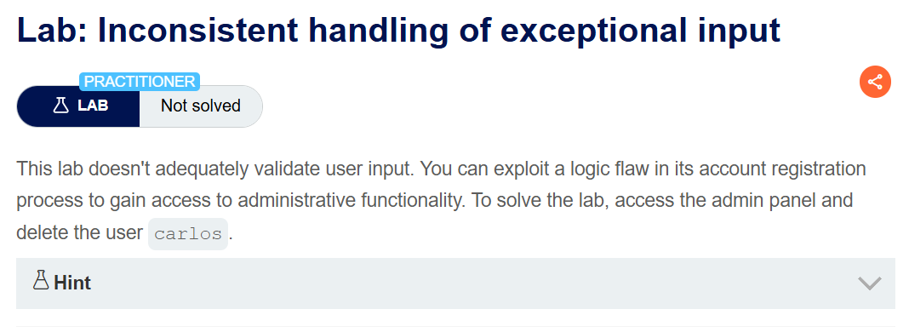
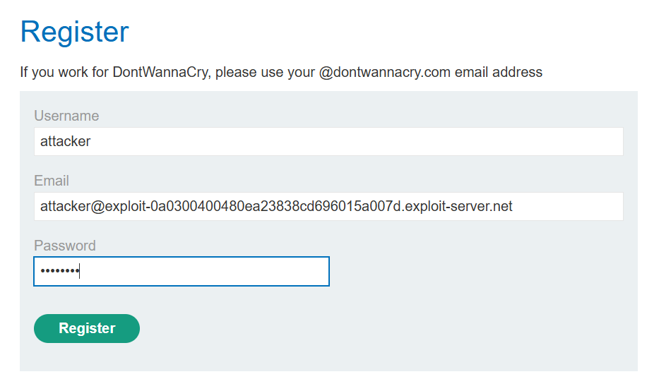
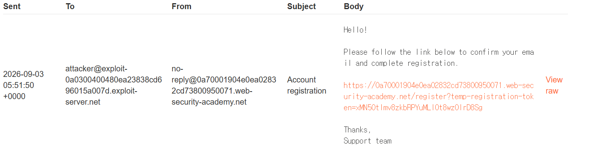
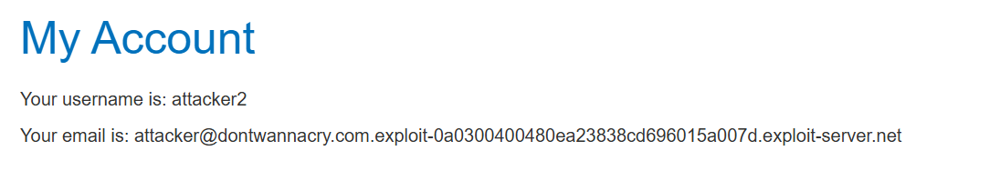
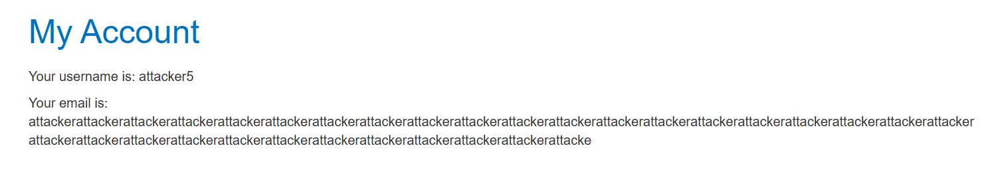
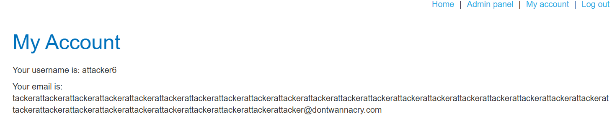
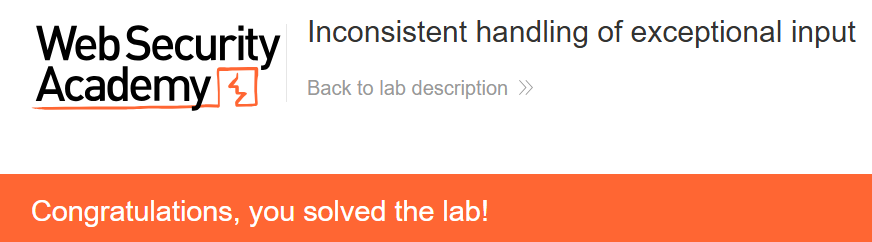

+++
date = '2026-08-25T21:00:00+09:00'
draft = false
title = '[Write-up] PortSwigger - Inconsistent handling of exceptional input'
summary = "메일 발송에는 원본 주소를 사용하고 계정에는 255자로 잘라 저장하는 차이를 이용해 관리자 권한을 얻는 Business Logic 풀이"
toc = true
tags = ["Business Logic", "Input Truncation", "Email Verification", "PortSwigger", "Practitioner"]
+++

---

## 문제 분석

> **난이도**: `PRACTITIONER`  
> **Lab**: [Inconsistent handling of exceptional input](https://portswigger.net/web-security/logic-flaws/examples/lab-logic-flaws-inconsistent-handling-of-exceptional-input)

> 

이 랩은 회원가입 과정에서 예외적인 입력을 적절히 처리하지 않는다. 로직 결함을 이용해 관리자 패널에 접근하고 `carlos`를 삭제하면 문제가 해결된다.

### Business Logic 진단

회원가입 화면에서 username, email, password를 입력한다. 회사 직원은 `@dontwannacry.com` 주소를 사용하라는 안내가 있다.



등록하면 입력한 주소로 확인 메일이 전달된다. 메일의 링크를 따라가야 가입이 완료된다.



실습의 이메일 클라이언트는 제공된 도메인과 그 하위 도메인으로 전송된 메일을 모두 보여준다. 먼저 `dontwannacry.com`을 실습 도메인 앞에 붙여 가입해 본다.

```text
attacker@dontwannacry.com.exploit-0a0300400480ea23838cd696015a007d.exploit-server.net
```

확인 메일을 받아 가입할 수는 있지만 관리자 권한은 생기지 않는다.



주소 안에 회사 도메인 문자열이 포함되는 것만으로는 부족하다. 계정에 저장된 주소가 정확히 `@dontwannacry.com`으로 끝나야 하는 것으로 보인다.

`%00`을 넣어 뒷부분을 자르는 시도는 실패한다. 이번에는 매우 긴 이메일 주소로 가입한 뒤 계정 화면을 확인한다. 메일은 원래 주소로 도착했지만 **계정에 표시되는 주소는 255자에서 잘린다.**



메일 발송과 계정 저장에 서로 다른 값이 사용되는 것이다. 잘리는 지점을 회사 도메인 끝에 맞추면 실제 메일은 실습 메일함에서 받으면서, 저장된 주소는 회사 이메일처럼 만들 수 있다.

---

## 익스플로잇

`@dontwannacry.com`의 마지막 `m`이 정확히 255번째 문자가 되도록 주소를 구성한다. 실습에서 사용한 값은 다음과 같다.

```text
tackerattackerattackerattackerattackerattackerattackerattackerattackerattackerattackerattackerattackerattackerattackerattackerattackerattackerattackerattackerattackerattackerattackerattackerattackerattackerattackerattackerattackerattacker@dontwannacry.com.exploit-0a0300400480ea23838cd696015a007d.exploit-server.net
```

이 값의 `@` 앞부분은 238자이고, `@dontwannacry.com`은 17자다. 합계 255자 뒤에 실습 메일 서버 도메인이 이어진다. 뒤의 `exploit-...` 부분은 실습 인스턴스에서 제공된 도메인이다.

가입 요청 후 실습 메일함에 도착한 링크로 확인을 마친다. 로그인하면 계정에는 회사 도메인으로 끝나는 주소가 저장되어 있고 Admin panel 링크가 나타난다.



관리자 패널에서 `carlos`를 삭제하면 문제가 해결된다.



---

## 정리

이 랩의 255자 제한은 이메일 표준의 길이 제한을 설명하는 것이 아니라, 애플리케이션이 주소를 저장하며 보인 동작이다. 핵심은 긴 입력을 받았을 때 한쪽은 원본을 사용하고 다른 쪽은 잘린 값을 사용했다는 점이다.

메일 소유권을 확인한 주소와 권한 판단에 사용한 주소가 같아야 한다. 저장할 수 없는 길이라면 입력 단계에서 명확히 거부하고, 주소를 조용히 잘라 다른 주소로 해석해서는 안 된다. 가입 후 주소 변경에서 같은 문제가 생긴 경우는 [Inconsistent security controls](/write-up/portswigger/business-logic/inconsistent-security-controls/)에서 다룬다.
