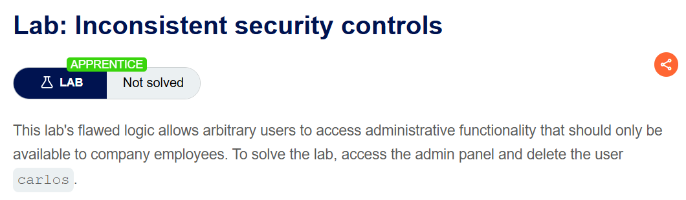
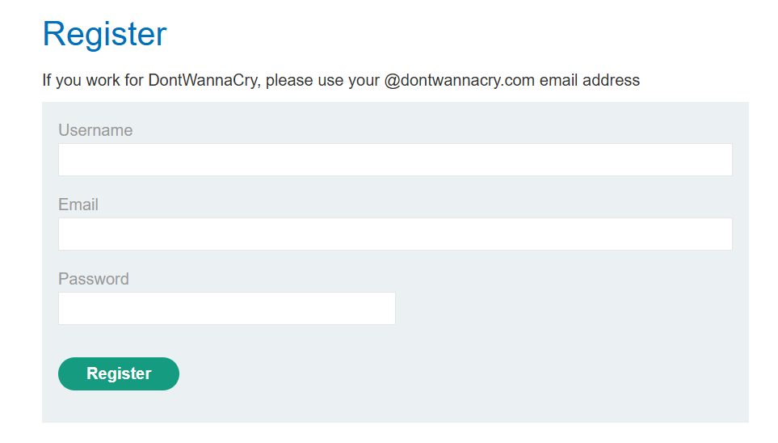
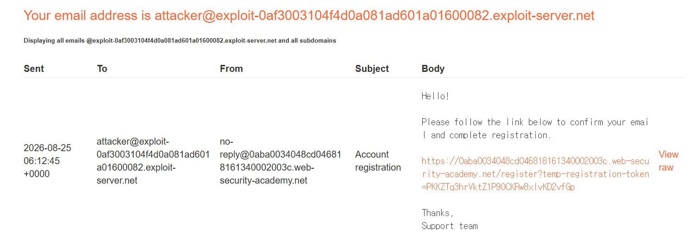
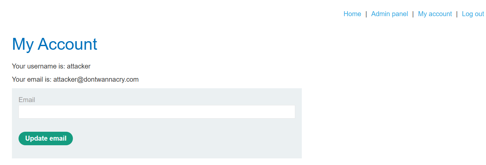
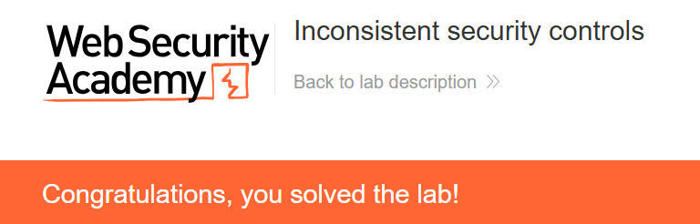

+++
date = '2026-08-15T15:20:00+09:00'
draft = false
title = '[Write-up] PortSwigger - Inconsistent security controls'
summary = "회원가입 때만 이메일을 인증하고 변경할 때는 검증하지 않는 차이를 이용해 관리자 권한을 얻는 Business Logic 풀이"
toc = true
tags = ["Business Logic", "Email Verification", "Access Control", "PortSwigger", "Apprentice"]
+++

---

## 문제 분석

> **난이도**: `APPRENTICE`  
> **Lab**: [Inconsistent security controls](https://portswigger.net/web-security/logic-flaws/examples/lab-logic-flaws-inconsistent-security-controls)

> 

이 랩은 회사 직원만 사용해야 하는 관리자 기능에 일반 사용자가 접근할 수 있는 로직 결함이 있다. 관리자 패널에 접근해 `carlos`를 삭제하면 문제가 해결된다.

### Business Logic 진단

회원가입 화면에는 회사 직원이면 `@dontwannacry.com` 이메일을 사용하라는 안내가 있다. 이메일 도메인이 직원 여부를 판단하는 기준일 것으로 보인다.

하지만 실습에서 메일을 확인할 수 있는 주소는 `attacker@exploit-0af3003104f4d0a081ad601a01600082.exploit-server.net`이다. 이 주소는 해당 실습 인스턴스에서 제공된 주소다.

먼저 이 주소로 가입하면 인증 메일이 도착한다.

메일의 링크를 따라가야 가입이 완료된다. 이 절차에서는 임의로 회사 이메일을 입력해도 메일을 읽을 수 없으므로 인증을 마칠 수 없다.

가입 후 My account를 확인하면 이메일 변경 기능이 있다. 여기서 이메일을 변경할 때는 별도의 인증을 요구하지 않는다. **가입과 변경에서 같은 이메일 값에 적용하는 검증이 다르다.**

---

## 익스플로잇

실습 이메일로 인증을 마친 계정에서 이메일을 `attacker@dontwannacry.com`으로 변경한다.

변경한 주소가 계정에 바로 반영되고, 상단에 Admin panel 링크가 나타난다. 회사 이메일의 소유권을 확인하지 않았는데도 직원 권한이 부여된 것이다.

관리자 패널로 이동해 `carlos`를 삭제하면 문제가 해결된다.

---

## 정리

회원가입 때 확인한 것은 최초 이메일의 소유권이다. 이후 이메일이 바뀌면 그 인증 결과를 새 주소에 그대로 적용할 수 없다. 이 랩은 변경된 주소를 다시 검증하지 않으면서 그 도메인을 권한 판단에 사용했다.

이메일 변경은 새 주소의 인증이 끝나야 반영하고, 직원 권한도 확인된 신원에 따라 관리해야 한다. 같은 값이 여러 기능에서 수정되는 경우의 점검 순서는 [Business Logic Playbook](/playbook/business-logic/)에서 정리한다.
