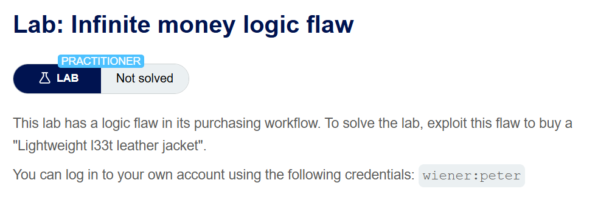
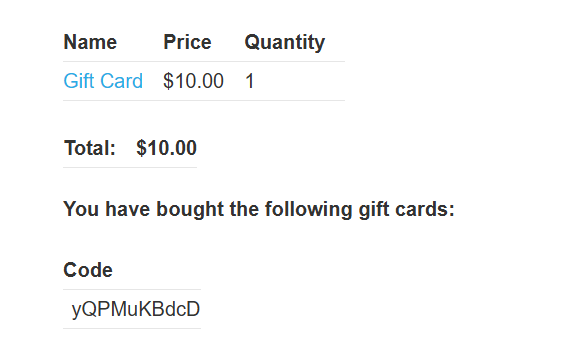
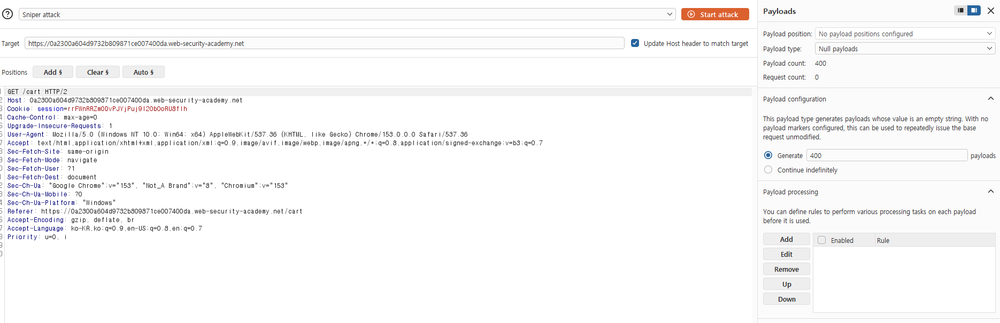
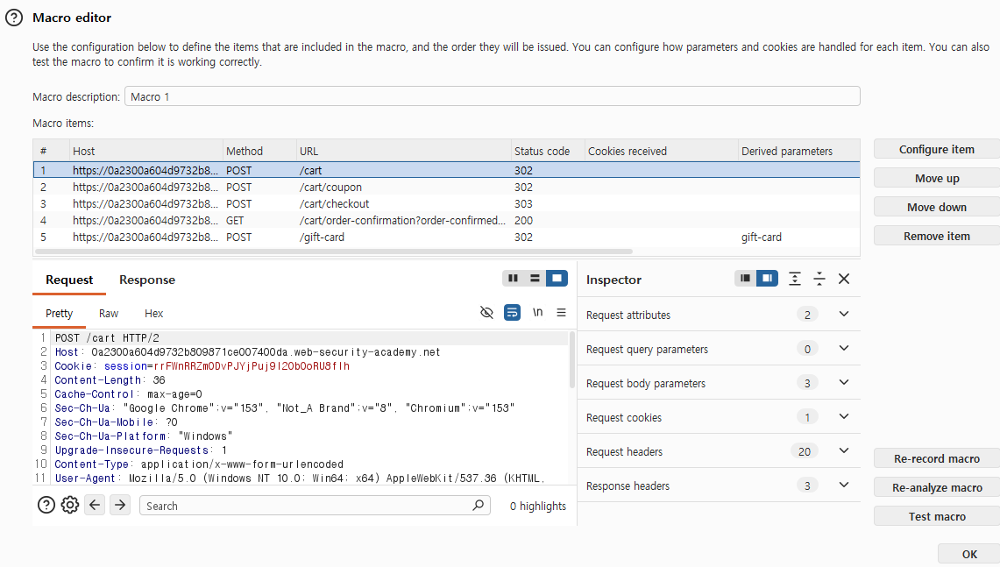
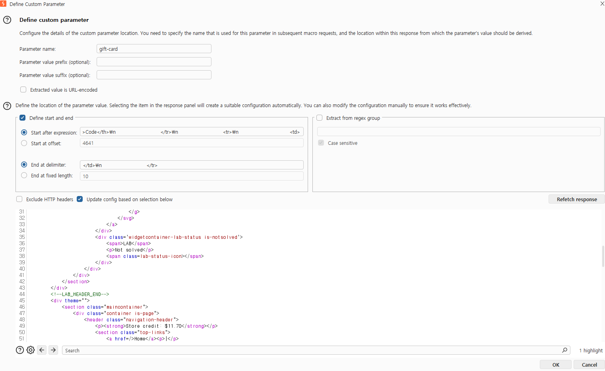
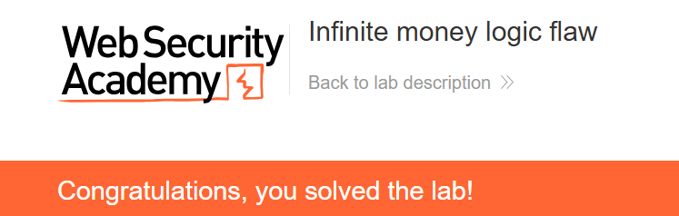

+++
date = '2026-09-08T20:50:00+09:00'
draft = false
title = '[Write-up] PortSwigger - Infinite money logic flaw'
summary = "30% 할인으로 새 $10 상품권을 $7에 구매하고 액면가를 충전하는 과정을 반복해 매회 $3씩 잔액을 늘리는 Business Logic 풀이"
toc = true
tags = ["Business Logic", "Gift Card", "Coupon Abuse", "PortSwigger", "Practitioner"]
+++

---

## 문제 분석

> **난이도**: `PRACTITIONER`  
> **Lab**: [Infinite money logic flaw](https://portswigger.net/web-security/logic-flaws/examples/lab-logic-flaws-infinite-money)

> 

이 랩은 구매 흐름의 기능을 조합할 때 로직 결함이 발생한다. 잔액을 늘려 `Lightweight l33t leather jacket`을 구매하면 문제가 해결된다. 실습 계정은 `wiener:peter`다.

### Business Logic 진단

페이지 아래에는 뉴스레터 구독 기능이 있다.


구독하면 30% 할인 쿠폰 `SIGNUP30`을 얻는다.


My account에는 상품권 코드를 입력해 잔액을 충전하는 기능도 있다.


홈페이지에서는 액면가가 `$10`인 Gift Card를 `$10`에 판매한다.



Gift Card를 장바구니에 넣고 `SIGNUP30`을 적용하면 `$7`에 결제할 수 있다. 구매 후 발급된 코드를 My account에 입력하면 액면가인 `$10`가 충전된다. 따라서 한 주기의 잔액 변화는 다음과 같다.

```text
상품권 구매: -$7
새 상품권 충전: +$10
순이익: +$3
```

같은 코드를 여러 번 등록하는 문제가 아니다. **매번 새 `$10` 상품권을 `$7`에 사고 새 코드를 한 번 충전해도 `$3`가 남는 구조**이며, 쿠폰 사용 횟수에 제한이 없어 이 과정을 반복할 수 있다.

---

## 익스플로잇

먼저 Gift Card 추가 → 쿠폰 적용 → 결제 → 새 코드 추출 → 상품권 충전까지 한 주기가 정상적으로 `$3`를 늘리는지 확인한다. 이후 Burp의 Session handling rule과 Macro로 이 흐름을 자동화한다.



매크로에는 다음 요청을 순서대로 넣는다.

```text
POST /cart
POST /cart/coupon
POST /cart/checkout
GET /cart/order-confirmation?order-confirmed=true
POST /gift-card
```



주문 완료 응답에서 이번에 발급된 상품권 코드를 추출하고, 마지막 `POST /gift-card`의 `gift-card` 파라미터가 그 값을 사용하도록 설정한다.



요청이 겹치지 않도록 한 번에 한 주기씩 반복한다. 재킷을 살 수 있을 만큼 잔액이 쌓이면 `Lightweight l33t leather jacket`을 장바구니에 넣고 정상 결제해 문제를 해결한다.



---

## 정리

할인과 상품권 충전은 각각 정상 기능이지만, 할인된 구매가와 고정된 충전액을 함께 검증하지 않아 반복할 때마다 잔액이 증가했다. 일회성 상품권 코드는 정상적으로 소모되므로 코드 재사용 방지만으로는 이 결함을 막을 수 없다.

상품권 같은 가치 저장 수단은 할인 대상에서 제외하거나, 실제 결제액과 충전액의 관계가 반복 이익을 만들지 않도록 업무 규칙을 설계해야 한다. 쿠폰 자체의 사용 이력을 잘못 검사한 사례는 [Flawed enforcement of business rules](/write-up/portswigger/business-logic/flawed-enforcement-of-business-rules/)에서 다룬다.
