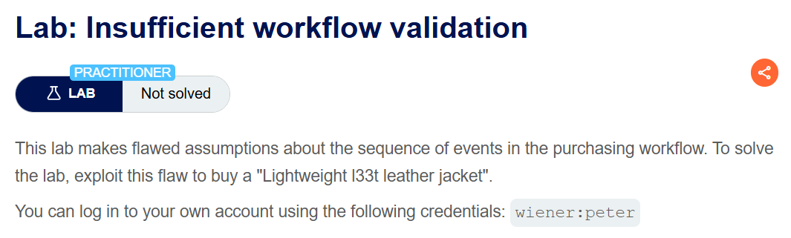
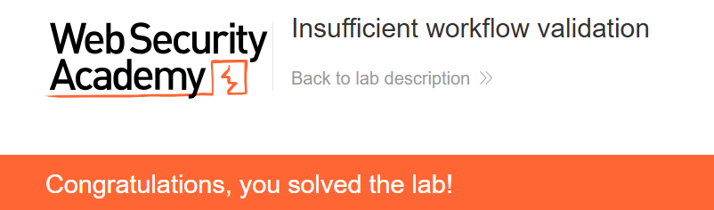

+++
date = '2026-09-01T21:20:00+09:00'
draft = false
title = '[Write-up] PortSwigger - Insufficient workflow validation'
summary = "저가 상품의 결제를 마친 뒤 재킷을 장바구니에 추가하고 기존 주문 완료 요청을 재전송해 결제 없이 구매를 확정하는 Business Logic 풀이"
toc = true
tags = ["Business Logic", "Workflow Validation", "Order Processing", "PortSwigger", "Practitioner"]
+++

---

## 문제 분석

> **난이도**: `PRACTITIONER`  
> **Lab**: [Insufficient workflow validation](https://portswigger.net/web-security/logic-flaws/examples/lab-logic-flaws-insufficient-workflow-validation)

> 

이 랩은 구매 절차의 요청 순서를 충분히 검증하지 않는다. 이를 이용해 `Lightweight l33t leather jacket`을 구매하면 문제가 해결된다. 실습 계정은 `wiener:peter`다.

### Business Logic 진단

먼저 구매할 수 있는 저가 상품을 장바구니에 넣고 정상 결제 흐름을 관찰한다.

```http
POST /cart HTTP/2
Host: <lab-id>.web-security-academy.net
Cookie: session=<session>
Content-Type: application/x-www-form-urlencoded

productId=2&redir=PRODUCT&quantity=1
```

이후 요청은 다음 순서로 진행된다.

```text
POST /cart/checkout
GET /cart/order-confirmation?order-confirmed=true
```

결제하지 않은 장바구니에서 곧바로 주문 완료 요청을 보내면 처리되지 않는다. 그러나 저가 상품을 한 번 결제한 뒤에는 주문 완료 요청이 확보된다. 서버가 이 요청을 현재 장바구니의 결제 상태와 다시 대조하지 않는다면, 결제 이후 장바구니에 상품을 추가하고 완료 요청만 재전송할 수 있다.

---

## 익스플로잇

구매 가능한 저가 상품을 장바구니에 넣고 `POST /cart/checkout`까지 정상 진행한다. 리다이렉트된 다음 요청을 Repeater에 보관한다.

```http
GET /cart/order-confirmation?order-confirmed=true HTTP/2
Host: <lab-id>.web-security-academy.net
Cookie: session=<session>
```

이제 `Lightweight l33t leather jacket`을 장바구니에 추가한다. 새로 결제하지 않고 앞서 보관한 주문 완료 요청을 다시 보내면 저가 상품과 재킷이 함께 구매 확정되어 문제가 해결된다.



---

## 정리

결제 시점에 확인한 장바구니와 주문 확정 시점의 장바구니가 달라졌지만, 서버는 완료 요청에서 현재 주문이 실제로 결제됐는지 다시 확인하지 않았다. 정상 흐름에서 얻은 완료 요청을 예상 밖의 상태에 재사용할 수 있었던 이유다.

다단계 처리에서는 화면의 순서가 아니라 서버 상태로 선행 조건을 강제해야 한다. 주문 내용이 바뀌면 기존 결제 상태를 무효화하고, 확정 단계에서는 결제한 항목과 현재 주문 항목이 일치하는지 검증해야 한다. 단계 생략 진단 흐름은 [Business Logic Playbook](/playbook/business-logic/)에 정리했다.
