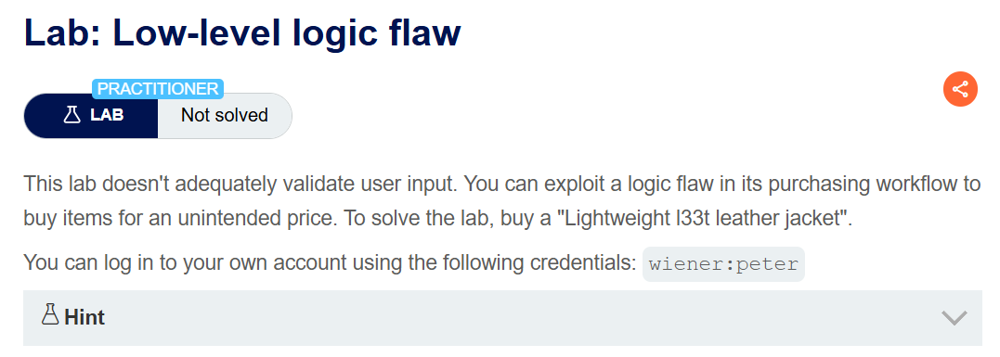
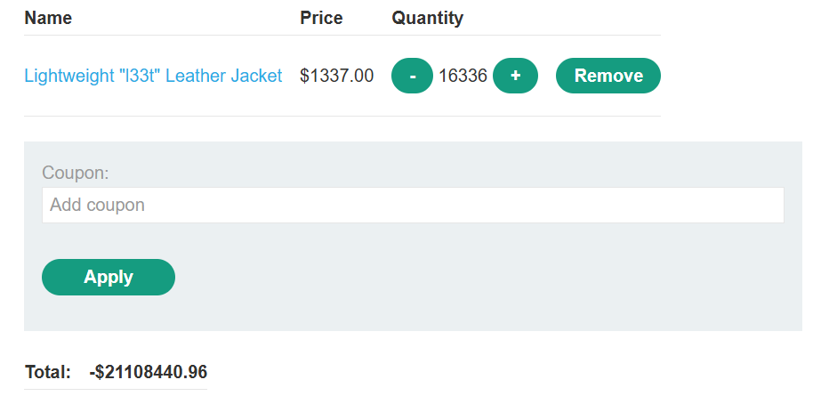
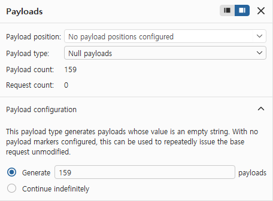
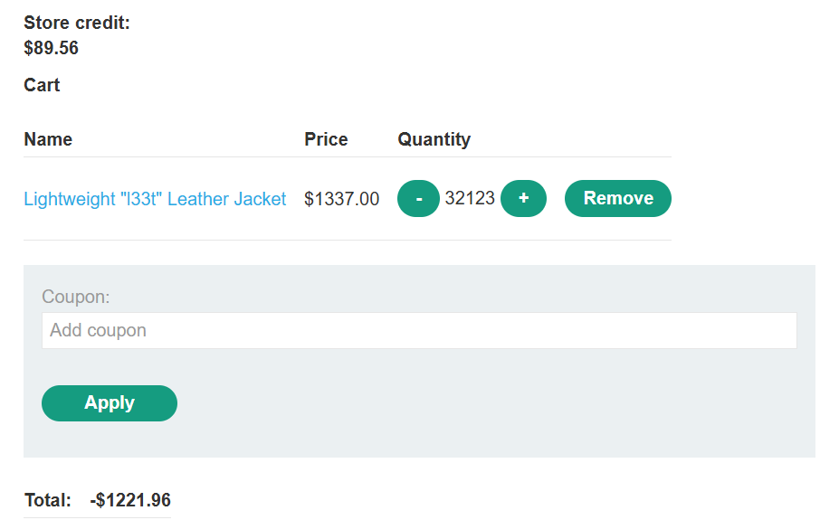
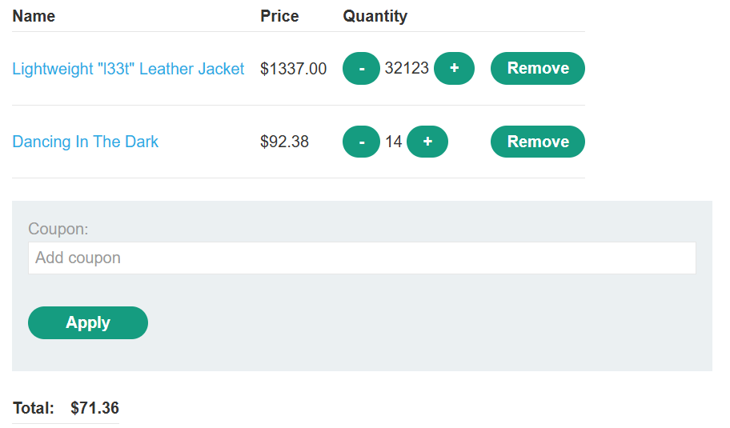
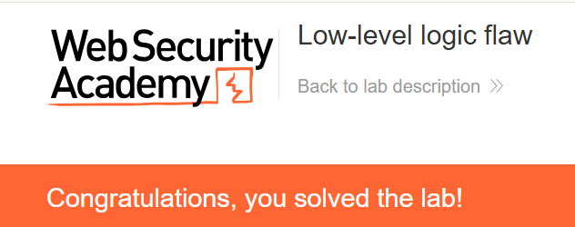

+++
date = '2026-08-21T22:10:00+09:00'
draft = false
title = '[Write-up] PortSwigger - Low-level logic flaw'
summary = "요청당 수량 제한을 반복 요청으로 넘기고 금액의 정수 오버플로를 이용해 재킷을 구매하는 Business Logic 풀이"
toc = true
tags = ["Business Logic", "Integer Overflow", "Input Validation", "PortSwigger", "Practitioner"]
+++

---

## 문제 분석

> **난이도**: `PRACTITIONER`  
> **Lab**: [Low-level logic flaw](https://portswigger.net/web-security/logic-flaws/examples/lab-logic-flaws-low-level)

> 

이 랩은 구매 과정의 입력 검증에 결함이 있다. 의도하지 않은 가격으로 `Lightweight l33t leather jacket`을 구매하면 문제가 해결된다. 실습 계정은 `wiener:peter`다.

### Business Logic 진단

먼저 로그인한 뒤 상품을 장바구니에 담아 요청을 확인한다.

```http
POST /cart HTTP/2
Host: <lab-id>.web-security-academy.net
Cookie: session=<session>
Content-Type: application/x-www-form-urlencoded

productId=6&redir=PRODUCT&quantity=1
```

가격을 지정하는 파라미터는 없고, 음수 수량도 사용할 수 없다. `quantity`를 늘려 보면 한 번에 `99`개까지 담을 수 있지만 `100` 이상은 거부된다.

그런데 `99`개를 담는 요청을 반복하면 장바구니에는 100개 이상이 쌓인다. **개별 요청에만 제한이 있고 누적 수량에는 같은 제한이 적용되지 않는다.** 재킷을 계속 추가하자 합계가 큰 음수로 바뀐다.



재킷 가격은 `$1337`이며, 서버 내부에서는 센트 단위인 `133700`으로 계산한다. 누적 금액이 32비트 부호 있는 정수의 범위를 넘으면서 음수로 돌아간 것이다.

---

## 익스플로잇

합계가 음수인 상태에서는 `Cart total price cannot be less than zero` 메시지가 나오며 결제가 막힌다. 오버플로를 발생시키는 것에서 그치지 않고, 합계를 잔액 `$100` 안의 양수로 맞춰야 한다.

당시 합계는 `-$21,108,440.96`이다. 이를 재킷 가격 `$1337`로 나누면 약 `15,787`개를 더 담았을 때 0에 가까워진다. 먼저 Burp Intruder에서 재킷 `99`개를 추가하는 요청을 `159`번 보내 큰 차이를 줄인다.



이후 Repeater로 추가 수량을 조절하면 재킷 `32,123`개에서 합계가 `-$1221.96`이 된다.



나머지는 다른 상품으로 맞춘다. `$92.38`인 상품을 `14`개 추가하면 합계가 `$71.36`이 된다.

```text
-1221.96 + 92.38 × 14 = 71.36
```



잔액 안의 양수가 되었으므로 Place order를 누르면 구매가 처리되고 문제가 해결된다.



---

## 정리

요청 한 번에 담을 수 있는 수량을 제한해도, 여러 요청으로 만들어지는 누적 수량과 계산 결과까지 제한되는 것은 아니다. 이 랩은 작은 입력을 반복해서 받아들이다 금액 연산에서 오버플로가 발생했다.

수량과 금액은 입력 시점뿐 아니라 누적·계산·결제 시점에도 검증해야 한다. [High-level logic vulnerability](/write-up/portswigger/business-logic/high-level-logic-vulnerability/)가 음수 수량을 직접 받아들인 경우라면, 이 랩은 양수 수량만으로도 잘못된 합계가 만들어진 경우다.
