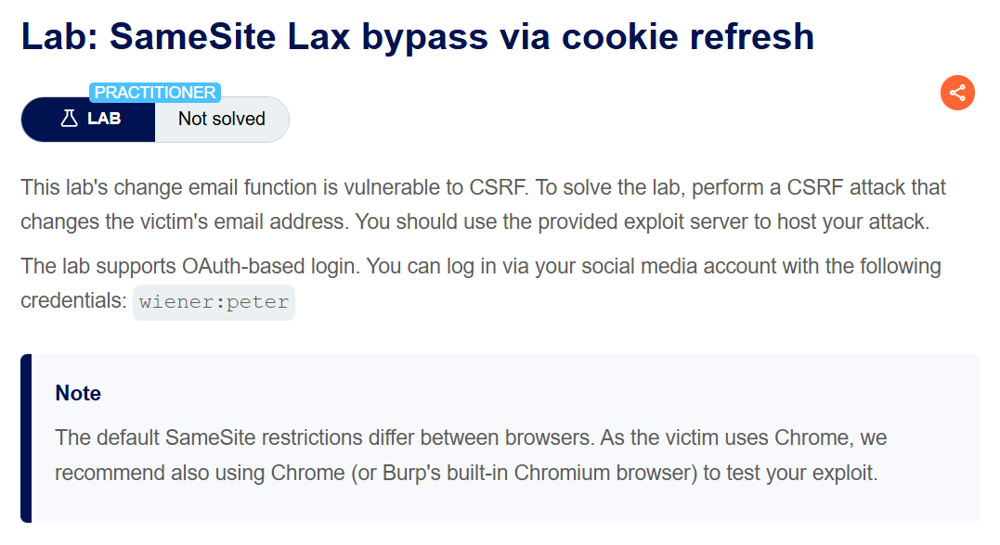
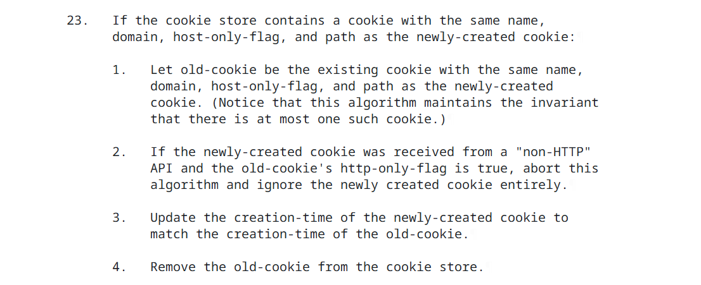
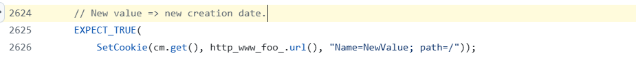
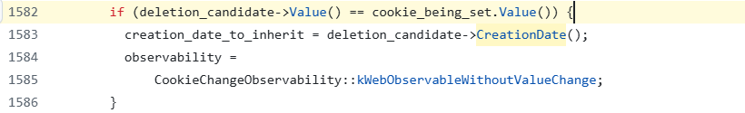
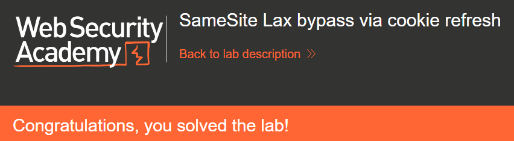

+++
date = '2026-06-25T12:00:00+09:00'
draft = false
title = '[Write-up] PortSwigger - SameSite Lax bypass via cookie refresh'
summary = "기본 Lax 쿠키에만 적용되는 2분간의 POST 완화 구간을 OAuth 로그인 랜딩으로 재발급시켜 되살리고, rfc6265bis와 Chromium 구현에서 그 조건을 확인하는 풀이"
toc = true
tags = ["CSRF", "SameSite", "Lax-Allowing-Unsafe", "OAuth", "Cookie", "PortSwigger", "Practitioner"]
url = '/write-up/portswigger/csrf/write-up-portswigger---samesite-lax-bypass-via-cookie-refresh/'
+++

---

## 문제 분석

> **난이도**: `PRACTITIONER`  
> **Lab**: [SameSite Lax bypass via cookie refresh](https://portswigger.net/web-security/csrf/bypassing-samesite-restrictions/lab-samesite-strict-bypass-via-cookie-refresh)

> 

이메일 변경 기능에 CSRF 취약점이 존재한다. CSRF 공격으로 피해자의 이메일 주소를 변경하면 문제가 해결된다. 이 랩은 OAuth 기반 로그인을 제공하며, `wiener:peter` 자격 증명으로 소셜 미디어 계정을 통해 로그인할 수 있다.

### Lax-allowing-unsafe

이 랩은 세션 쿠키에 `SameSite` 속성을 명시하지 않아 브라우저 기본값이 적용된다. Chrome은 명시되지 않은 쿠키를 `Lax`로 처리하되, **생성 후 2분 이내에 한해 교차 사이트 최상위 `POST` 요청에도 쿠키를 전송한다.**

이를 [Lax-allowing-unsafe](https://datatracker.ietf.org/doc/html/draft-ietf-httpbis-rfc6265bis-22#name-lax-allowing-unsafe-enforce)(통칭 Lax+POST)라 하며, SSO·결제처럼 교차 사이트 `POST`로 세션을 넘기는 로그인 플로우가 깨지는 것을 막기 위한 한시적 완화책이다. 명시적으로 `SameSite=Lax`를 선언한 쿠키에는 적용되지 않는다는 점이 중요하다.

그렇다면 이 2분을 되살릴 수 있는지가 관건이다. 쿠키 [Storage Model](https://datatracker.ietf.org/doc/html/draft-ietf-httpbis-rfc6265bis-22#name-storage-model)의 Step 23을 보면, name·domain·host-only flag·path가 동일한 쿠키를 다시 받으면 새 쿠키가 기존 쿠키의 생성 시각을 물려받는다고 되어 있다. 명세만 보면 같은 이름의 쿠키를 다시 발급받아도 2분 창은 갱신되지 않는다.



하지만 Chromium의 [테스트 케이스](https://github.com/chromium/chromium/blob/main/net/cookies/cookie_monster_unittest.cc#L2624)를 보면 구현 의도가 다르다. **값(value)이 달라지면 생성 시각을 갱신한다**고 명시되어 있다.



실제 [구현 코드](https://github.com/chromium/chromium/blob/main/net/cookies/cookie_monster.cc#L1582)도 값을 비교해 동일할 때만 생성 시각을 상속한다.



따라서 `Set-Cookie`로 내려오는 쿠키의 값이 이전과 달라진다면, 그 시점부터 2분의 완화 구간이 다시 시작된다.

### CSRF 진단

남은 일은 피해자의 로그인 상태를 유지한 채 세션 쿠키 값을 새로 발급받게 만드는 지점을 찾는 것이다.

한 번 소셜 로그인을 완료한 뒤 다시 `/social-login` 랜딩 페이지에 진입하면, 별도의 자격 증명 입력 없이 OAuth 플로우가 다시 완주되면서 새 세션이 발급된다. OAuth 제공자는 사용자가 대상 사이트에 여전히 로그인되어 있는지 알지 못하므로 매번 새 세션을 내려주는 것이다.

이때 재발급을 트리거하는 요청은 최상위 탐색이어야 한다. 그래야 현재 OAuth 세션에 해당하는 쿠키가 함께 전송되어 재로그인이 자동으로 완료된다.

---

## 익스플로잇

세션을 재발급시킨 뒤 완화 구간 안에서 `POST`를 보내도록 페이로드를 구성한다.

```html
<form id="autosubmit" action="https://<lab-id>.web-security-academy.net/my-account/change-email" method="POST">
    <input name="email" value="csrf3@csrf.com" />
</form>
<script>
window.onclick = () => {
    window.open('https://<lab-id>.web-security-academy.net/social-login');
    setTimeout(() => { document.getElementById('autosubmit').submit(); }, 5000);
}
</script>
```

팝업으로 소셜 로그인 페이지를 열어 세션을 재발급시키고, 5초 뒤 이메일 변경 `POST`를 제출한다. 제출 시점은 재발급으로부터 2분 이내이므로 Lax-allowing-unsafe가 적용되어 새 세션 쿠키가 첨부된다.

브라우저는 사용자 상호작용 없이 생성되는 팝업을 기본적으로 차단한다. 이 랩의 피해자는 페이지에서 클릭을 수행하므로, `window.onclick` 안에서 `window.open`을 호출해 사용자 제스처 컨텍스트를 확보하는 방식으로 차단을 회피한다.

이 페이로드를 피해자에게 전달하면 문제가 해결된다.



---

## 정리

이 랩은 호환성을 위한 완화 조치가 그대로 공격면이 되는 사례다. Lax-allowing-unsafe는 교차 사이트 `POST`로 세션을 전달하는 기존 SSO·결제 플로우를 깨뜨리지 않기 위해 도입된 예외인데, 그 조건인 "새로 발급된 쿠키"를 공격자가 임의로 만들어낼 수 있다면 예외는 상시 열린 문이 된다.

여기서 가젯 역할을 한 것은 OAuth 로그인 랜딩이다. 이미 로그인한 사용자가 다시 진입하면 별도 확인 없이 새 세션을 발급하는 동작은 사용자 경험 측면에서는 자연스럽지만, 공격자가 원하는 시점에 완화 구간을 되살리는 스위치가 된다. 세션 재발급 지점은 SSO뿐 아니라 세션 고정 방어를 위한 세션 재생성, 권한 변경 후 재발급 등 여러 곳에 존재할 수 있다.

명세와 구현이 어긋난다는 점도 짚어둘 만하다. rfc6265bis Storage Model만 읽으면 같은 이름의 쿠키 재발급으로는 생성 시각이 갱신되지 않아 이 공격이 성립하지 않아야 한다. 실제로 성립하는 이유는 Chromium이 값이 달라진 경우를 갱신 대상으로 구현했기 때문이고, 세션 쿠키는 재발급될 때마다 값이 바뀐다. 브라우저 동작에 기대는 방어를 평가할 때는 명세만이 아니라 구현까지 확인해야 한다는 뜻이다.

방어는 명확하다. 브라우저 기본값에 의존하지 말고 세션 쿠키에 `SameSite=Strict`(불가피하면 `Lax`)를 **명시적으로** 선언하면 이 완화는 적용되지 않는다. 그리고 SameSite는 어디까지나 심층 방어일 뿐이므로, 세션에 결합된 CSRF 토큰을 함께 적용해야 한다.
