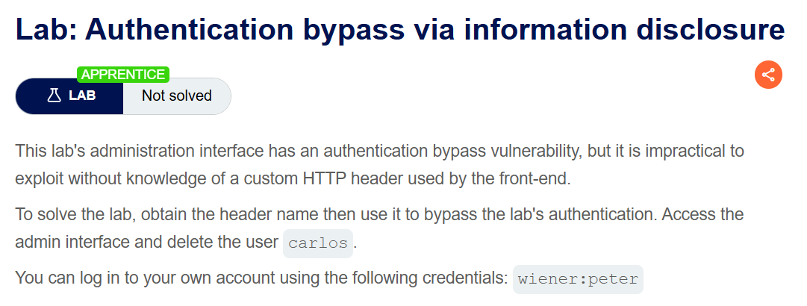
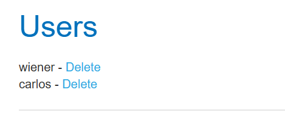
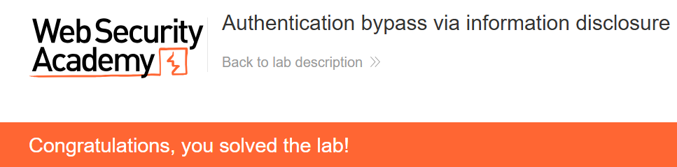

+++
date = '2026-07-25T16:40:00+09:00'
draft = false
title = '[Write-up] PortSwigger - Authentication bypass via information disclosure'
summary = "TRACE 응답에서 내부 인증 헤더를 찾고 클라이언트가 보낸 로컬 IP 값을 신뢰하는 관리자 접근 제어를 우회하는 Information Disclosure 풀이"
toc = true
tags = ["Information Disclosure", "TRACE", "Authentication Bypass", "PortSwigger", "Apprentice"]
+++

---

## 문제 분석

> **난이도**: `APPRENTICE`  
> **Lab**: [Authentication bypass via information disclosure](https://portswigger.net/web-security/information-disclosure/exploiting/lab-infoleak-authentication-bypass)

> 

이 랩의 관리자 인터페이스는 커스텀 HTTP 헤더를 이용해 요청 출처를 판별한다. 헤더 이름을 알아낸 뒤 인증을 우회하고 `carlos` 사용자를 삭제하면 문제가 해결된다. 실습 계정은 `wiener:peter`다.

### Information Disclosure 진단

`/admin`에 접근하면 `Admin interface only available to local users`라는 응답이 반환된다. 요청 출처에 따라 접근을 제한하는 것으로 보인다. 문제 설명에 따르면 프론트엔드가 커스텀 헤더를 사용하므로, 진단용 `TRACE` 메서드가 서버에 도착한 요청을 어떻게 보여 주는지 확인한다.

```http
TRACE /admin HTTP/1.1
Host: <lab-id>.web-security-academy.net
```

응답은 프론트엔드가 추가한 헤더까지 포함해 요청을 반사한다.

```http
HTTP/2 200 OK
Content-Type: message/http

TRACE /admin HTTP/1.1
Host: <lab-id>.web-security-academy.net
X-Custom-IP-Authorization: <client-ip>
```

`TRACE`가 만든 정보 노출은 **내부 헤더 이름을 알려 준 것**이다. 실제 인증 우회는 별개의 결함으로, 뒤쪽 컴포넌트가 클라이언트도 직접 보낼 수 있는 `X-Custom-IP-Authorization` 값을 신뢰할 때 성립한다.

---

## 익스플로잇

헤더 값을 루프백 주소로 바꿔 관리자 경로를 요청한다.

```http
GET /admin HTTP/2
Host: <lab-id>.web-security-academy.net
X-Custom-IP-Authorization: 127.0.0.1
```

서버는 요청을 로컬에서 온 것으로 판정하고 관리자 패널을 반환한다.



패널에서 `carlos` 사용자를 삭제하면 문제가 해결된다.



---

## 정리

공격 사슬은 두 단계다. 활성화된 `TRACE`가 프론트엔드가 붙이는 내부 헤더 이름을 노출했고, 관리자 접근 제어는 그 헤더가 신뢰할 수 있는 경로에서만 온다고 가정했다. 그러나 외부 요청에 같은 헤더를 직접 넣을 수 있어 `127.0.0.1`로 판정을 위조할 수 있었다.

진단에서는 `TRACE` 같은 진단 기능이 내부 헤더를 반사하는지 확인한 뒤, 그 헤더를 외부 클라이언트가 공급하거나 덮어쓸 수 있는지 별도로 검증한다. 정보 노출과 신뢰 경계 점검은 [Information Disclosure Note](/note/portswigger-information-disclosure/)에서 이어서 다룬다.
