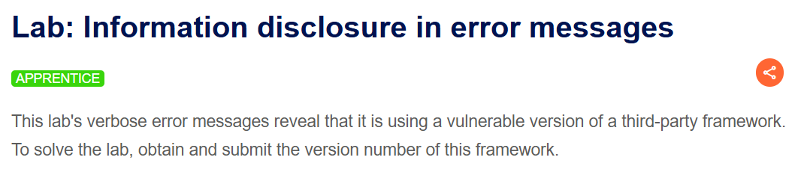
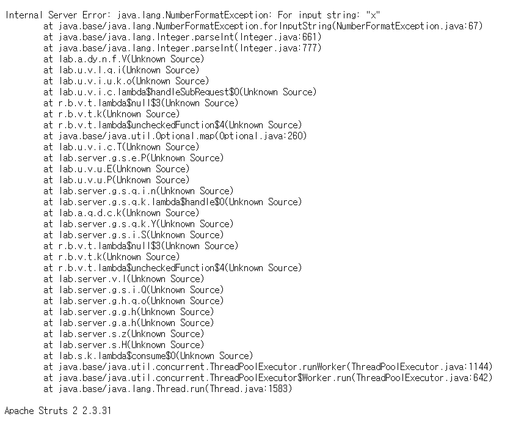
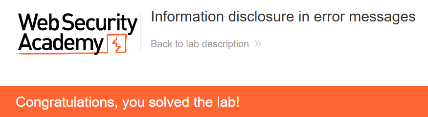

+++
date = '2026-07-15T20:30:00+09:00'
draft = false
title = '[Write-up] PortSwigger - Information disclosure in error messages'
summary = "productId에 예상하지 않은 문자열을 전달해 상세 오류를 유도하고 Apache Struts 2 버전을 식별하는 Information Disclosure 풀이"
toc = true
tags = ["Information Disclosure", "Error Message", "Apache Struts", "PortSwigger", "Apprentice"]
+++

---

## 문제 분석

> **난이도**: `APPRENTICE`  
> **Lab**: [Information disclosure in error messages](https://portswigger.net/web-security/information-disclosure/exploiting/lab-infoleak-in-error-messages)

> 

이 랩은 상세 오류 메시지에서 취약한 서드파티 프레임워크의 버전을 노출한다. 프레임워크의 버전 번호를 찾아 제출하면 문제가 해결된다.

### Information Disclosure 진단

상품 상세 페이지는 `productId`를 숫자로 받아 상품을 조회한다. 서버가 입력 형식을 엄격하게 처리하지 못한다면 숫자가 아닌 값을 전달했을 때 내부 예외가 응답에 드러날 수 있다.

```http
GET /product?productId=x HTTP/2
Host: <lab-id>.web-security-academy.net
```

`productId`를 문자열 `x`로 바꾸면 `NumberFormatException`과 전체 스택 트레이스가 반환된다.



응답 마지막에는 사용 중인 프레임워크와 버전이 `Apache Struts 2 2.3.31`로 표시된다. 여기서 `2.3.31`은 Apache HTTP Server가 아니라 **Apache Struts 2 프레임워크의 버전**이다.

---

## 익스플로잇

오류 메시지에서 확인한 버전 번호 `2.3.31`을 제출하면 문제가 해결된다.



---

## 정리

정상적인 숫자 입력에서는 보이지 않던 내부 정보가 예상하지 않은 문자열 하나로 노출됐다. 원인은 예외 자체가 아니라, 서버가 예외를 운영 환경의 응답에 그대로 포함한 데 있다. 상세 스택 트레이스에는 프레임워크 이름과 정확한 버전처럼 후속 공격의 기준이 되는 정보가 함께 담길 수 있다.

진단에서는 숫자·날짜·열거형 파라미터에 다른 자료형을 넣어 보고, 오류 응답의 클래스명·파일 경로·제품명·버전을 확인한다. 다른 노출 지점과 대응 방법은 [Information Disclosure Note](/note/portswigger-information-disclosure/)에서 정리한다.
