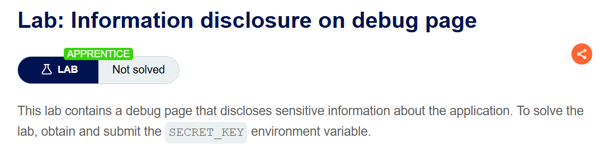
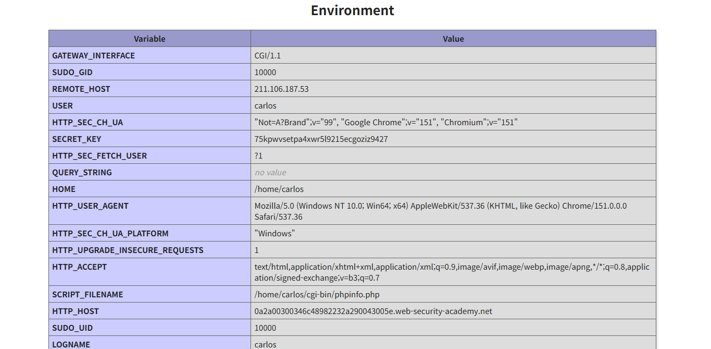

+++
date = '2026-07-18T14:20:00+09:00'
draft = false
title = '[Write-up] PortSwigger - Information disclosure on debug page'
summary = "HTML 주석에서 숨겨진 phpinfo 디버그 페이지를 찾고 환경 변수 SECRET_KEY를 식별하는 Information Disclosure 풀이"
toc = true
tags = ["Information Disclosure", "Debug Page", "PHPInfo", "PortSwigger", "Apprentice"]
+++

---

## 문제 분석

> **난이도**: `APPRENTICE`  
> **Lab**: [Information disclosure on debug page](https://portswigger.net/web-security/information-disclosure/exploiting/lab-infoleak-on-debug-page)

> 

이 랩은 공개된 디버그 페이지에서 애플리케이션의 민감정보를 노출한다. `SECRET_KEY` 환경 변수의 값을 찾아 제출하면 문제가 해결된다.

### Information Disclosure 진단

먼저 `productId`를 바꾸고 다른 HTTP 메서드와 존재하지 않는 경로도 요청하지만 자세한 오류는 반환되지 않는다. 오류를 더 유도하는 대신, 공개 페이지에 숨겨진 개발 흔적이 남았는지 소스를 확인한다.

HTML 주석에서 다음 링크가 발견된다.

```html
<!-- <a href=/cgi-bin/phpinfo.php>Debug</a> -->
```

화면에서는 보이지 않지만 주석은 브라우저에 전달되므로 누구나 경로를 읽을 수 있다. `/cgi-bin/phpinfo.php`를 요청하면 PHP 설정과 환경 변수가 담긴 `phpinfo()` 페이지가 열린다.

---

## 익스플로잇

디버그 페이지의 환경 변수 목록에서 `SECRET_KEY`를 확인한다.



랩에서 생성된 값은 다음과 같다.

```text
SECRET_KEY=75kpwvsetpa4xwr5l9215ecgoziz9427
```

이 값을 제출하면 문제가 해결된다.


---

## 정리

이 랩에서는 일반적인 오류 응답이 조용했지만, HTML 주석이 디버그 엔드포인트의 위치를 알려 줬다. 공개된 `phpinfo()` 페이지는 그 경로에서 다시 비밀 환경 변수를 노출했다. 즉, 개발 주석과 운영 환경의 디버그 기능이 연결되면서 직접적인 비밀값 유출로 이어졌다.

진단에서는 응답 본문의 주석과 숨겨진 링크를 먼저 찾고, 발견한 디버그·상태·진단 경로가 설정값이나 환경 변수를 반환하는지 확인한다. 관련 점검 흐름은 [Information Disclosure Note](/note/portswigger-information-disclosure/)에서 이어서 다룬다.
