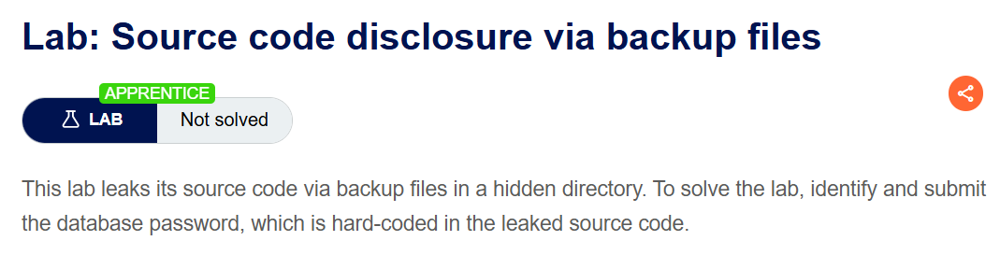
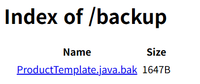
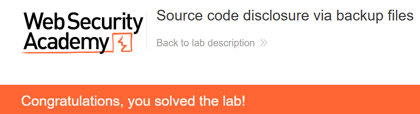

+++
date = '2026-07-22T21:10:00+09:00'
draft = false
title = '[Write-up] PortSwigger - Source code disclosure via backup files'
summary = "공개된 backup 디렉터리에서 Java 백업 파일을 내려받아 하드코딩된 PostgreSQL 비밀번호를 식별하는 Information Disclosure 풀이"
toc = true
tags = ["Information Disclosure", "Backup File", "Hardcoded Credentials", "PortSwigger", "Apprentice"]
+++

---

## 문제 분석

> **난이도**: `APPRENTICE`  
> **Lab**: [Source code disclosure via backup files](https://portswigger.net/web-security/information-disclosure/exploiting/lab-infoleak-via-backup-files)

> 

이 랩은 숨겨진 디렉터리의 백업 파일을 통해 소스 코드를 노출한다. 코드에 하드코딩된 데이터베이스 비밀번호를 찾아 제출하면 문제가 해결된다.

### Information Disclosure 진단

숨겨진 디렉터리 후보로 가장 직관적인 `/backup`을 요청하면 디렉터리 인덱싱이 허용되어 파일 목록이 반환된다. `/robots.txt`에서도 같은 디렉터리가 제외 경로로 노출된다.



목록에는 Java 소스의 백업 파일인 `ProductTemplate.java.bak`가 있다. 서버가 이 파일을 정적 콘텐츠로 내려주는지 확인한다.

---

## 익스플로잇

`/backup/ProductTemplate.java.bak`를 요청하면 Java 소스가 그대로 반환된다. 데이터베이스 연결 코드에는 PostgreSQL 비밀번호가 하드코딩되어 있다.

```java
ConnectionBuilder connectionBuilder = ConnectionBuilder.from(
        "org.postgresql.Driver",
        "postgresql",
        "localhost",
        5432,
        "postgres",
        "postgres",
        "1f4m0wzulnqlssp61azok9y3luex8qb9"
).withAutoCommit();
```

랩에서 노출된 비밀번호 `1f4m0wzulnqlssp61azok9y3luex8qb9`를 제출하면 문제가 해결된다.



---

## 정리

백업 파일은 실행 대상에서 벗어나도 웹 루트 안에 남아 있으면 원본 소스를 그대로 공개할 수 있다. 이 랩에서는 디렉터리 인덱싱과 `robots.txt`가 위치를 알려 줬고, `.bak` 파일 안의 하드코딩된 자격증명이 최종 노출로 이어졌다.

진단에서는 `robots.txt`와 디렉터리 목록을 확인하고, 발견한 소스 파일명에 `.bak`·`~` 같은 백업 형태가 남아 있는지 본다. 소스가 열리면 비밀번호·API 키·내부 호스트 같은 비밀값을 찾는다. 다른 주요 노출 경로는 [Information Disclosure Note](/note/portswigger-information-disclosure/)에서 정리한다.
