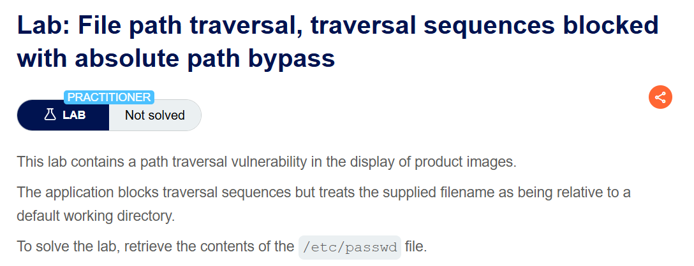

+++
url = '/write-up/portswigger/path-traversal/write-up-portswigger---file-path-traversal-traversal-sequences-blocked-with-absolute-path-bypass/'
date = '2026-06-28T12:00:00+09:00'
draft = false
title = '[Write-up] PortSwigger - File path traversal, traversal sequences blocked with absolute path bypass'
summary = "경로 이탈 시퀀스를 차단하는 필터를 절대경로로 우회해 /etc/passwd를 읽는 풀이와, 차단 목록 방식 검증의 구조적 한계 정리"
toc = true
tags = ["Path Traversal", "Absolute Path", "Filter Bypass", "PortSwigger", "Practitioner"]
+++

---

## 문제 분석

> **난이도**: `PRACTITIONER`  
> **Lab**: [File path traversal, traversal sequences blocked with absolute path bypass](https://portswigger.net/web-security/file-path-traversal/lab-absolute-path-bypass)

> 

상품 이미지 표시 기능에 path traversal 취약점이 존재한다. 애플리케이션이 경로 이탈 시퀀스를 차단하지만, 전달된 파일명을 기본 작업 디렉터리를 기준으로 처리한다. `/etc/passwd` 파일의 내용을 가져오면 문제가 해결된다.

### Path Traversal 진단

이미지 요청 형태를 확인한다.

```http
GET /image?filename=6.jpg HTTP/2
Host: <lab-id>.web-security-academy.net
```

앞선 랩과 동일한 구조이지만 이번에는 `../`가 차단된다. 여기서 필터가 무엇을 보고 있는지를 먼저 좁혀야 한다. 경로를 벗어나는 방법이 `../` 하나뿐인 것은 아니기 때문이다.

| 경로 이탈 수단 | 필요한 조건 | 차단 여부 |
| --- | --- | --- |
| `../` 상대경로 탈출 | 기준 디렉터리 접두가 유지됨 | 차단됨 |
| 절대경로 지정 | 파일 API가 절대경로를 만나면 기준 경로를 버림 | 미확인 |

문제 설명에서 파일명을 기본 작업 디렉터리 기준으로 처리한다고 밝히고 있으므로, 애플리케이션이 경로를 문자열로 이어 붙이는 대신 절대경로를 그대로 사용할 가능성이 높다. 이 경우 `../` 없이도 경로 이탈이 성립한다.

---

## 익스플로잇

경로 이탈 시퀀스를 전혀 쓰지 않고 대상 파일을 직접 지정한다.

```http
GET /image?filename=/etc/passwd HTTP/2
Host: <lab-id>.web-security-academy.net
```

요청을 전송하면 응답 본문에 `/etc/passwd`의 내용이 포함되며 문제가 해결된다.


---

## 정리

이 랩의 필터는 정상적으로 동작한다. `../`는 실제로 차단되고 앞선 랩의 페이로드는 통하지 않는다. 그런데도 공격이 성립하는 이유는 필터가 **경로 이탈이라는 행위**가 아니라 **`../`라는 문자열**을 막고 있기 때문이다. 목적지가 기준 디렉터리 바깥이라는 결과는 같은데, 그 결과에 도달하는 경로 하나만 차단 목록에 올라 있었다.

절대경로가 통하는지 여부는 애플리케이션이 쓰는 파일 API에 따라 갈린다. 언어별로 경로 결합 함수가 절대경로 인자를 다르게 처리한다.

| 언어·API | `join("/var/www/images", "/etc/passwd")` 결과 | 절대경로 우회 |
| --- | --- | --- |
| Python `os.path.join()` | `/etc/passwd` | 성립 |
| Java `Path.resolve()` | `/etc/passwd` | 성립 |
| Java `new File(parent, child)` | `/var/www/images/etc/passwd` | 불성립 |
| 단순 문자열 연결 | `/var/www/images/etc/passwd` | 불성립 |

`os.path.join()`과 `Path.resolve()`는 두 번째 인자가 절대경로면 첫 번째 인자를 **버린다.** 문서에 명시된 정상 동작이지만, 기준 디렉터리를 강제하는 장치로 이 함수들을 쓰고 있었다면 그 전제가 통째로 사라진다. 앞선 랩에서 절대경로가 실패하고 이번 랩에서 성공한 차이도 여기서 나온다.

이 랩이 남기는 교훈은 차단 목록 방식 검증의 구조적 한계다. 차단 목록은 알려진 공격 문자열을 열거하는 방식이라, 열거되지 않은 경로가 항상 남는다. `../`를 막으면 절대경로가 남고, 절대경로까지 막으면 다음 랩에서 볼 인코딩과 중첩 시퀀스가 남는다. 방어는 입력에서 위험한 형태를 찾아 제거하는 방향이 아니라, **조립이 끝난 경로를 정규화한 뒤 기준 디렉터리 하위인지 확인하는** 방향이어야 한다. 무엇을 막을지 열거하는 대신 무엇을 허용할지 확정하는 쪽이 유일하게 닫힌 검증이 된다.
