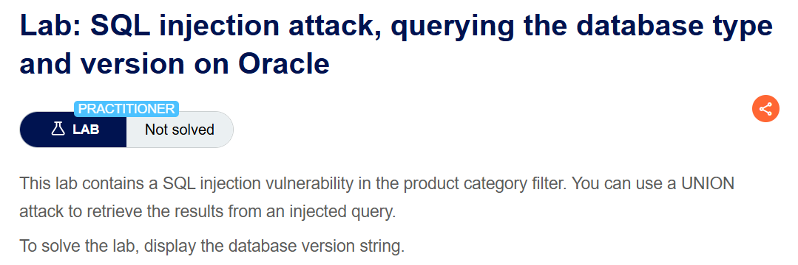
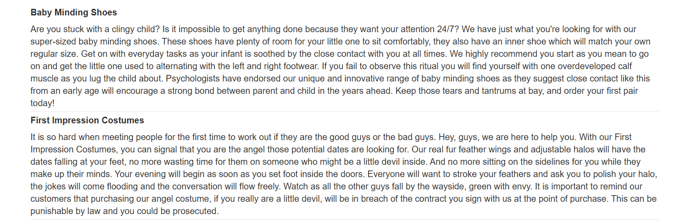
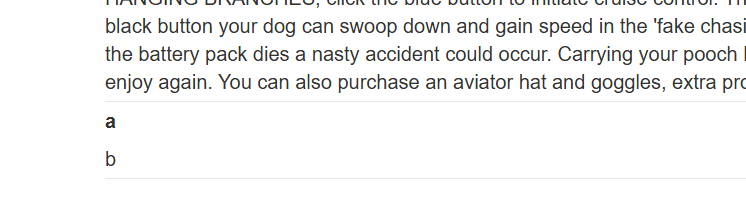
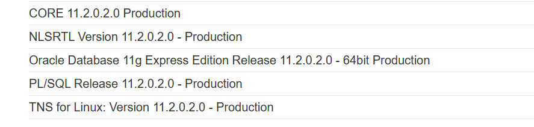
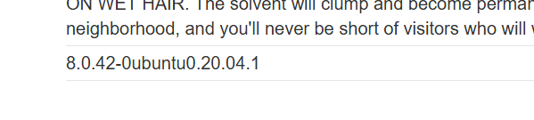

+++
url = '/write-up/portswigger/sql-injection/write-up-portswigger---sql-injection-attack-querying-the-database-type-and-version/'
date = '2026-05-20T14:12:45+09:00'
draft = false
title = '[Write-up] PortSwigger - SQL injection attack, querying the database type and version'
summary = "UNION 기반 SQL Injection으로 컬럼 수와 데이터 타입을 파악한 뒤 데이터베이스 버전 문자열을 조회하는 PortSwigger 랩 풀이 (Oracle · MySQL · Microsoft)"
toc = true
tags = ["SQL Injection", "UNION-Based", "PortSwigger", "Practitioner"]
+++

---

## 문제 분석

> **난이도**: `PRACTITIONER`  
> **Lab (Oracle)**: [querying the database type and version on Oracle](https://portswigger.net/web-security/sql-injection/examining-the-database/lab-querying-database-version-oracle)  
> **Lab (MySQL/Microsoft)**: [querying the database type and version on MySQL and Microsoft](https://portswigger.net/web-security/sql-injection/examining-the-database/lab-querying-database-version-mysql-microsoft)

> 

상품 카테고리 필터에 SQL Injection이 발생하며, UNION attack으로 주입한 쿼리의 결과를 응답에서 확인할 수 있다.  
데이터베이스의 버전 문자열을 표시하면 문제가 해결된다.

### SQL Injection 진단 - Oracle

문제 페이지에 접속해 카테고리 필터 기능을 확인하면 `?category=Pets` 파라미터가 존재하는 것을 볼 수 있다.  
해당 파라미터에 `'` 문자를 입력하면 500 에러가 발생하며, 입력값이 SQL 구문으로 처리되고 있음을 추측할 수 있다.

필터 결과는 다음과 같다.



각 행마다 제목과 내용 두 가지 데이터를 조회하는 것으로 보이며, UNION으로 컬럼 수를 동일하게 맞추면 UNION 기반 SQL Injection이 가능할 것으로 판단된다.  
먼저 다음 페이로드로 컬럼 개수를 확인한다. Oracle은 모든 `SELECT` 문에 `FROM` 절이 필요하므로, 내장 테이블인 `dual` 을 사용한다.

```sql
' UNION SELECT NULL,NULL FROM dual--
```

`NULL` 개수를 하나씩 늘려가며 확인하면 컬럼이 2개일 때 정상적으로 조회되어, 컬럼 수가 2개임을 알 수 있다.  
이어서 각 컬럼 자리에 임의의 문자열을 삽입해 데이터가 표시되는 위치를 확인한다.

```sql
' UNION SELECT 'a','b' FROM dual--
```



첫 번째 컬럼이 제목, 두 번째 컬럼이 내용에 해당함을 확인할 수 있다.

### SQL Injection 진단 - MySQL and Microsoft

MySQL과 Microsoft는 Oracle과 문법이 달라 `FROM dual` 이 필요하지 않다.

```sql
' UNION SELECT NULL,NULL--
```

이때 `--` 뒤에는 공백이 있어야 주석으로 처리되며, MySQL에서는 `#` 을 주석으로 사용할 수도 있다.

---

## 익스플로잇

컬럼 수(2개)와 텍스트 컬럼의 위치를 확인했으니, 버전 조회 함수를 텍스트 컬럼 자리에 넣어 페이로드를 구성한다.

Oracle

```sql
' UNION SELECT NULL,banner FROM v$version--
```

MySQL and Microsoft

```sql
' UNION SELECT NULL,@@version--
```






각 DB에서 버전 문자열이 조회되며 문제가 해결된다.

---

## 정리

UNION 기반 SQL Injection의 핵심은 두 가지다. 첫째, 원본 쿼리가 반환하는 컬럼 수와 정확히 일치시켜야 한다. 둘째, 조회 결과를 표시할 수 있는 텍스트 데이터 타입의 컬럼을 찾아야 한다.  
버전 조회 함수와 주석·문자열 관련 문법은 DB마다 다르다. Oracle은 모든 `SELECT` 에 `FROM` 이 필요해 `dual` 테이블을 사용하고 버전은 `v$version` 으로 조회하며, MySQL·Microsoft는 `@@version` 으로 조회한다. DB별 문법 차이는 이론 노트의 치트시트에서 정리한 바 있다.
