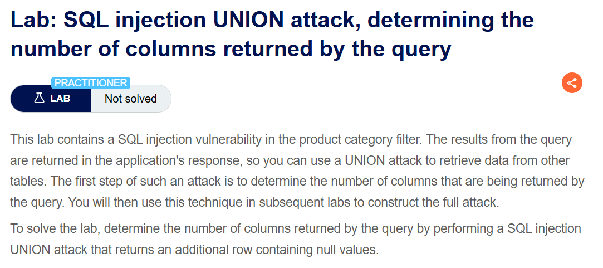
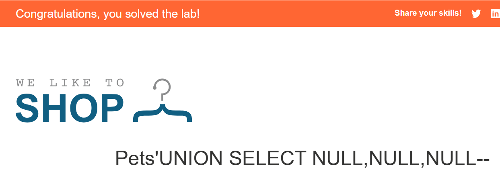

+++
url = '/write-up/portswigger/sql-injection/write-up-portswigger---sql-injection-union-attack-determining-the-number-of-columns-returned-by-the-query/'
date = '2026-05-20T14:25:12+09:00'
draft = false
title = '[Write-up] PortSwigger - SQL injection UNION attack, determining the number of columns returned by the query'
summary = "ORDER BY와 UNION SELECT NULL을 이용해 원본 쿼리가 반환하는 컬럼 수를 파악하는 PortSwigger 랩 풀이"
toc = true
tags = ["SQL Injection", "UNION-Based", "PortSwigger", "Practitioner"]
+++

---

## 문제 분석

> **난이도**: `PRACTITIONER`  
> **Lab**: [SQL injection UNION attack, determining the number of columns returned by the query](https://portswigger.net/web-security/sql-injection/union-attacks/lab-determine-number-of-columns)

> 

Product Category Filter에 SQL Injection이 존재하며, 쿼리 결과가 애플리케이션 응답에 포함되어 UNION attack이 가능하다.  
쿼리에서 반환되는 컬럼의 개수를 알아내면 문제가 해결된다.

### SQL Injection 진단

먼저 서버가 사용하는 DBMS를 좁히기 위해, Oracle과 PostgreSQL에서 문자열 연결 연산자로 동작하는 `||` 를 삽입해 값이 정상적으로 조회되는지 확인한다.

```sql
?category=Pe'||'ts
```

`'Pe'||'ts'` 가 `'Pets'` 로 평가되어 카테고리가 정상 조회되므로, 대상 DBMS는 Oracle 또는 PostgreSQL로 좁혀진다.

다음으로 두 DBMS 모두 사용할 수 있는 `ORDER BY` 구문으로 컬럼 개수를 파악한다. 인덱스를 1부터 하나씩 늘려가며 삽입한다.

```sql
' ORDER BY 4--
```

`ORDER BY 3` 까지는 정상 응답이 오지만 `ORDER BY 4` 에서 오류가 발생하므로, 컬럼의 개수는 3개로 파악된다.

---

## 익스플로잇

파악한 컬럼 수가 맞는지 UNION으로 확정한다. `NULL` 의 개수를 하나씩 늘려가며 삽입한다.  
`NULL` 은 어떤 데이터 타입의 컬럼에도 들어갈 수 있어, 타입 호환성 문제 없이 컬럼 수만 검증할 수 있다.

```sql
' UNION SELECT NULL,NULL,NULL--
```

`NULL` 이 3개일 때 오류 없이 조회되어 컬럼 수가 3개임이 확정된다.  
또한 Oracle과 달리 `FROM dual` 없이도 정상 동작하므로, 대상 DBMS는 PostgreSQL로 판단된다.



NULL 값으로 이루어진 추가 행이 응답에 반환되며 문제가 해결된다.

---

## 정리

UNION 기반 SQL Injection의 첫 단계는 원본 쿼리가 반환하는 컬럼 수를 파악하는 것이며, 두 가지 방법이 있다.  
첫째는 `ORDER BY` 인덱스를 증가시키는 방법으로, 실제 컬럼 수를 초과하는 순간 오류가 발생한다. 둘째는 `UNION SELECT` 의 `NULL` 개수를 증가시키는 방법으로, 개수가 일치할 때 정상 조회된다. 이때 `NULL` 을 사용하는 이유는 컬럼의 데이터 타입과 무관하게 삽입할 수 있어 타입 호환성 문제를 피할 수 있기 때문이다.  
한편 문자열 연결 연산자(`||`)의 동작 여부로 DBMS를 좁힐 수 있고, UNION 시 `FROM dual` 필요 여부로 Oracle과 PostgreSQL을 구분할 수 있다.
