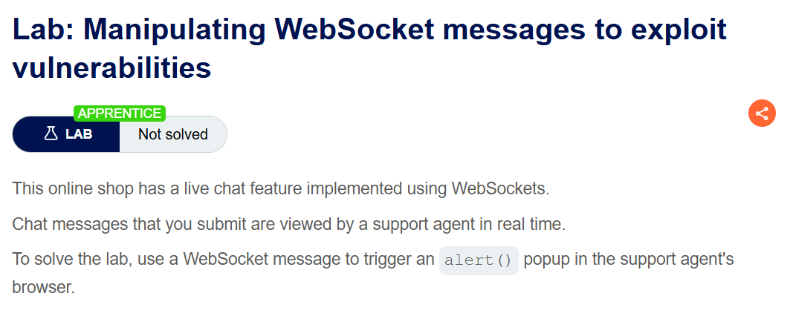
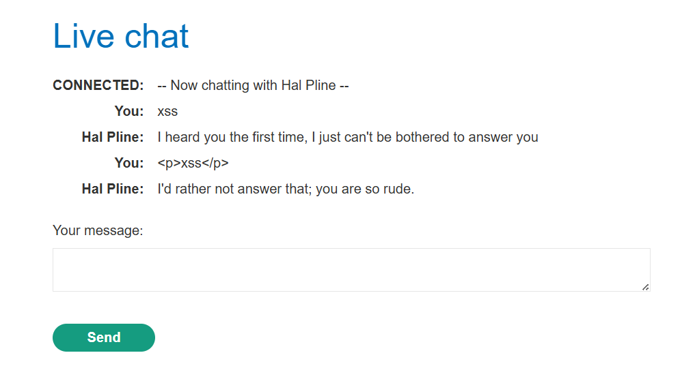
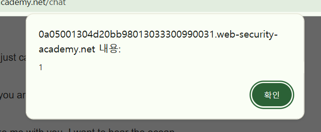

+++
url = '/write-up/portswigger/websocket/write-up-portswigger---manipulating-websocket-messages-to-exploit-vulnerabilities/'
date = '2026-06-12T09:00:00+09:00'
draft = false
title = '[Write-up] PortSwigger - Manipulating WebSocket messages to exploit vulnerabilities'
summary = "라이브 챗의 HTML 인코딩이 클라이언트에서만 수행되는 점을 이용해, 프록시에서 WebSocket 메시지를 직접 조작하여 지원 상담원의 브라우저에서 스크립트를 실행하는 풀이"
toc = true
tags = ["WebSocket", "XSS", "innerHTML", "PortSwigger", "Apprentice"]
+++

---

## 문제 분석

> **난이도**: `APPRENTICE`  
> **Lab**: [Manipulating WebSocket messages to exploit vulnerabilities](https://portswigger.net/web-security/websockets/lab-manipulating-messages-to-exploit-vulnerabilities)

> 

WebSocket으로 구현된 라이브 챗 기능이 있는 온라인 쇼핑몰이다. 사용자가 보낸 메시지는 지원 상담원(support agent)이 실시간으로 확인한다. WebSocket 메시지를 이용해 상담원의 브라우저에서 `alert()` 함수를 호출하면 문제가 해결된다.

### XSS 진단

`alert()`를 실행하려면 XSS가 필요하므로, 먼저 챗 메시지가 어떤 형태로 출력되는지 확인한다. 챗 입력창에 `<p>xss</p>`를 입력하면 태그로 해석되지 않고 문자열 그대로 출력된다.



Burp의 WebSockets history에서 실제로 전송된 메시지를 확인하면, 입력값이 서버로 전달되기 전에 이미 HTML Entity로 인코딩되어 있다.

```json
{"message":"&lt;p&gt;xss&lt;/p&gt;"}
```

즉 인코딩은 서버가 아니라 메시지를 보내는 클라이언트 측 스크립트가 수행한다. WebSocket 메시지는 브라우저의 입력창을 거치지 않고도 프록시에서 직접 수정해 보낼 수 있으므로, 이 인코딩은 우회 가능한 처리에 해당한다.

메시지를 다시 보내면서 인코딩되지 않은 태그를 그대로 서버로 전송하면, 응답이 다음과 같이 태그로 해석되어 출력된다.

```html
<td><p>xss</p></td>
```

서버는 전달받은 메시지를 검증하거나 인코딩하지 않고 그대로 중계하며, 수신 측에서도 별도 처리 없이 DOM에 삽입한다.

---

## 익스플로잇

메시지가 전송되는 시점에 삽입할 페이로드를 다음과 같이 구성한다.

```html
<script>alert(1)</script>
```

이 페이로드는 `<script>` 요소로 정상적으로 삽입되지만 코드가 실행되지 않는다. 챗 기능의 스크립트를 확인하면 수신한 메시지를 `innerHTML`로 삽입하고 있다.

```javascript
function writeMessage(className, user, content) {
    var row = document.createElement("tr");
    row.className = className

    var userCell = document.createElement("th");
    var contentCell = document.createElement("td");
    userCell.innerHTML = user;
    contentCell.innerHTML = (typeof window.renderChatMessage === "function") ? window.renderChatMessage(content) : content;

    row.appendChild(userCell);
    row.appendChild(contentCell);
    document.getElementById("chat-area").appendChild(row);
}
```

`innerHTML`로 동적으로 삽입된 `<script>` 요소는 실행되지 않으므로, 파싱 직후 자동으로 이벤트가 발생하는 요소가 필요하다. 존재하지 않는 이미지 주소로 오류를 유발해 `onerror` 핸들러를 실행시키는 페이로드로 교체한다.

```html

```

메시지를 전송하면 상담원의 브라우저에서 스크립트가 실행되며 문제가 해결된다.



---

## 정리

이 랩의 취약점은 WebSocket 자체가 아니라, 검증과 인코딩을 클라이언트 측 스크립트에만 맡긴 설계에 있다. 브라우저의 입력창을 통과하는 값은 인코딩되지만, WebSocket 메시지는 프록시에서 직접 만들어 보낼 수 있으므로 그 처리는 방어로 기능하지 못한다. 따라서 WebSocket으로 수신한 데이터도 일반 HTTP 요청 파라미터와 동일하게 신뢰할 수 없는 입력으로 취급해 서버 측에서 검증·인코딩해야 한다.

또한 수신 측 처리 방식이 페이로드 선택을 좌우한다는 점도 같다. 메시지를 `innerHTML`로 삽입하는 구조에서는 `<script>`가 실행되지 않으므로, `img`의 `onerror`처럼 파싱 후 자동으로 발생하는 이벤트를 이용해야 한다.
