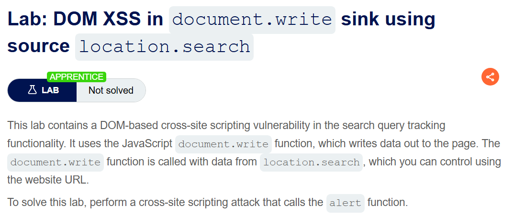
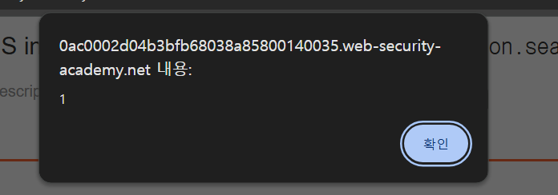

+++
date = '2026-06-01T15:00:00+09:00'
draft = false
title = '[Write-up] PortSwigger - DOM XSS in document.write sink using source location.search'
summary = "location.search에서 가져온 검색어가 document.write로 img 속성에 삽입되는 흐름을 이용해 이벤트 핸들러를 주입하는 DOM XSS 풀이"
toc = true
tags = ["XSS", "DOM-Based", "document.write", "PortSwigger", "Apprentice"]
url = '/write-up/portswigger/xss/write-up-portswigger---dom-xss-in-document.write-sink-using-source-location.search/'
+++

---

## 문제 분석

> **난이도**: `APPRENTICE`  
> **Lab**: [DOM XSS in document.write sink using source location.search](https://portswigger.net/web-security/cross-site-scripting/dom-based/lab-document-write-sink)

> 

검색어 추적 기능이 `location.search`에서 가져온 값을 `document.write()`로 페이지에 출력한다. URL로 제어할 수 있는 값이 HTML을 생성하는 sink까지 전달되는 흐름을 이용해 `alert()` 함수를 호출하면 문제가 해결된다.

### DOM XSS 진단

페이지의 검색어 추적 코드는 다음과 같다.

```html
<script>
  function trackSearch(query) {
      document.write('');
  }
  var query = (new URLSearchParams(window.location.search)).get('search');
  if (query) {
      trackSearch(query);
  }
</script>
```

`search` 파라미터에 `xss`를 전달하면 브라우저가 생성한 DOM은 다음과 같다.

```html

```

입력값은 `img` 요소의 큰따옴표로 감싼 `src` 속성 내부에 들어간다. 따라서 `"`로 기존 속성 값을 닫으면 같은 요소에 새로운 이벤트 핸들러를 추가하거나 요소 전체를 탈출할 수 있다.

---

## 익스플로잇

다음 페이로드로 `src` 값을 닫고 `onload` 이벤트 핸들러를 추가한다.

```html
" onload="alert(1)"
```

최종적으로 `document.write()`가 생성하는 요소는 다음과 같은 형태가 된다.

```html

```



추적 이미지가 로드되면 주입한 `onload` 핸들러가 실행되어 문제가 해결된다.


---

## 정리

DOM XSS를 진단할 때는 입력값이 응답 원문에 보이는지만 확인해서는 부족하다. 이 랩에서는 URL의 `location.search`가 source이고, HTML 문자열을 직접 쓰는 `document.write()`가 sink다. 같은 sink라도 입력이 태그 본문인지 속성 값인지에 따라 필요한 탈출 문자가 달라지므로 최종 DOM 컨텍스트를 먼저 확인해야 한다.
