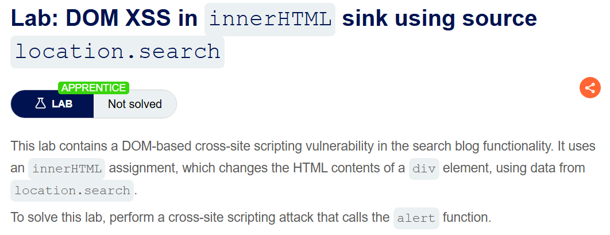
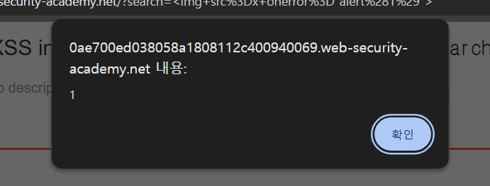

+++
date = '2026-06-01T18:00:00+09:00'
draft = false
title = '[Write-up] PortSwigger - DOM XSS in innerHTML sink using source location.search'
summary = "검색어가 location.search에서 innerHTML sink로 전달되는 흐름에서 img의 onerror 이벤트를 이용해 스크립트를 실행하는 DOM XSS 풀이"
toc = true
tags = ["XSS", "DOM-Based", "innerHTML", "PortSwigger", "Apprentice"]
url = '/write-up/portswigger/xss/write-up-portswigger---dom-xss-in-innerhtml-sink-using-source-location.search/'
+++

---

## 문제 분석

> **난이도**: `APPRENTICE`  
> **Lab**: [DOM XSS in innerHTML sink using source location.search](https://portswigger.net/web-security/cross-site-scripting/dom-based/lab-innerhtml-sink)

> 

블로그 검색 기능이 `location.search`에서 읽은 검색어를 `innerHTML` 속성으로 페이지에 삽입한다. 이 DOM XSS 취약점을 이용해 `alert()` 함수를 호출하면 문제가 해결된다.

### DOM XSS 진단

페이지에서 다음 스크립트를 확인할 수 있다.

```html
<script>
  function doSearchQuery(query) {
      document.getElementById('searchMessage').innerHTML = query;
  }
  var query = (new URLSearchParams(window.location.search)).get('search');
  if (query) {
      doSearchQuery(query);
  }
</script>
```

`search` 파라미터의 값은 별도의 처리 없이 `searchMessage` 요소의 `innerHTML`에 대입된다. 따라서 입력한 문자열은 단순 텍스트가 아니라 HTML 조각으로 파싱된다.

다만 다음과 같이 `<script>` 요소를 삽입해도 코드는 실행되지 않는다.

```html
<script>alert(1)</script>
```

`innerHTML`로 동적으로 삽입된 `<script>` 요소는 실행되지 않으므로, 파싱 후 자동으로 발생하는 이벤트를 가진 다른 요소가 필요하다.

---

## 익스플로잇

존재하지 않는 이미지 주소로 오류를 발생시키고 `onerror` 핸들러에서 `alert()`를 호출한다.

```html

```



브라우저가 입력을 `img` 요소로 파싱한 뒤 `x` 리소스 로드에 실패하면서 `onerror`가 실행되어 문제가 해결된다.


---

## 정리

`innerHTML`은 문자열을 HTML로 파싱하는 대표적인 DOM XSS sink지만, 삽입된 모든 요소가 같은 방식으로 동작하지는 않는다. `<script>`는 실행되지 않는 반면 `img`의 `onerror` 같은 이벤트 핸들러는 동작할 수 있다. 따라서 sink의 이름뿐 아니라 브라우저가 해당 요소를 삽입하고 이벤트를 발생시키는 방식까지 함께 확인해야 한다.
